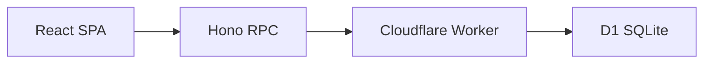
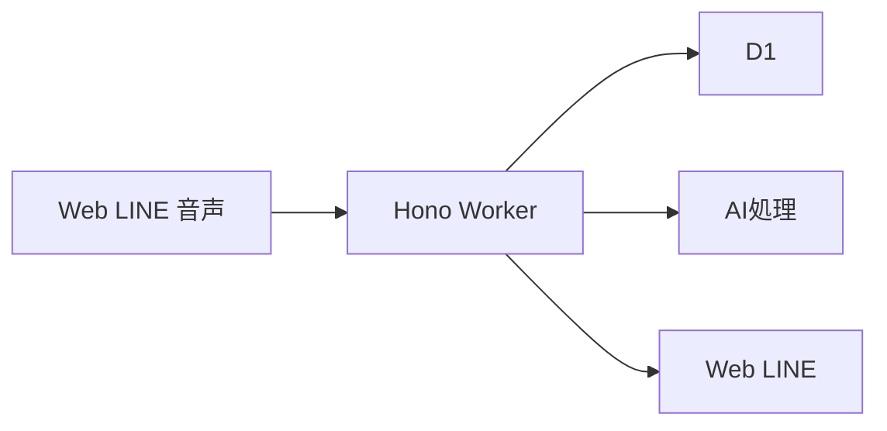

# 目安箱 要件定義書

## 1. 文書の位置づけ

この文書は、58ハッカソンで完成させる「目安箱（仮）」の目的、利用体験、実装範囲、技術要件、受け入れ条件を定める。実装時はこの文書を最上位の基準とする。

### 優先度の定義

| 区分 | 意味 |
| --- | --- |
| MVP | Webで投稿・閲覧・リアクションを成立させるために必ず動作させる機能 |
| デモ必須 | MVPに加えて、審査員へ価値と技術的な工夫を伝えるために今回完成させる機能 |
| 対象外 | 今回は実装しない機能 |

### 現在のリポジトリとの差分

現時点のリポジトリは開発基盤の初期状態であり、プロダクト機能はまだ実装されていない。現在動作する機能は、次の構成による `GET /health` とフロントエンドの接続確認である。

- フロントエンド: React 19、Vite、TypeScript、Cloudflare Pages 想定
- バックエンド: Hono、Cloudflare Workers、TypeScript
- データベース: Cloudflare D1、Drizzle ORM
- API連携: `frontend` から `backend` の `AppType` を参照する Hono RPC
- テスト: Vitest と `@cloudflare/vitest-pool-workers` によるバックエンドテスト
- CI: バックエンドとフロントエンドの lint / build / test。完成構成では主要導線のE2Eテストも含める

この文書に書かれた投稿、閲覧、リアクション、クラスタリング、レコメンド、クイズ、LINE連携、音声入力、多言語表示、学習履歴は今回の開発対象である。対象外に明記した機能は実装しない。

## 2. プロジェクト概要

### アプリ名

目安箱（仮）

### 解決したい課題

人は、普段関わる人や所属コミュニティの外にいる人の悩みを知る機会が少ない。また、自分から発信することが苦手な人や、文字入力・スマートフォン操作が難しい人は、悩みを他人へ伝える入口を持ちにくい。

### 開発目的

匿名で寄せられた悩みを、年齢や所属コミュニティを越えて知る機会を作る。Web、LINE、音声入力という複数の入口と、クラスタリング、レコメンド、クイズという複数の知り方を用意し、発信が得意でない人も参加できる状態を作る。

### 中心となる価値

投稿者が「自分の悩みを知ってもらえた」と感じ、閲覧者が「自分とは異なる立場の人の悩みを考えることができた」と感じることを価値とする。単に投稿を一覧表示するのではなく、意味の近い悩みをまとめ、地域や属性の違いを意識しながら次に読む悩みを提示する。

### インクルーシブとの関係

インクルーシブを、全員に同じUIを使わせることではなく、参加方法を一つに限定しないこととして扱う。

- 文章を入力できる人はWeb画面から投稿する
- LINEなど普段使っているサービスを使いたい人は、LINEから投稿し、クイズを受け取る
- 話して伝えたい人は、音声入力で投稿する
- 画面を見ることが難しい人には、読み上げ、ひらがな表示、英語表示、大きな文字などの選択肢を提供する

## 3. 対象ユーザーと利用場面

### 想定ユーザー

- 年齢、性別、職業、障害の有無を問わず、身近な悩みを匿名で共有したい人
- 自分の周囲にはいない人の悩みを知りたい人
- 学校、会社、自治体など、同じ地域や組織内の課題を把握したい運営者

### 主な利用場面

1. 一人で過ごしているときに、短い悩みを投稿する
2. 休憩時間などに、他人の悩みを数件読む
3. 自分と異なる年齢、性別、地域の悩みをクイズ形式で考える
4. LINEの友だち登録後に、デイリークイズの配信を受け取る
5. 日本語、ひらがな、英語を切り替えて悩みを読む

### 利用しない前提

- 実名で相手を探すためのSNSとしては利用しない
- 個人への返信や、投稿者を特定するための機能は提供しない
- 医療、法律、緊急通報などの専門相談窓口の代替にはしない

## 4. スコープと完成段階

### MVP

MVPでは、Webブラウザだけで匿名の投稿と閲覧が完結する状態を必須とする。

1. Web画面を開く
2. 匿名セッションで投稿する
3. D1に投稿を保存する
4. 投稿一覧から他人の悩みを読む
5. 読んだ悩みにリアクションする
6. 不正な入力や通信失敗を画面に表示する
7. モバイル幅とキーボード操作に対応する

### デモ必須

MVPに加えて、次の機能を今回の完成条件に含める。デモでは、WebとLINEをつなぎ、他人の悩みを知る体験が最後まで成立することを示す。

1. 意味の近い悩みをクラスタリングし、フィード上に「同じことで困っている人がいる」ことを表示する
2. クラスタ、未読履歴、投稿の新しさを使い、次に読む悩みをレコメンドする
3. 3ユーザーの属性と3件の実投稿を使った対応付けクイズを、WebとLINEから体験できるようにする
4. LINE公式アカウントの友だち登録、投稿受付、デイリークイズの一斉配信を行う
5. 音声入力、読み上げ、英語翻訳、ひらがな表示を行う
6. LINEユーザーまたは匿名セッション単位で、読んだ悩みとクイズ結果の学習履歴を表示する
7. ユーザーが選択した都道府県または広域区分で、地域別の悩みを表示する
8. 不適切な投稿を公開前に保留できる状態管理を持つ

### 対象外

今回のハッカソンでは、次の機能を対象外とする。

- 正確な住所やリアルタイム位置の保存
- 投稿者の氏名、電話番号、SNSアカウントなどの表示
- 投稿者同士の個別メッセージ
- 専門家による相談への回答

## 5. ユースケース

### UC-01 悩みを投稿する

1. ユーザーが投稿画面を開く
2. Web入力、LINE入力、音声入力のいずれかを選ぶ
3. 悩み本文を入力する。音声入力の場合は文字起こし結果を確認・修正する
4. 任意で年代、性別、地域を選択する
5. 匿名投稿であることと、緊急相談窓口ではないことを確認する
6. 投稿する
7. 投稿が保存されたことを表示する
8. クラスタリング、レコメンド用の処理、翻訳が非同期で進むことを表示する

本文が空、長すぎる、禁止された形式である場合は保存しない。属性を入力しない場合も投稿できる。

### UC-02 他人の悩みを読む

1. ユーザーがフィードを開く
2. 投稿カードから悩み本文と、表示可能な範囲の属性を見る
3. 原文、ひらがな、英語の表示を切り替える
4. 必要に応じて、クラスタや地域で絞り込む
5. 次の投稿へ移動する

投稿者を特定できる情報は表示しない。正確な投稿時刻ではなく、日付または経過時間などの粗い情報を基本とする。

### UC-03 悩みにリアクションする

1. ユーザーが投稿カードのリアクション操作を選ぶ
2. 1セッションにつき1投稿1回までリアクションを登録する
3. 投稿カードの集計数を更新する
4. 同じ操作を繰り返した場合は二重加算しない

リアクションは返信ではなく、「読んだ」「考えた」「共感した」ことを示す集計情報として扱う。ボタン名は実装前に一つに決め、画面全体で統一する。

### UC-04 次に読む悩みを推薦する

匿名セッションまたはLINEユーザーには、直近の投稿、未読投稿、テーマの分散、地域の分散を組み合わせたフィードを返す。学習履歴を利用できる場合は、既読クラスタの偏りを避ける。

推薦結果には、同じクラスタだけが連続しないようにし、推薦理由または表示テーマを示す。AI処理が利用できない場合は、時系列とランダム性を使ったフォールバックへ切り替える。

### UC-05 他人の悩みをクイズで考える

1. WebまたはLINEから、その日のクイズを開く
2. 異なる3ユーザーの年代、性別、地域を確認する
3. 3ユーザーに対応する3件の悩みを、順番を混ぜた状態で確認する
4. 各ユーザーと、そのユーザーが投稿したと考える悩みを対応付ける
5. 回答を送信し、正解の対応と解説を見る
6. 回答結果を学習履歴へ保存する

クイズに使う3ユーザーは、公開済みの投稿を持つ異なる匿名セッションまたはLINEユーザーから抽出する。表示する属性は年代、性別、地域の広い区分に限り、正確な年齢や個人を特定できる情報は表示しない。3件の悩みはすべて実際の投稿であり、ユーザー情報と悩みの表示順をそれぞれランダム化する。

LINEの友だち登録済みユーザーへ、デイリークイズのURLを一斉配信する。デモでは実際にテスト用ユーザーに友だち登録してもらい、同時に配信して体験できる状態にする。

### UC-06 学習履歴を確認する

1. ユーザーが学習履歴を開く
2. 読んだ悩みのクラスタ、地域、属性の傾向を見る
3. クイズの回答履歴と正答率を見る

学習履歴は、匿名セッションではセッションの有効期間内、LINEユーザーでは友だち登録と紐づくユーザー単位で保持する。個人を特定する情報や投稿者の実名は履歴に表示しない。

## 6. 画面要件

### 画面一覧

| 画面 | 優先度 | 目的 |
| --- | --- | --- |
| フィード | MVP | 他人の悩みを読む |
| 投稿フォーム | MVP | 匿名で悩みを投稿する |
| 投稿詳細またはカード展開 | MVP | 本文、属性、リアクションを確認する |
| クイズ | デモ必須 | 3ユーザーと3件の悩みを対応付ける |
| LINE配信 | デモ必須 | クイズURLを友だちへ一斉配信する |
| 学習履歴 | デモ必須 | 読んだテーマや得た知見を確認する |
| 管理画面 | 対象外 | 今回は公開前の状態管理で代替する |

### フィード

- 投稿本文
- 年代、性別、地域のうち投稿者が公開を選択したもの
- クラスタ名またはテーマ。処理中は表示しない
- 原文、ひらがな、英語の表示切り替え
- 投稿日時の粗い表示
- リアクションボタンと集計数
- レコメンド理由または表示テーマ
- 次の投稿へ進む操作
- 読み込み中、空データ、通信失敗の表示

### 投稿フォーム

- 本文入力欄
- 年代の任意選択
- 性別の任意選択。回答しない選択肢を必ず用意する
- 地域の任意選択。都道府県または広域区分までとし、住所は入力させない
- 音声入力と文字起こし結果の確認
- 匿名投稿であることの説明
- 投稿ボタン
- 入力エラーと送信中の状態

### クイズ

- 3ユーザー分の年代、性別、地域
- 対応関係を混ぜた3件の実投稿
- ユーザーと悩みを対応付ける操作
- 回答ボタンと回答結果
- 回答済み状態
- 正解の対応と解説

### LINE配信

- LINE公式アカウントの友だち登録導線
- デイリークイズURLの一斉配信
- 配信済み、未配信、配信失敗の表示
- LINEからWebクイズへ戻る導線

### 学習履歴

- 読んだ悩み、クラスタ、地域の傾向
- クイズの回答履歴と正答率
- 匿名セッションまたはLINEユーザーに紐づく履歴

### 共通のUI要件

- スマートフォン幅を優先し、PC幅でも崩れない
- 文字サイズをブラウザ設定で拡大しても操作できる
- 色だけで状態を伝えない
- すべての入力欄とボタンにラベルまたは読み上げ可能な名前を付ける
- キーボードだけで投稿、閲覧、リアクションまで操作できる
- 投稿本文は、長文でもカードからはみ出さず折り返す
- API処理中は二重送信を防ぐ

## 7. 機能要件

### 投稿管理

- 投稿を作成、取得、非表示化できる
- 本文は前後の空白を除去して保存する
- 投稿本文の長さをサーバー側で検証する
- 入力経路を `web`、`line`、`voice` のいずれかで記録する
- 投稿者が未ログインでも投稿できる
- 削除済み、非公開の投稿を一般フィードに表示しない。処理失敗の投稿は原文で表示する

### 閲覧と推薦

- 新着フィードを取得できる
- カーソルを使って次の投稿を取得できる
- 投稿を既読として記録できる
- 未読、テーマ分散、投稿の新しさを使って匿名フィードを生成する
- クラスタ、地域、学習履歴を使ってLINEユーザー向けフィードを生成する
- 推薦理由または表示テーマを返す
- レコメンドの最低限の品質を確認できる評価用データを持つ
- 推薦処理が失敗した場合も、新着順で閲覧を継続できる

### リアクション

- 投稿ごとにリアクションを登録できる
- 同一セッションからの重複登録を防ぐ
- 集計数を取得できる
- 削除済み投稿へのリアクションを受け付けない

### クラスタリング

- 投稿保存とクラスタリングを分離する
- クラスタリング中の投稿は、投稿そのものを先に閲覧できる
- クラスタリング成功時はクラスタ識別子と表示用ラベルを保存する
- AIが利用できない場合は、未分類として扱い投稿を失わない
- AIの出力をそのまま画面に表示せず、長さ・禁止語・個人情報を検査する

### 音声と多言語表示

- 音声入力を文字起こしし、投稿前にユーザーが内容を確認・修正できる
- 原文を保持したまま、ひらがな表示と英語翻訳を生成する
- 原文、ひらがな、英語をフィードとクイズで切り替えられる
- 翻訳または音声認識に失敗した場合は、原文で投稿・閲覧を継続できる
- 読み上げを利用でき、読み上げ対象の言語と文章を選択できる

### クイズ

- 1日分のクイズを取得できる
- 異なる3ユーザーの属性と、対応関係を混ぜた3件の実投稿を表示できる
- 3ユーザーと3件の悩みの対応付けを回答できる
- ユーザー情報と悩みの表示順をランダム化できる
- 同じユーザーまたは匿名セッションの回答を二重集計しない
- 正解の対応、解説、回答結果を表示できる
- クイズの元となった投稿を削除した場合、クイズを非公開にできる

### LINE連携

- LINE公式アカウントの友だち登録イベントを受け取れる
- 友だち登録済みユーザーへデイリークイズのURLを一斉配信できる
- 配信処理を再実行しても同じユーザーへ重複送信しない
- LINEから受け取った投稿を匿名投稿として保存できる
- LINEのユーザーIDやアクセストークンを画面とログへ出力しない

### 学習履歴

- 読んだ投稿、クラスタ、地域、属性の傾向を記録できる
- クイズの回答、正答率、回答日時を記録できる
- 匿名セッションの履歴はセッション失効時に参照できなくする
- LINEユーザーの履歴は友だち登録状態と紐づけて参照できる

### 管理とモデレーション

管理画面は作らない。ただし、公開フィードへ出す前に最低限の状態管理を持つ。

- `pending`、`published`、`hidden`、`deleted` を区別する
- 明らかな個人情報、攻撃的な内容、緊急性の高い相談を自動判定または手動確認の対象にする
- 判定できない投稿は削除せず、公開保留にできる
- 緊急相談が必要な場合は、専門窓口へ誘導する文言を表示する

## 8. API要件

### 共通仕様

- APIはJSONを利用する
- APIのルートは `/api/v1` とする
- 既存の `GET /health` は運用監視用として維持する
- ブラウザからのAPI URLは `VITE_API_BASE_URL` で設定する
- 本番環境のCORS許可元は `CORS_ORIGIN` で明示する
- Hono RPCでリクエストとレスポンスの型をフロントエンドへ共有する
- エラーは `code`、`message`、`requestId` を含む形式に統一する

### MVPとデモ必須のエンドポイント

| Method | Path | 優先度 | 認証 | 用途 |
| --- | --- | --- | --- | --- |
| GET | `/health` | 現在実装済み | 不要 | WorkerとD1の疎通確認 |
| POST | `/api/v1/concerns` | MVP | 匿名可 | 悩みを投稿する |
| GET | `/api/v1/concerns` | MVP | 匿名可 | 悩みを新着または推薦順で取得する |
| GET | `/api/v1/concerns/:id` | MVP | 匿名可 | 悩みの詳細を取得する |
| POST | `/api/v1/concerns/:id/reactions` | MVP | 匿名可 | リアクションを登録する |
| POST | `/api/v1/concerns/:id/views` | MVP | 匿名可 | 既読を記録する |
| GET | `/api/v1/clusters` | デモ必須 | 匿名可 | クラスタと投稿数を取得する |
| GET | `/api/v1/quiz/today` | デモ必須 | 匿名可 | 3ユーザーと3件の悩みを取得する |
| POST | `/api/v1/quiz/answers` | デモ必須 | 匿名可 | 対応付けクイズの回答を登録する |
| GET | `/api/v1/history` | デモ必須 | セッションまたはLINE | 学習履歴を取得する |
| POST | `/api/v1/speech/transcriptions` | デモ必須 | 匿名可 | 音声を一時的に文字起こしする |
| POST | `/api/v1/webhooks/line` | デモ必須 | LINE署名 | LINEの友だち登録と投稿を受け取る |
| POST | `/api/v1/line/broadcasts/daily-quiz` | デモ必須 | 内部認証 | 友だち登録済みユーザーへクイズを一斉配信する |

### 投稿リクエストの例

```json
{
  "body": "食堂が混んでいて、昼休みにゆっくり食べられない",
  "ageGroup": "20s",
  "gender": "回答しない",
  "region": "大阪府",
  "inputMethod": "web"
}
```

`ageGroup`、`gender`、`region`、`inputMethod` は任意とする。`inputMethod` は `web`、`line`、`voice` のいずれかとする。正確な年齢、住所、緯度経度は受け付けない。

### 投稿レスポンスの例

```json
{
  "id": "concern_01J...",
  "body": "食堂が混んでいて、昼休みにゆっくり食べられない",
  "ageGroup": "20s",
  "gender": "回答しない",
  "region": "大阪府",
  "inputMethod": "web",
  "representations": {
    "jaHira": null,
    "en": null
  },
  "cluster": null,
  "reactionCount": 0,
  "createdAt": "2026-09-20T10:00:00.000Z",
  "processingStatus": "pending"
}
```

### HTTPステータス

| Status | 用途 |
| --- | --- |
| 200 | 取得または更新に成功 |
| 201 | 投稿やリアクションの作成に成功 |
| 400 | 入力形式または値が不正 |
| 401 | LINEまたは内部認証に失敗 |
| 403 | 管理操作またはWebhook認証に失敗 |
| 404 | 対象の投稿やクイズが存在しない |
| 409 | 重複登録や状態の競合 |
| 429 | 短時間の過剰な投稿や操作 |
| 500 | 想定外のサーバーエラー |
| 503 | AIや外部サービスが利用できないが、再試行可能 |

## 9. データ要件

### エンティティ

| エンティティ | 主な項目 | 用途 |
| --- | --- | --- |
| `concerns` | id、actor_key、原文、入力経路、属性、公開状態、処理状態、日時 | 悩み本体 |
| `concern_clusters` | id、表示ラベル、要約、状態、日時 | 意味の近い悩みのまとまり |
| `concern_representations` | concern_id、言語、本文、生成状態、日時 | ひらがな表示と英語翻訳 |
| `concern_reactions` | concern_id、actor_key、種類、日時 | リアクションの重複防止と集計 |
| `concern_views` | concern_id、actor_key、日時 | 既読と推薦に利用 |
| `anonymous_sessions` | actor_key、作成日時、失効日時 | 匿名利用者を一時的に識別 |
| `quizzes` | id、対象日、状態、作成日時 | デイリークイズ |
| `quiz_participants` | quiz_id、actor_key、concern_id、属性、表示順 | クイズに登場する3ユーザー |
| `quiz_options` | quiz_id、concern_id、表示順 | 順番を混ぜて表示する3件の実投稿 |
| `quiz_answers` | quiz_id、actor_key、participant_id、selected_concern_id、日時 | 対応付け回答の集計 |
| `users` | id、actor_key、LINE user IDのハッシュ、友だち状態、日時 | LINE配信とユーザー単位の履歴 |
| `learning_histories` | actor_key、concern_id、cluster_id、quiz_id、イベント種別、日時 | 閲覧とクイズの履歴 |

### 投稿の状態

投稿は、公開状態と処理状態を分けて持つ。

- 公開状態: `pending`、`published`、`hidden`、`deleted`
- 処理状態: `not_started`、`transcribing`、`translating`、`clustering`、`ready`、`failed`

投稿の保存が成功した後に文字起こし、翻訳、クラスタリングのいずれかが失敗しても、原文の投稿は失わず、その処理だけ未完了として閲覧できるようにする。

### 属性の扱い

- 年齢は年代などの広い区分で保存し、正確な年齢を保存しない
- 性別は任意入力とし、回答しない選択肢を用意する
- 地域はユーザーが選択した都道府県または広域区分のみを保存する
- クイズの3ユーザーは異なるactor_keyから選び、表示時には属性だけを利用する
- クイズでは未入力の属性を「回答しない」として扱い、個人を特定できる組み合わせを避ける
- IPアドレスを生データとして保存しない
- GPSやIPから地域を推定しない

### 保存、削除、匿名化

- 投稿本文、属性、リアクション、学習履歴はデモ期間中に必要な範囲で保存する
- 匿名セッションには有効期限を設定する
- ユーザーが削除を要求した投稿は公開対象から直ちに除外する
- 生の音声、画像、IPアドレス、LINEアクセストークンは保存しない
- デモ終了時に投稿、翻訳、学習履歴、LINE連携情報を削除する

## 10. システム構成

### 現在の構成



### デモ必須の構成



### バックエンドの責務

既存のレイヤー分割を維持し、機能追加時も依存方向を崩さない。

- `presentation`: HTTPリクエスト、レスポンス、入力検証
- `application`: 投稿、閲覧、推薦、クラスタリング、クイズ、LINE配信、学習履歴などのユースケース
- `application/entity`: アプリケーションで扱うモデル
- `application/*.repository.ts`: 永続化や外部サービスのPort
- `infrastructure`: D1、Drizzle、音声認識、翻訳、AI、LINEのAdapter
- `bootstrap/container.ts`: 依存関係の組み立て
- `app`: Honoアプリ、共通middleware、エラーハンドラー

リクエストごとにRepositoryやUseCaseを生成せず、現在のComposition Rootの方針を踏襲する。

### 非同期処理

投稿の保存は、AI処理や外部通知の成否に依存させない。少なくとも次の順序を守る。

1. 入力を検証する
2. 投稿をD1へ保存する
3. 投稿者へ保存成功を返す
4. 文字起こし、翻訳、クラスタリング、推薦用データ更新、LINE通知を非同期で処理する
5. 完了または失敗した状態を保存する

ハッカソンでは小規模な非同期処理で実装してよいが、AIサービスの待ち時間で投稿APIがタイムアウトしないことを受け入れ条件とする。

### デプロイ

- バックエンドはCloudflare Workersへデプロイする
- データベースはCloudflare D1を利用する
- フロントエンドはCloudflare Pagesを第一候補とする
- D1のマイグレーションを適用してからWorkerをデプロイする
- 本番用D1の識別子やAPIトークンをリポジトリへ保存しない
- バックエンドとフロントエンドのCI/CDを整備し、E2Eテストを含む完成確認後にデモ環境へデプロイする

## 11. 非機能要件

### 性能

- フィード取得は、AI処理を待たずに通常時2秒以内で画面へ返す
- 投稿受付は、AI処理を待たずに通常時2秒以内で保存結果を返す
- クラスタリングや要約は結果が遅れても投稿閲覧を妨げない
- ハッカソンデモでは、同時100ユーザー程度を想定する

### 可用性と障害時の挙動

- D1やWorkerが一時的に失敗した場合は、再試行可能なエラーを表示する
- AI、翻訳、音声認識のサービス停止時は、原文で投稿と閲覧を継続する
- LINEが停止しても、Web投稿とWeb閲覧は継続する
- 外部サービスの障害を理由に、投稿本文を再送し続けない

### セキュリティ

- 本文、属性、クイズ回答をサーバー側でも検証する
- 本番CORSは許可するフロントエンドのoriginに限定する
- APIキー、LINE秘密情報、Cloudflareトークンをフロントエンドへ含めない
- 投稿、リアクション、クイズ回答には過剰利用を抑止する仕組みを設ける
- ログへ投稿本文、IPアドレス、アクセストークンを出力しない
- LINE webhookは署名検証し、配信APIは内部認証で保護する

### アクセシビリティ

- キーボード操作だけで主要フローを完了できる
- スクリーンリーダーが入力欄、ボタン、エラーを認識できる
- 文字サイズ変更時に本文と操作部品が重ならない
- 色、音、アニメーションのいずれか一つに依存せず状態を伝える
- 原文、翻訳文、ひらがな文、匿名属性、集計値を短く分かりやすく表示する

## 12. エラー、プライバシー、コンテンツ安全性

### エラー表示

ユーザーには原因を推測できる短い日本語を表示し、内部のスタックトレースや外部サービスの詳細を表示しない。

- 入力エラー: どの項目を直すか表示する
- 通信エラー: 再試行ボタンを表示する
- 音声認識失敗: 音声を再入力するか、原文を直接入力するよう案内する
- 翻訳・クラスタリング処理中: 投稿は保存済みで、結果を後から更新することを表示する
- 翻訳・クラスタリング処理失敗: 原文で閲覧できることを表示する
- 429: 時間を置いて再試行するよう案内する

### プライバシー

- 匿名投稿であっても、投稿内容から本人が推測される可能性を説明する
- 年代、性別、地域は任意入力にする
- 正確な位置情報を扱わない
- 投稿本文をAIサービスへ送る場合は、送信目的と送信先をチーム内で確認する
- LINEの友だち登録とクイズ配信への利用目的を明示する
- クイズでは3ユーザーの属性だけを表示し、LINE user IDやactor_keyを表示しない
- 公開前に、氏名、連絡先、住所などを含む投稿を検出または保留する

### 緊急性の高い投稿

自殺、虐待、犯罪、医療上の緊急事態などに対して、アプリ内で対応を約束しない。検出した場合は、地域の相談窓口や緊急通報を案内し、必要なら公開保留にする。ハッカソンのデモデータには、実在の個人が特定できる内容を使わない。

## 13. テスト要件と受け入れ条件

### 自動テスト

- Application層のユースケースを、D1に依存しないFakeで単体テストする
- APIの正常系、入力エラー、404、重複リアクションをテストする
- D1マイグレーションを適用したローカル環境でRepositoryをテストする
- フロントエンドはlintとbuildをCIで実行する
- Hono RPCの型変更時は、バックエンドとフロントエンドを同時にbuildする
- E2Eテストで、投稿、閲覧、リアクション、クラスタ表示、レコメンド、言語切り替え、クイズ回答までの主要導線を確認する
- LINEはテスト用公式アカウントとテストユーザーを使い、友だち登録イベントとクイズ配信をE2Eまたは結合テストで確認する

### MVPの受け入れ条件

- [ ] 未ログインのユーザーが投稿できる
- [ ] 投稿した内容が、別のブラウザまたは別セッションのフィードに表示される
- [ ] 空本文、長すぎる本文、不正な属性をサーバーが拒否する
- [ ] 投稿へリアクションでき、同じセッションで二重加算されない
- [ ] APIまたはD1が失敗した場合に、画面が無限に待機しない
- [ ] スマートフォン幅で投稿から閲覧まで操作できる
- [ ] キーボード操作とスクリーンリーダーで主要な入力項目を確認できる
- [ ] `pnpm lint`、`pnpm build`、バックエンドのテストが成功する

### デモ必須の受け入れ条件

- [ ] 似た悩みが同じクラスタへまとめられる
- [ ] クラスタリングが失敗しても投稿閲覧が継続できる
- [ ] 推薦理由または表示テーマをユーザーが理解できる
- [ ] 音声入力の文字起こし結果を確認して投稿できる
- [ ] 原文、ひらがな、英語を切り替えて悩みを読める
- [ ] 3ユーザーと3件の実投稿を対応付けるクイズに回答できる
- [ ] LINEの友だち登録済みテストユーザーへクイズURLを一斉配信できる
- [ ] 読んだ悩みとクイズ回答が学習履歴へ記録される
- [ ] 主要導線のE2Eテストが成功する

## 14. 開発・運用要件

### ローカル開発

```bash
pnpm install
make db-migrate
make dev
```

バックエンドは `http://localhost:8787`、フロントエンドは `http://localhost:5173` を利用する。D1はWranglerのローカル環境を使い、独立したDBサーバーを起動しない。

### 環境変数と秘密情報

| 変数 | 用途 | 配置 |
| --- | --- | --- |
| `VITE_API_BASE_URL` | フロントエンドが接続するAPI URL | フロントエンドの環境設定 |
| `CORS_ORIGIN` | APIが許可するフロントエンドorigin | Worker環境変数 |
| `CLOUDFLARE_API_TOKEN` | D1マイグレーションとWorkerデプロイ | GitHub Secret |
| `CLOUDFLARE_ACCOUNT_ID` | Cloudflareアカウント識別子 | GitHub Secretまたは環境設定 |
| AIサービスのAPIキー | クラスタリング、翻訳、音声認識 | Worker環境変数またはSecret |
| `LINE_CHANNEL_SECRET` | LINE webhookの署名検証 | Worker環境変数またはSecret |
| `LINE_CHANNEL_ACCESS_TOKEN` | LINEクイズ配信 | Worker環境変数またはSecret |
| `E2E_BASE_URL` | E2Eテスト対象のWeb URL | GitHub Actions Secretまたは環境設定 |

### CIとPR

- PRでは、変更したパッケージに応じてlint、build、testを実行する
- D1スキーマを変更した場合はDrizzleのmigrationを同じ変更に含める
- API仕様を変更した場合は、バックエンドとフロントエンドの型検査を同時に行う
- 投稿からクイズ回答までのE2EテストをPRまたはデモ前のCIで実行する
- mainへ直接pushせず、機能単位のブランチとPRを使う
- PR本文には変更内容と確認したコマンドを記載する

### ログと監視

- `/health` でWorkerとD1の疎通を確認する
- リクエストのメソッド、パス、ステータス、処理時間を構造化ログへ記録する
- 投稿本文、属性、IPアドレス、トークンはログへ含めない
- AI、翻訳、音声認識、LINE配信の成功数、失敗数、処理時間を本文なしで確認できるようにする

### コスト

ハッカソン期間は無料枠または低額で動作する構成を優先する。AI、翻訳、音声認識の呼び出しは投稿ごとに無制限に実行せず、クラスタ単位、バッチ単位、またはデモ用データ単位で回数を制限する。LINE配信の宛先と回数もデモ用に制限し、課金が発生する外部サービスを採用する場合は、利用量の上限と停止方法をREADMEへ記載する。

## 15. デモシナリオ

1. 画面を開き、匿名で利用できることを示す
2. ユーザーAがWebまたは音声入力で「食堂が混んでいて昼休みに休めない」という悩みを投稿する
3. ユーザーBが別セッションからフィードを開き、投稿と年代・地域の表示を見る
4. 原文、ひらがな、英語を切り替えて同じ投稿を読む
5. 意味の近い投稿が同じクラスタに集まり、「同じことで困っている人がいる」と表示される
6. ユーザーBがリアクションし、推薦理由付きの次の投稿を読む
7. 3ユーザー分の属性と3件の悩みが順番を混ぜて表示され、対応付けクイズに回答する
8. テスト用ユーザーがLINE公式アカウントを友だち登録し、クイズURLの一斉配信を受け取る
9. AI、翻訳、音声認識が停止しても、原文で投稿と閲覧が続くフォールバックを示す

デモでは実在の個人情報を使わず、事前に用意した匿名のサンプルデータを利用する。

## 16. 審査基準との対応

| 審査基準 | 要件との対応 |
| --- | --- |
| 完成度 40点 | 投稿、閲覧、リアクション、音声入力、言語切り替え、LINE配信、対応付けクイズをデモ中に安定して動かす |
| WOW度 30点 | 意味によるクラスタリング、最低限のレコメンド、3ユーザー対応クイズ、LINE一斉配信を組み合わせる |
| チームワーク 20点 | API仕様、データモデル、PR運用、受け入れ条件を文書化し、担当境界を明確にする |
| 挑戦・成長 10点 | Cloudflare Workers、D1、Hono RPC、AI処理、音声認識、LINE連携など、チームが選んだ新しい技術を説明できるようにする |

## 17. 重要な設計判断

現時点では、次の方針を実装上の前提とする。

1. 入口はWeb、LINE、音声入力とする
2. ログインを必須にせず、匿名セッションとLINEの友だち登録を併用する
3. 投稿保存と外部処理を分離し、AI、翻訳、音声認識の障害で投稿を失わないようにする
4. 正確な位置情報と生IPを保存しない
5. クラスタリングや推薦は、失敗時に新着順へ戻れるようにする
6. クイズは3ユーザーの実投稿を対応付ける形式とし、架空の選択肢は使わない
7. D1のテーブル、Drizzle schema、migrationを同じ変更単位で管理する
8. 現在のHono、Workers、D1、Hono RPCの構成を維持し、外部機能はPortとAdapterに分離する

## 18. 実装前に決める事項

以下は要件の骨格ではなく、デモ実装開始前にチームで決める具体的な選択肢である。

- 正式なアプリ名と、画面で使う「悩み」「困りごと」などの用語
- リアクションの名称と種類。MVPでは一種類にするか
- AI、翻訳、音声認識サービスの提供元、送信する本文、利用量の上限
- クラスタリングをリアルタイム、遅延処理、事前生成のどれで行うか
- LINE公式アカウントのチャネル、Webhook設定、一斉配信の実行手順
- 音声認識、読み上げ、英語翻訳、ひらがな変換の実装方式
- E2Eテストの実行環境、テストユーザー、デモデータのリセット手順
- デモ終了時の投稿保存期間と削除手順

## 19. 実装ロードマップ

### Phase 0 開発基盤

- 投稿、リアクション、既読を表すD1 schemaとmigrationを追加する
- Application、Infrastructure、Presentationのレイヤーを既存のHealth機能と同じ方針で追加する
- Hono RPCでAPI型を共有する
- 投稿APIの単体テストとAPIテストを追加する

### Phase 1 MVP

- Webの投稿フォームを作る
- 匿名セッションを導入する
- フィードと投稿カードを作る
- リアクションと入力エラーを実装する
- モバイル表示とキーボード操作を確認する

### Phase 2 デモ必須機能

- クラスタリングAdapterと非同期処理を追加する
- クラスタ表示と推薦フィードを追加する
- 音声入力、読み上げ、ひらがな表示、英語翻訳を追加する
- 3ユーザー対応付けクイズと学習履歴を追加する
- デモデータとデモ当日のリセット手順を用意する

### Phase 3 LINE連携と完成確認

- LINEの友だち登録イベントと投稿受付を接続する
- デイリークイズのURLを友だちへ一斉配信する
- E2Eテスト、フォールバック、保存データ削除手順を確認する
