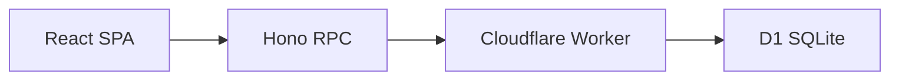
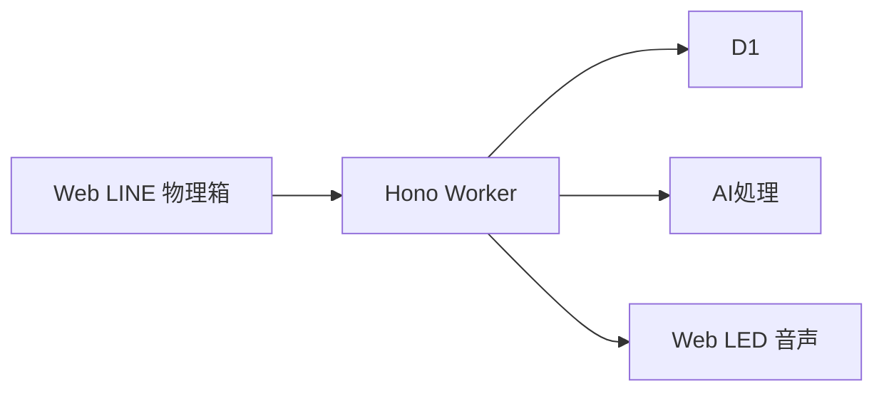

# 目安箱 要件定義書

## 1. 文書の位置づけ

この文書は、58ハッカソンで開発する「目安箱（仮）」の目的、利用体験、実装範囲、技術要件、受け入れ条件を定める。実装時はこの文書を基準にし、アイデアの追加や変更が発生した場合は、対象範囲と優先度を更新する。

### 優先度の定義

| 区分 | 意味 |
| --- | --- |
| MVP | ハッカソンの成果物として必ず動作させる機能 |
| デモ目標 | MVPに加えて、審査員へ価値と技術的な工夫を伝えるために実装する機能 |
| 拡張 | ハッカソン後に実装する機能。デモに含めない |
| 対象外 | 今回は要件として扱わない機能 |

### 現在のリポジトリとの差分

現時点のリポジトリは開発基盤の初期状態であり、プロダクト機能はまだ実装されていない。現在動作する機能は、次の構成による `GET /health` とフロントエンドの接続確認である。

- フロントエンド: React 19、Vite、TypeScript、Cloudflare Pages 想定
- バックエンド: Hono、Cloudflare Workers、TypeScript
- データベース: Cloudflare D1、Drizzle ORM
- API連携: `frontend` から `backend` の `AppType` を参照する Hono RPC
- テスト: Vitest と `@cloudflare/vitest-pool-workers` によるバックエンドテスト
- CI: バックエンドとフロントエンドの lint / build / test

この文書に書かれた投稿、閲覧、リアクション、クラスタリング、クイズ、LINE連携、物理デバイス連携は、明記されていない限り今後実装する機能である。

## 2. プロジェクト概要

### アプリ名

目安箱（仮）

### 解決したい課題

人は、普段関わる人や所属コミュニティの外にいる人の悩みを知る機会が少ない。また、自分から発信することが苦手な人や、文字入力・スマートフォン操作が難しい人は、悩みを他人へ伝える入口を持ちにくい。

### 開発目的

匿名で寄せられた悩みを、年齢や所属コミュニティを越えて知る機会を作る。投稿する入口と、悩みを知る入口を複数用意し、発信が得意でない人も参加できる状態を目指す。

### 中心となる価値

投稿者が「自分の悩みを知ってもらえた」と感じ、閲覧者が「自分とは異なる立場の人の悩みを考えることができた」と感じることを価値とする。単に投稿を一覧表示するのではなく、意味の近い悩みをまとめ、地域や属性の違いを意識しながら次に読む悩みを提示する。

### インクルーシブとの関係

インクルーシブを、全員に同じUIを使わせることではなく、参加方法を一つに限定しないこととして扱う。

- 文章を入力できる人はWeb画面から投稿する
- LINEなど普段使っているサービスを使いたい人は、将来的にLINEから投稿する
- 話して伝えたい人は、将来的に音声入力を使う
- 紙で匿名投稿したい人は、将来的に物理的な目安箱を使う
- 画面を見ることが難しい人には、読み上げや大きな文字などの選択肢を提供する

## 3. 対象ユーザーと利用場面

### 想定ユーザー

- 年齢、性別、職業、障害の有無を問わず、身近な悩みを匿名で共有したい人
- 自分の周囲にはいない人の悩みを知りたい人
- 学校、会社、自治体など、同じ地域や組織内の課題を把握したい運営者

### 主な利用場面

1. 一人で過ごしているときに、短い悩みを投稿する
2. 休憩時間などに、他人の悩みを数件読む
3. 自分と異なる年齢、性別、地域の悩みをクイズ形式で考える
4. 物理的な目安箱やLINEから投稿し、Web上で集計結果を見る
5. 一定期間に多く寄せられた悩みを、箱のLEDや音声で知る

### 利用しない前提

- 実名で相手を探すためのSNSとしては利用しない
- 個人への返信や、投稿者を特定するための機能は提供しない
- 医療、法律、緊急通報などの専門相談窓口の代替にはしない

## 4. スコープとリリース段階

### MVP

MVPでは、Webブラウザだけで匿名の投稿と閲覧が完結する状態を必須とする。

1. Web画面を開く
2. 匿名セッションで投稿する
3. D1に投稿を保存する
4. 投稿一覧から他人の悩みを読む
5. 読んだ悩みにリアクションする
6. 不正な入力や通信失敗を画面に表示する
7. モバイル幅とキーボード操作に対応する

### デモ目標

MVPが安定した後、次の機能を優先してデモへ追加する。すべてを実装できない場合は、上から順に優先する。

1. 意味の近い悩みをクラスタリングし、「同じことで困っている人がいる」ことを表示する
2. クラスタや未読履歴を使い、次に読む悩みをレコメンドする
3. 実際の悩み1件とAIが生成した悩み3件を使った4択クイズをWeb上で体験できるようにする
4. クラスタの投稿数をLEDや音声で物理的な目安箱から知らせる

### 拡張

- LINE公式アカウントまたはLINEミニアプリからの投稿、閲覧、クイズ配信
- LINE Loginなどによるログインと、ユーザー単位の学習履歴
- 音声入力、読み上げ、英語翻訳、ひらがな表示
- 紙の投稿を取り込む入力端末
- GPSやユーザーが選択した地域情報を使った地域別表示
- 投稿を読んで得た新しい知見を、タグや履歴で可視化する機能
- 複数の目安箱を同じイベント基盤へ接続する機能

### 対象外

今回のハッカソンでは、次の機能を完成条件に含めない。

- 正確な住所やリアルタイム位置の保存
- 投稿者の氏名、電話番号、SNSアカウントなどの表示
- 投稿者同士の個別メッセージ
- 専門家による相談への回答
- 大規模サービス向けの推薦精度保証
- LINE、音声、翻訳、紙入力をすべて同時に完成させること

## 5. ユースケース

### UC-01 悩みを投稿する

1. ユーザーが投稿画面を開く
2. 悩み本文を入力する
3. 任意で年代、性別、地域を選択する
4. 匿名投稿であることと、緊急相談窓口ではないことを確認する
5. 投稿する
6. 投稿が保存されたことを表示する
7. AI処理がある場合は、クラスタリングが非同期で進むことを表示する

本文が空、長すぎる、禁止された形式である場合は保存しない。属性を入力しない場合も投稿できる。

### UC-02 他人の悩みを読む

1. ユーザーがフィードを開く
2. 投稿カードから悩み本文と、表示可能な範囲の属性を見る
3. 次の投稿へ移動する
4. 必要に応じて、クラスタやテーマで絞り込む

投稿者を特定できる情報は表示しない。正確な投稿時刻ではなく、日付または経過時間などの粗い情報を基本とする。

### UC-03 悩みにリアクションする

1. ユーザーが投稿カードのリアクション操作を選ぶ
2. 1セッションにつき1投稿1回までリアクションを登録する
3. 投稿カードの集計数を更新する
4. 同じ操作を繰り返した場合は二重加算しない

リアクションは返信ではなく、「読んだ」「考えた」「共感した」ことを示す集計情報として扱う。ボタン名は実装前に一つに決め、画面全体で統一する。

### UC-04 次に読む悩みを推薦する

匿名ユーザーには、直近の投稿、未読投稿、テーマの分散を組み合わせたフィードを返す。ログインユーザーへの個人別推薦は拡張扱いとし、MVPでは実装しない。

推薦結果には、同じクラスタだけが連続しないようにする。AI処理が利用できない場合は、時系列とランダム性を使ったフォールバックへ切り替える。

### UC-05 他人の悩みをクイズで考える

1. その日のクイズを開く
2. 年代、性別、地域などの属性と4つの選択肢を見る
3. 本当の投稿だと思う選択肢を一つ選ぶ
4. 正解と、なぜその悩みを取り上げたかを見る
5. 回答結果を集計する

4つの選択肢は、実際の投稿1件とAI生成3件で構成する。AI生成の文章は、回答後に生成物であることを明示する。実在しない悩みを実在する投稿として誤認させない。

LINEからの毎日配信は拡張機能とし、デモではWeb画面から同じ体験を提供できればよい。

### UC-06 物理的な目安箱と連携する

物理デバイスは、投稿入力と集計結果の出力を担当する。デバイス固有の処理をバックエンドへ持ち込まず、次のイベント境界で連携する。

- 入力イベント: `inputMethod=paper|voice|nfc` と本文または処理済みテキストを送る
- 出力イベント: クラスタの投稿数、質問文、LEDの明るさ、音声文などを受け取る

MVPではWeb投稿のみを実装し、物理デバイス連携はデモ目標とする。

## 6. 画面要件

### 画面一覧

| 画面 | 優先度 | 目的 |
| --- | --- | --- |
| フィード | MVP | 他人の悩みを読む |
| 投稿フォーム | MVP | 匿名で悩みを投稿する |
| 投稿詳細またはカード展開 | MVP | 本文、属性、リアクションを確認する |
| クイズ | デモ目標 | 他人の悩みを考える |
| 学習履歴 | 拡張 | 読んだテーマや得た知見を確認する |
| 管理画面 | 拡張 | 不適切な投稿やクラスタを確認する |

### フィード

- 投稿本文
- 年代、性別、地域のうち投稿者が公開を選択したもの
- クラスタ名またはテーマ。処理中は表示しない
- 投稿日時の粗い表示
- リアクションボタンと集計数
- 次の投稿へ進む操作
- 読み込み中、空データ、通信失敗の表示

### 投稿フォーム

- 本文入力欄
- 年代の任意選択
- 性別の任意選択。回答しない選択肢を必ず用意する
- 地域の任意選択。都道府県または広域区分までとし、住所は入力させない
- 匿名投稿であることの説明
- 投稿ボタン
- 入力エラーと送信中の状態

### クイズ

- クイズ対象者の属性
- 4つの選択肢
- 回答ボタン
- 回答済み状態
- 正解、実際の投稿、AI生成文章の説明

### 共通のUI要件

- スマートフォン幅を優先し、PC幅でも崩れない
- 文字サイズをブラウザ設定で拡大しても操作できる
- 色だけで状態を伝えない
- すべての入力欄とボタンにラベルまたは読み上げ可能な名前を付ける
- キーボードだけで投稿、閲覧、リアクションまで操作できる
- 投稿本文は、長文でもカードからはみ出さず折り返す
- API処理中は二重送信を防ぐ

## 7. 機能要件

### 投稿管理

- 投稿を作成、取得、非表示化できる
- 本文は前後の空白を除去して保存する
- 投稿本文の長さをサーバー側で検証する
- 入力経路を `web`、`line`、`paper`、`voice`、`nfc` のいずれかで記録する
- 投稿者が未ログインでも投稿できる
- 削除済み、非公開、処理失敗の投稿を一般フィードに表示しない

### 閲覧と推薦

- 新着フィードを取得できる
- カーソルを使って次の投稿を取得できる
- 投稿を既読として記録できる
- 未読、テーマ分散、投稿の新しさを使って匿名フィードを生成する
- 推薦処理が失敗した場合も、新着順で閲覧を継続できる

### リアクション

- 投稿ごとにリアクションを登録できる
- 同一セッションからの重複登録を防ぐ
- 集計数を取得できる
- 削除済み投稿へのリアクションを受け付けない

### クラスタリング

- 投稿保存とクラスタリングを分離する
- クラスタリング中の投稿は、投稿そのものを先に閲覧できる
- クラスタリング成功時はクラスタ識別子と表示用ラベルを保存する
- AIが利用できない場合は、未分類として扱い投稿を失わない
- AIの出力をそのまま画面に表示せず、長さ・禁止語・個人情報を検査する

### クイズ

- 1日分のクイズを取得できる
- 4つの選択肢を表示できる
- 同じユーザーまたは匿名セッションの回答を二重集計しない
- 実際の投稿とAI生成文章をデータ上で区別する
- クイズの元となった投稿を削除した場合、クイズを非公開にできる

### 管理とモデレーション

ハッカソンのMVPでは管理画面を作らない。ただし、公開フィードへ出す前に最低限の状態管理を持つ。

- `pending`、`published`、`hidden`、`deleted` を区別する
- 明らかな個人情報、攻撃的な内容、緊急性の高い相談を自動判定または手動確認の対象にする
- 判定できない投稿は削除せず、公開保留にできる
- 緊急相談が必要な場合は、専門窓口へ誘導する文言を表示する

## 8. API要件

### 共通仕様

- APIはJSONを利用する
- APIのルートは `/api/v1` とする
- 既存の `GET /health` は運用監視用として維持する
- ブラウザからのAPI URLは `VITE_API_BASE_URL` で設定する
- 本番環境のCORS許可元は `CORS_ORIGIN` で明示する
- Hono RPCでリクエストとレスポンスの型をフロントエンドへ共有する
- エラーは `code`、`message`、`requestId` を含む形式に統一する

### MVPとデモ目標のエンドポイント

| Method | Path | 優先度 | 認証 | 用途 |
| --- | --- | --- | --- | --- |
| GET | `/health` | 現在実装済み | 不要 | WorkerとD1の疎通確認 |
| POST | `/api/v1/concerns` | MVP | 匿名可 | 悩みを投稿する |
| GET | `/api/v1/concerns` | MVP | 匿名可 | 悩みを新着または推薦順で取得する |
| GET | `/api/v1/concerns/:id` | MVP | 匿名可 | 悩みの詳細を取得する |
| POST | `/api/v1/concerns/:id/reactions` | MVP | 匿名可 | リアクションを登録する |
| POST | `/api/v1/concerns/:id/views` | MVP | 匿名可 | 既読を記録する |
| GET | `/api/v1/clusters` | デモ目標 | 匿名可 | クラスタと投稿数を取得する |
| GET | `/api/v1/quiz/today` | デモ目標 | 匿名可 | その日のクイズを取得する |
| POST | `/api/v1/quiz/answers` | デモ目標 | 匿名可 | クイズ回答を登録する |
| POST | `/api/v1/ingestion/events` | 拡張 | デバイス認証 | LINEや物理デバイスから投稿を受け取る |
| POST | `/api/v1/webhooks/line` | 拡張 | LINE署名 | LINE webhookを受け取る |

### 投稿リクエストの例

```json
{
  "body": "食堂が混んでいて、昼休みにゆっくり食べられない",
  "ageGroup": "20s",
  "gender": "回答しない",
  "region": "大阪府",
  "inputMethod": "web"
}
```

`ageGroup`、`gender`、`region`、`inputMethod` は任意とする。正確な年齢、住所、緯度経度は受け付けない。

### 投稿レスポンスの例

```json
{
  "id": "concern_01J...",
  "body": "食堂が混んでいて、昼休みにゆっくり食べられない",
  "ageGroup": "20s",
  "gender": "回答しない",
  "region": "大阪府",
  "inputMethod": "web",
  "cluster": null,
  "reactionCount": 0,
  "createdAt": "2026-09-20T10:00:00.000Z",
  "processingStatus": "pending"
}
```

### HTTPステータス

| Status | 用途 |
| --- | --- |
| 200 | 取得または更新に成功 |
| 201 | 投稿やリアクションの作成に成功 |
| 400 | 入力形式または値が不正 |
| 401 | 将来のログイン認証に失敗 |
| 403 | 管理操作またはWebhook認証に失敗 |
| 404 | 対象の投稿やクイズが存在しない |
| 409 | 重複登録や状態の競合 |
| 429 | 短時間の過剰な投稿や操作 |
| 500 | 想定外のサーバーエラー |
| 503 | AIや外部サービスが利用できないが、再試行可能 |

## 9. データ要件

### エンティティ

| エンティティ | 主な項目 | 用途 |
| --- | --- | --- |
| `concerns` | id、本文、入力経路、属性、公開状態、処理状態、日時 | 悩み本体 |
| `concern_clusters` | id、表示ラベル、要約、状態、日時 | 意味の近い悩みのまとまり |
| `concern_reactions` | concern_id、actor_key、種類、日時 | リアクションの重複防止と集計 |
| `concern_views` | concern_id、actor_key、日時 | 既読と推薦に利用 |
| `anonymous_sessions` | actor_key、作成日時、失効日時 | 匿名利用者を一時的に識別 |
| `quizzes` | id、対象日、正解の投稿ID、状態 | デイリークイズ |
| `quiz_options` | quiz_id、本文、実投稿かAI生成か | 4つの選択肢 |
| `quiz_answers` | quiz_id、actor_key、選択肢、日時 | 回答の集計 |
| `users` | id、認証方式、外部subject、日時 | LINE Loginなどの拡張用 |

### 投稿の状態

投稿は、保存状態とAI処理状態を分けて持つ。

- 公開状態: `pending`、`published`、`hidden`、`deleted`
- AI処理状態: `not_started`、`processing`、`ready`、`failed`

投稿の保存が成功した後にAI処理が失敗しても、投稿は失わず、未分類の投稿として閲覧できるようにする。

### 属性の扱い

- 年齢は年代などの広い区分で保存し、正確な年齢を保存しない
- 性別は任意入力とし、回答しない選択肢を用意する
- 地域はユーザーが選択した都道府県または広域区分のみを保存する
- IPアドレスを生データとして保存しない
- IPから地域を推定する場合も、推定後すぐに破棄し、推定結果の精度を保証しない

### 保存、削除、匿名化

- 投稿本文、属性、リアクションはデモ期間中に必要な範囲で保存する
- 匿名セッションには有効期限を設定する
- ユーザーが削除を要求した投稿は公開対象から直ちに除外する
- 生の音声、画像、IPアドレス、LINEアクセストークンはMVPで保存しない
- ハッカソン後に運用する場合は、保存期間、削除方法、問い合わせ窓口を別途定める

## 10. システム構成

### 現在の構成



### デモ目標の構成



### バックエンドの責務

既存のレイヤー分割を維持し、機能追加時も依存方向を崩さない。

- `presentation`: HTTPリクエスト、レスポンス、入力検証
- `application`: 投稿、閲覧、推薦、クラスタリング依頼などのユースケース
- `application/entity`: アプリケーションで扱うモデル
- `application/*.repository.ts`: 永続化や外部サービスのPort
- `infrastructure`: D1、Drizzle、AI、LINE、デバイスのAdapter
- `bootstrap/container.ts`: 依存関係の組み立て
- `app`: Honoアプリ、共通middleware、エラーハンドラー

リクエストごとにRepositoryやUseCaseを生成せず、現在のComposition Rootの方針を踏襲する。

### 非同期処理

投稿の保存は、AI処理や外部通知の成否に依存させない。少なくとも次の順序を守る。

1. 入力を検証する
2. 投稿をD1へ保存する
3. 投稿者へ保存成功を返す
4. クラスタリング、要約、通知を非同期で処理する
5. 完了または失敗した状態を保存する

ハッカソンでは小規模な非同期処理で実装してよいが、AIサービスの待ち時間で投稿APIがタイムアウトしないことを受け入れ条件とする。

### デプロイ

- バックエンドはCloudflare Workersへデプロイする
- データベースはCloudflare D1を利用する
- フロントエンドはCloudflare Pagesを第一候補とする
- D1のマイグレーションを適用してからWorkerをデプロイする
- 本番用D1の識別子やAPIトークンをリポジトリへ保存しない
- 現在はバックエンドのデプロイワークフローがある。フロントエンドの自動デプロイは未整備であり、必要になった時点で追加する

## 11. 非機能要件

### 性能

- フィード取得は、AI処理を待たずに通常時2秒以内で画面へ返す
- 投稿受付は、AI処理を待たずに通常時2秒以内で保存結果を返す
- クラスタリングや要約は結果が遅れても投稿閲覧を妨げない
- ハッカソンデモでは、同時100ユーザー程度を想定する

### 可用性と障害時の挙動

- D1やWorkerが一時的に失敗した場合は、再試行可能なエラーを表示する
- AIサービス停止時は、投稿を保存して未分類で表示する
- LINEや物理デバイスが停止しても、Web投稿とWeb閲覧は継続する
- 外部サービスの障害を理由に、投稿本文を再送し続けない

### セキュリティ

- 本文、属性、クイズ回答をサーバー側でも検証する
- 本番CORSは許可するフロントエンドのoriginに限定する
- APIキー、LINE秘密情報、Cloudflareトークンをフロントエンドへ含めない
- 投稿、リアクション、クイズ回答には過剰利用を抑止する仕組みを設ける
- ログへ投稿本文、IPアドレス、アクセストークンを出力しない
- Webhookは署名検証またはデバイス用の認証情報で保護する

### アクセシビリティ

- キーボード操作だけで主要フローを完了できる
- スクリーンリーダーが入力欄、ボタン、エラーを認識できる
- 文字サイズ変更時に本文と操作部品が重ならない
- 色、音、アニメーションのいずれか一つに依存せず状態を伝える
- AI生成文、匿名属性、集計値を短く分かりやすい日本語で表示する

## 12. エラー、プライバシー、コンテンツ安全性

### エラー表示

ユーザーには原因を推測できる短い日本語を表示し、内部のスタックトレースや外部サービスの詳細を表示しない。

- 入力エラー: どの項目を直すか表示する
- 通信エラー: 再試行ボタンを表示する
- AI処理中: 投稿は保存済みで、分類を後から更新することを表示する
- AI処理失敗: 投稿は未分類のまま閲覧できることを表示する
- 429: 時間を置いて再試行するよう案内する

### プライバシー

- 匿名投稿であっても、投稿内容から本人が推測される可能性を説明する
- 年代、性別、地域は任意入力にする
- 正確な位置情報を扱わない
- 投稿本文をAIサービスへ送る場合は、送信目的と送信先をチーム内で確認する
- 公開前に、氏名、連絡先、住所などを含む投稿を検出または保留する

### 緊急性の高い投稿

自殺、虐待、犯罪、医療上の緊急事態などに対して、アプリ内で対応を約束しない。検出した場合は、地域の相談窓口や緊急通報を案内し、必要なら公開保留にする。ハッカソンのデモデータには、実在の個人が特定できる内容を使わない。

## 13. テスト要件と受け入れ条件

### 自動テスト

- Application層のユースケースを、D1に依存しないFakeで単体テストする
- APIの正常系、入力エラー、404、重複リアクションをテストする
- D1マイグレーションを適用したローカル環境でRepositoryをテストする
- フロントエンドはlintとbuildをCIで実行する
- Hono RPCの型変更時は、バックエンドとフロントエンドを同時にbuildする
- E2Eテスト基盤は現状存在しないため、MVPでは手動の受け入れ確認を必須とし、余裕があればPlaywrightなどを追加する

### MVPの受け入れ条件

- [ ] 未ログインのユーザーが投稿できる
- [ ] 投稿した内容が、別のブラウザまたは別セッションのフィードに表示される
- [ ] 空本文、長すぎる本文、不正な属性をサーバーが拒否する
- [ ] 投稿へリアクションでき、同じセッションで二重加算されない
- [ ] APIまたはD1が失敗した場合に、画面が無限に待機しない
- [ ] スマートフォン幅で投稿から閲覧まで操作できる
- [ ] キーボード操作とスクリーンリーダーで主要な入力項目を確認できる
- [ ] `pnpm lint`、`pnpm build`、バックエンドのテストが成功する

### デモ目標の受け入れ条件

- [ ] 似た悩みが同じクラスタへまとめられる
- [ ] クラスタリングが失敗しても投稿閲覧が継続できる
- [ ] 推薦理由または表示テーマをユーザーが理解できる
- [ ] 4択クイズで、実投稿とAI生成文章を混同させない
- [ ] 物理デバイスを使う場合、デバイス停止時もWeb機能が動作する

## 14. 開発・運用要件

### ローカル開発

```bash
pnpm install
make db-migrate
make dev
```

バックエンドは `http://localhost:8787`、フロントエンドは `http://localhost:5173` を利用する。D1はWranglerのローカル環境を使い、独立したDBサーバーを起動しない。

### 環境変数と秘密情報

| 変数 | 用途 | 配置 |
| --- | --- | --- |
| `VITE_API_BASE_URL` | フロントエンドが接続するAPI URL | フロントエンドの環境設定 |
| `CORS_ORIGIN` | APIが許可するフロントエンドorigin | Worker環境変数 |
| `CLOUDFLARE_API_TOKEN` | D1マイグレーションとWorkerデプロイ | GitHub Secret |
| `CLOUDFLARE_ACCOUNT_ID` | Cloudflareアカウント識別子 | GitHub Secretまたは環境設定 |
| AIサービスのAPIキー | クラスタリングや生成 | Worker環境変数またはSecret |
| LINEの秘密情報 | LINE連携 | Worker環境変数またはSecret |

### CIとPR

- PRでは、変更したパッケージに応じてlint、build、testを実行する
- D1スキーマを変更した場合はDrizzleのmigrationを同じ変更に含める
- API仕様を変更した場合は、バックエンドとフロントエンドの型検査を同時に行う
- mainへ直接pushせず、機能単位のブランチとPRを使う
- PR本文には変更内容、確認したコマンド、未実装の前提を記載する

### ログと監視

- `/health` でWorkerとD1の疎通を確認する
- リクエストのメソッド、パス、ステータス、処理時間を構造化ログへ記録する
- 投稿本文、属性、IPアドレス、トークンはログへ含めない
- AI処理の成功数、失敗数、処理時間を本文なしで確認できるようにする

### コスト

ハッカソン期間は無料枠または低額で動作する構成を優先する。AI呼び出しは投稿ごとに無制限に実行せず、クラスタ単位、バッチ単位、またはデモ用データ単位で回数を制限する。課金が発生する外部サービスを採用する場合は、利用量の上限と停止方法をREADMEへ記載する。

## 15. デモシナリオ

1. 画面を開き、匿名で利用できることを示す
2. ユーザーAが「食堂が混んでいて昼休みに休めない」という悩みを投稿する
3. ユーザーBが別セッションからフィードを開き、投稿と年代・地域の表示を見る
4. 意味の近い投稿が同じクラスタに集まり、「同じことで困っている人がいる」と表示される
5. ユーザーBがリアクションし、集計数が更新される
6. クイズ画面で、異なる年代や地域の悩みを4択から考える
7. 可能であれば、クラスタの増加を物理目安箱のLEDまたは音声で知らせる
8. AIが停止しても投稿と閲覧が続くフォールバックを示す

デモでは実在の個人情報を使わず、事前に用意した匿名のサンプルデータを利用する。

## 16. 審査基準との対応

| 審査基準 | 要件との対応 |
| --- | --- |
| 完成度 40点 | MVPの投稿、閲覧、リアクション、エラー処理をデモ中に安定して動かす |
| WOW度 30点 | 意味によるクラスタリング、推薦、4択クイズ、物理目安箱のいずれかを組み合わせる |
| チームワーク 20点 | API仕様、データモデル、PR運用、受け入れ条件を文書化し、担当境界を明確にする |
| 挑戦・成長 10点 | Cloudflare Workers、D1、Hono RPC、AI処理、ハードウェアなど、チームが選んだ新しい技術を説明できるようにする |

## 17. 重要な設計判断

現時点では、次の方針を実装上の前提とする。

1. MVPの入口はWebに限定し、LINEや物理箱がなくても価値を体験できるようにする
2. ログインを必須にせず、匿名セッションを基本とする
3. 投稿保存とAI処理を分離し、AI障害で投稿を失わないようにする
4. 正確な位置情報と生IPを保存しない
5. クラスタリングや推薦は、失敗時に新着順へ戻れるようにする
6. D1のテーブル、Drizzle schema、migrationを同じ変更単位で管理する
7. 現在のHono、Workers、D1、Hono RPCの構成を維持し、必要な外部機能はPortとAdapterに分離する

## 18. 実装前に決める事項

以下は要件の骨格ではなく、デモ実装開始前にチームで決める具体的な選択肢である。

- 正式なアプリ名と、画面で使う「悩み」「困りごと」などの用語
- リアクションの名称と種類。MVPでは一種類にするか
- AIサービスの提供元、送信する本文、利用量の上限
- クラスタリングをリアルタイム、遅延処理、事前生成のどれで行うか
- 物理目安箱を実装する場合のマイコン、LED、スピーカー、通信方式
- LINE連携をデモへ含めるか。含める場合のチャネルとWebhook設定
- ハッカソン終了後の投稿保存期間と削除窓口

## 19. 実装ロードマップ

### Phase 0 開発基盤

- 投稿、リアクション、既読を表すD1 schemaとmigrationを追加する
- Application、Infrastructure、Presentationのレイヤーを既存のHealth機能と同じ方針で追加する
- Hono RPCでAPI型を共有する
- 投稿APIの単体テストとAPIテストを追加する

### Phase 1 MVP

- Webの投稿フォームを作る
- 匿名セッションを導入する
- フィードと投稿カードを作る
- リアクションと入力エラーを実装する
- モバイル表示とキーボード操作を確認する

### Phase 2 デモ目標

- クラスタリングAdapterと非同期処理を追加する
- クラスタ表示と推薦フィードを追加する
- 4択クイズを追加する
- デモデータとデモ当日のリセット手順を用意する

### Phase 3 拡張

- LINE、音声、紙、NFC、物理箱の入口を共通イベントへ接続する
- ログインと学習履歴を追加する
- 管理画面と継続運用の監視・削除フローを追加する
