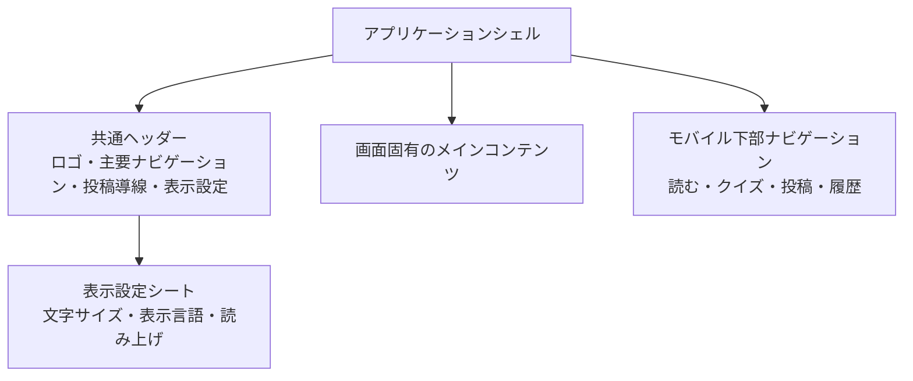
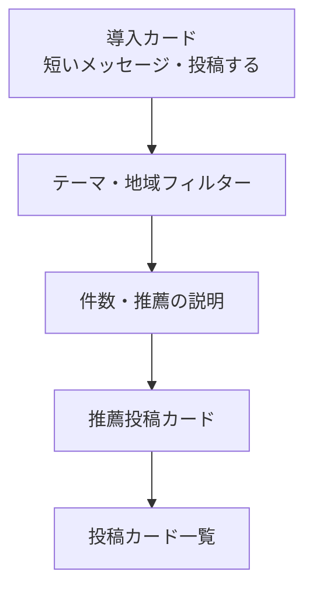
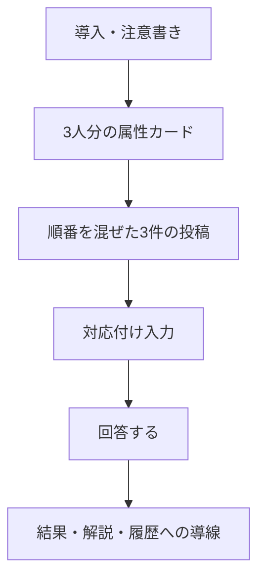

# 目安箱 画面詳細設計

## 目的と前提

この文書は、[画面設計](./screens.md) に定義した画面を、デザインと実装の両方で迷いなく作れる粒度まで具体化する。アプリは、悩みを短時間で匿名投稿でき、他人の言葉を落ち着いて読めることを最優先とする。

- 1画面につき、主要な行動は1つに絞る。
- 投稿者を特定できる情報、返信、フォロー、共有の導線は置かない。
- 画面幅は360pxから崩れない1カラムを基準とし、本文と操作を同じ幅にそろえる。
- 色だけで状態を伝えず、文章、アイコン、ボタン状態を組み合わせる。
- 投稿、リアクション、クイズ回答などの送信中は、二重送信できない状態にする。

## 共通レイアウト

| 要素 | デスクトップ | モバイル |
| --- | --- | --- |
| コンテンツ幅 | 最大720px、画面中央 | 左右16〜20pxの余白を持つ1カラム |
| ヘッダー | ロゴ、読む・クイズ・履歴、投稿ボタン、表示設定 | ロゴ、表示設定。主要導線は下部ナビゲーションへ |
| 主要アクション | 見出しや入力欄の直後に配置 | 親指で押しやすい幅・高さを確保し、画面下部に近づける |
| 言語・読み上げ | 投稿詳細の本文付近に表示 | 同じ位置に折り返して表示。設定シートからも変更可能 |

共通ヘッダーの「投稿する」とモバイル下部ナビゲーションの「投稿」は、常に投稿フォームへ遷移する。フィード、クイズ、履歴の現在地は、文字と選択状態の両方で示す。

## フィード `/`

### 目的

他人の悩みを一つずつ読み、「自分とは異なる立場の人がいる」ことを知る入口にする。最初の画面で情報を詰め込みすぎず、投稿を読む行動と投稿する行動を両立させる。

### レイアウトと表示項目

| 領域 | 内容 | 操作 |
| --- | --- | --- |
| 導入カード | 「誰かの見え方を知る」短い説明と投稿ボタン | 投稿フォームへ進む |
| フィルター | テーマ、地域。選択中の条件を明示する | フィードを絞り込む。解除は「すべて」で行う |
| フィード情報 | 表示件数、推薦理由またはテーマ | 説明のみ。推薦理由は短く具体的にする |
| 投稿カード | 本文の先頭、テーマ、公開属性、粗い日時、リアクション数 | カード本文で詳細へ進む。リアクションはカード内で完結する |
| 最初のカード | 「今のあなたに、まず読んでほしい声」などの推薦理由 | 他のカードと同じ操作を提供する |

投稿本文は一覧で3〜5行を目安に表示し、長文は省略記号と詳細への導線を付ける。年代・地域は、投稿者が公開を選んだ場合だけ表示する。性別は一覧の標準表示に含めない。

### 状態と例外

| 状態 | 表示 | 次の行動 |
| --- | --- | --- |
| 読み込み中 | 投稿カードと同じ大きさのスケルトンを3件表示する | 操作不要 |
| 投稿なし | 「まだ声が届いていません」と表示する | 投稿する、またはフィルターを解除する |
| 絞り込み結果なし | 選択中の条件を表示する | 条件を解除する |
| 取得失敗 | 「読み込めませんでした」と理由を短く示す | 再試行する |
| AI処理中 | 投稿本文は表示し、テーマ・翻訳には「準備中」と表示する | そのまま読む |

### アクセシビリティ

- 投稿カード全体をリンク相当の操作にせず、本文を読むボタンとリアクションボタンを分離する。
- リアクション後は「考えた。現在18件」のようにスクリーンリーダーへ結果を通知する。
- フィルターは選択中の状態を `aria-pressed` などで伝える。

## 投稿フォーム `/post`

### 目的

投稿の心理的負担を下げ、匿名性と安全上の注意を理解したうえで、本文を確実に送信できるようにする。

### レイアウトと表示項目

| 順序 | 領域 | 詳細 |
| --- | --- | --- |
| 1 | 導入文 | 「うまくまとまっていなくても大丈夫」と短く伝える |
| 2 | 本文入力 | 必須。最大文字数、入力済み文字数、例文を表示する |
| 3 | 音声入力 | デモ必須。録音開始、文字起こし中、結果の確認・編集を同じ領域で扱う |
| 4 | 任意属性 | 年代、性別、地域。各項目に「回答しない」または「選択しない」を置く |
| 5 | 匿名・安全の注意 | 氏名、連絡先、住所を書かないこと、緊急相談窓口の代替でないことを示す |
| 6 | 投稿ボタン | 「匿名で投稿する」。送信中は文言を「投稿しています…」へ変え、無効化する |

性別の選択肢は「女性」「男性」「ノンバイナリー」「回答しない」を基本とし、利用者を分類するためではなく、本人が公開を選びたい場合だけ使う。地域は都道府県または広域区分までとし、住所の自由入力欄は作らない。

### 入力検証と送信結果

| 条件 | 画面上の扱い |
| --- | --- |
| 本文が空白のみ | 入力欄の直下に「悩みをひとこと入力してください」と表示し、入力欄へフォーカスする |
| 文字数超過 | 入力中に残り文字数を示し、送信時は理由を明示する |
| 属性が不正 | 対象の選択欄の直下にエラーを表示する |
| 送信成功 | 完了状態に切り替え、「置いていってくれて、ありがとう」と表示する。フィードへ戻る導線を置く |
| 通信失敗 | 入力内容を保持し、「もう一度投稿する」ボタンを表示する |
| 外部処理失敗 | 投稿保存の成功を優先して知らせ、翻訳・クラスタリングは後から反映されると説明する |

## 投稿詳細 `/concerns/:id`

### 目的

一つの悩みを急かさず読めるようにし、言語・文字の読みやすさを選び、返信ではない静かなリアクションを残せるようにする。

### レイアウトと表示項目

| 領域 | 内容 | 操作 |
| --- | --- | --- |
| 戻る導線 | 「フィードに戻る」 | 直前のフィード状態へ戻る |
| 投稿情報 | テーマ、粗い日時、公開属性 | 属性は公開済みのものだけ表示する |
| 本文 | 選択中の言語の全文 | 長文も省略しない |
| 表示ツール | 原文・ひらがな・英語、読み上げ | 選択状態を明示する。読み上げの停止も可能にする |
| リアクション | 「考えた」など一種類のリアクションと件数 | 1匿名セッションにつき1回。済みの場合は選択済みを表示する |
| 次の導線 | 「次の声を読む」 | フィードまたは次の推薦投稿へ進む |

翻訳・ひらがな表示が未生成または失敗した場合は、その選択肢を無効にせず「現在は原文を表示しています」と本文の近くに表示する。投稿が非公開・削除済みの場合は本文を出さず、「この投稿は現在読めません」とフィードへ戻る導線だけを表示する。

## 今日のクイズ `/quiz/today`

### 目的

属性だけで人を決めつけず、実際の投稿を丁寧に読む体験を作る。正答を競う画面ではなく、違う立場への想像を促す画面にする。

### レイアウトと表示項目

| 領域 | 詳細 |
| --- | --- |
| 導入 | 「属性だけでは決めつけられない」ことを一文で伝える |
| 参加者 | A〜Cの匿名ラベル、年代、性別、地域を表示する。個人を再特定できる情報は出さない |
| 投稿 | 3件の実投稿をランダム順で表示する。原文・ひらがな・英語の切替を提供する |
| 回答 | 各参加者に対応する投稿を選ぶ。重複選択した場合は送信前に分かるようにする |
| 結果 | 正解の対応、解説、回答済み状態を同一画面で表示する |

回答前は正解を示す色を使わない。回答後は、正誤だけで終わらせず「言葉を読んだことで見えたこと」を説明する。すでに回答済みの場合は選択肢を変更できない状態で結果を表示する。

## 学習履歴 `/history`

### 目的

既読数の競争ではなく、自分がどのような声に触れたかを穏やかに振り返る画面にする。

### レイアウトと表示項目

| 領域 | 詳細 |
| --- | --- |
| 要約 | 今週読んだ投稿数、出会った地域数、クイズ回答数を3項目以内で表示する |
| 傾向 | 読んだテーマ、地域、公開属性の傾向を、短い文章とラベルで表示する |
| クイズ履歴 | 回答日、正答数、クイズへの再訪導線を表示する |
| 次の提案 | まだ読んでいないテーマ・地域を一つだけ提示し、フィードへ戻る導線を置く |

匿名セッションの有効期限が切れた場合は、履歴を空の状態として表示する。「この端末での記録は終了しました」と説明し、フィードへ戻る導線を提供する。LINEユーザーでも、LINE user IDなどの識別子は表示しない。

## 共通設定と画面状態

### 表示設定シート

表示設定は独立ページではなく、ヘッダーから開くモーダルまたはボトムシートとする。

| 設定 | 選択肢 | 挙動 |
| --- | --- | --- |
| 文字サイズ | 標準・大きく表示 | 本文、ボタン、フォームを同時に拡大し、横スクロールを発生させない |
| 表示言語 | 原文・ひらがな・英語 | 投稿詳細、フィード、クイズへ反映する |
| 読み上げ | 開始・停止 | 現在開いている投稿本文だけを読み上げる |

モーダルまたはボトムシートを開いている間は、キーボードフォーカスを設定内に閉じ、閉じた後は開いたボタンへ戻す。

### エラーと通知

- エラー文は、何が起きたかと次にできることを短い日本語で示す。内部エラーや外部サービス名は表示しない。
- 成功・失敗・リアクション数の更新は、視覚表示に加えて `aria-live` で通知する。
- 通信失敗時に入力内容やクイズの選択内容を失わない。
- ローディング中は操作対象のボタンを無効化し、進行中であることをボタン文言でも示す。
