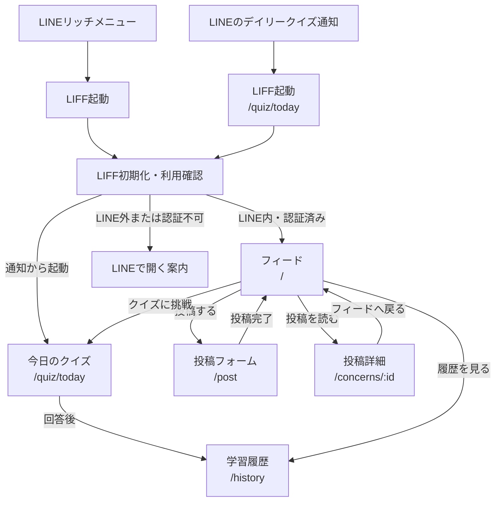

# 目安箱 画面設計

## 前提

すべての利用者は、LINEミニアプリ（LIFF）から目安箱を開く。通常のブラウザからプロダクト機能へ直接アクセスする導線は提供しない。

LINEでは利用者を識別するが、投稿・フィード・クイズ・履歴の画面でLINE表示名、アイコン、LINE user IDは表示しない。つまり、**LINEで利用を確認し、他の利用者には匿名である**状態を維持する。

各画面の詳細は [画面詳細設計](./screens/README.md) を参照する。

## 画面一覧

以下のパスは、LIFFの初期化と利用確認が完了した後のミニアプリ内ルートである。

| 画面 | ミニアプリ内ルート | 優先度 | 目的 |
| --- | --- | --- | --- |
| 起動と利用確認 | 起動時 | MVP | LIFFを初期化し、LINE内から開かれていることを確認する |
| フィード | `/` | MVP | 他人の悩みを読み、次に読む投稿を見つける |
| 投稿フォーム | `/post` | MVP | LINE利用者として確認済みの状態で、匿名投稿する |
| 投稿詳細 | `/concerns/:id` | MVP | 投稿全文、ヘッダー設定による表示切替、リアクションを確認する |
| 今日のクイズ | `/quiz/today` | デモ必須 | 3ユーザーと3件の投稿を対応付ける |
| 学習履歴 | `/history` | デモ必須 | 自分の閲覧傾向とクイズ結果を振り返る |

## 起動・画面遷移

投稿完了、読み込み中、空データ、通信失敗、入力エラーは独立ページではなく、それぞれの画面内の状態として表示する。LINE配信は公開画面ではなく、LINE公式アカウントからクイズURLを送る外部連携である。
