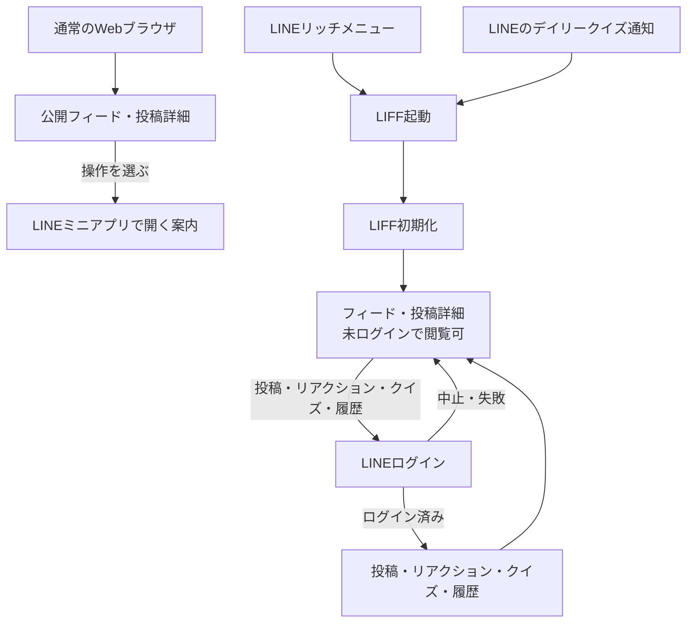

# Qiite 画面設計

## 前提

通常のWebブラウザでは、公開済み投稿のフィード・詳細を未ログインで閲覧できる。投稿、リアクション、既読記録、クイズ回答、学習履歴など利用者に紐づく操作は、LINEミニアプリ（LIFF）内でのみ提供する。LINEミニアプリでは未ログインでも閲覧でき、これらの操作を選んだときだけ **LINEログイン** を必須とする。LINEログイン済みの投稿も、他の利用者には匿名で表示する。

画面UIはスマホ版のみを設計対象とし、PC向けのレイアウトやナビゲーションは考慮しない。片手でのタップ、画面の限られた縦幅、LINE内での利用を前提に、1カラム・十分なタップ領域・画面遷移を活かしたUIにする。

各画面の詳細は [画面詳細設計](./screens/README.md) を参照する。

## 画面一覧

通常ブラウザで利用できるのは `/` と `/concerns/:id` の閲覧だけである。通常ブラウザから操作用パスや `/settings` を開いた場合は、LINEミニアプリで開く案内だけを表示する。LINEミニアプリ内の `/post`、`/quiz/today`、`/history` は、未ログインの場合にLINEログインを案内し、ログイン後に各画面を表示する。`/settings` は未ログインでも開けるが、個人設定の保存にはLINEログインを必要とする。

| 画面 | ルート | 利用条件 | 優先度 | 目的 |
| --- | --- | --- | --- |
| フィード | `/` | 通常ブラウザ、LINEミニアプリ（未ログイン可） | MVP | 他人の悩みを読む |
| 投稿フォーム | `/post` | LINEミニアプリ・LINEログイン後 | MVP | 匿名で悩みを投稿する |
| 投稿詳細 | `/concerns/:id` | 通常ブラウザ、LINEミニアプリ（未ログイン可） | MVP | 投稿全文を読む。リアクションはLINEログイン後に行う |
| 今日のクイズ | `/quiz/today` | LINEミニアプリ・LINEログイン後 | デモ必須 | 3ユーザーと3件の投稿を対応付ける |
| 学習履歴 | `/history` | LINEミニアプリ・LINEログイン後 | デモ必須 | 自分の閲覧傾向とクイズ結果を振り返る |
| 設定 | `/settings` | LINEミニアプリ（未ログイン可） | MVP | 表示設定と個人設定を行う |

## 起動・画面遷移

投稿完了、読み込み中、空データ、通信失敗、入力エラーは独立ページではなく、それぞれの画面内の状態として表示する。LINE配信は公開画面ではなく、LINE公式アカウントからクイズURLを送る外部連携である。

### 初期表示と読み込み

- 起動専用の読み込み画面は表示しない。フィードは「めくってみる」、クイズは「手紙をひらく」を押す前の表紙を、初期化・認証確認・データ取得中から表示する。
- ボタンを押すまでは待機表示を出さない。押した時点で準備中なら表紙を保ち、ボタン付近に読み込み中の文言を表示して重複操作を防ぐ。取得成功後は再度押さずに開く。
- 取得失敗・空データは開く操作後に案内し、失敗時は再試行できる。
- クイズのAPI取得はLINE内の認証とプロフィール確認後に限る。利用不可の場合は既存のLINE・ログイン・初期登録案内へ進む。
- LIFF初期化中は下部ナビの操作を止め、URLを変更しない。初期化の完了によって、表紙を開く操作の受付状態を失わない。

## 表示することば

設定で英語を選ぶと、画面の固定文言、入力例、エラー、読み上げ用ラベルを英語に切り替える。ひらがなを選ぶと、同じ範囲をカタカナも含めてひらがなにする。LINEなどの固有名詞・数字・記号は保持する。日本語（原文）では従来のUIを維持する。投稿本文は既存APIの選択言語の表現を表示し、翻訳待ち・失敗の場合は選択言語の案内を添えて原文を表示する。入力中の文章は変換しない。

表示言語はログインユーザーの既存設定へ保存し、再読み込み後にも復元する。保存できなかった場合は元の言語を維持する。地域などの属性キーは変更せず、既存の表示処理を利用する。ひらがなでは性別・年代・相対日時もひらがなにし、履歴の日付と管理画面の日時は数字と区切り記号で表示する。任意に生成されたテーマ名・解説は、APIに選択言語の表現がない場合は原文で表示する。
