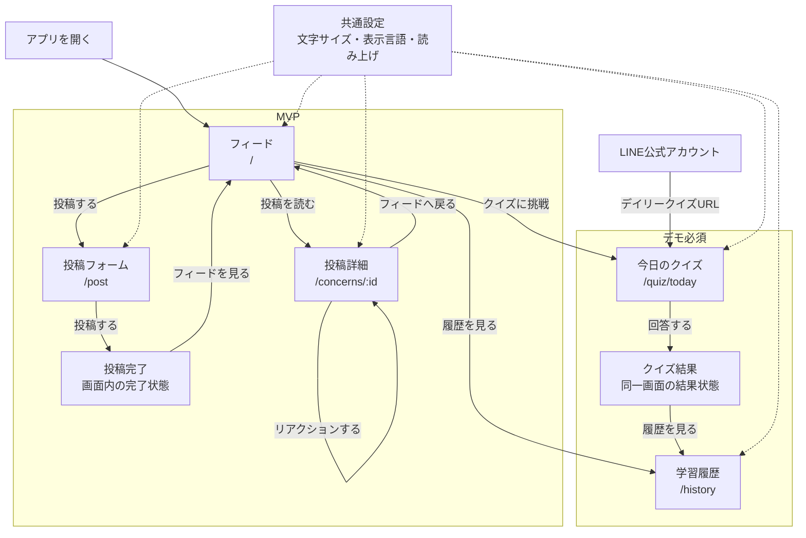

# 目安箱 画面設計

## 目的

目安箱のWeb画面、画面内で扱う状態、LINEからの導線を定義する。プロダクト上の要件は [プロダクト要件](./product.md) を、APIとの対応は [API仕様](../technical/api.md) を参照する。

各画面のレイアウト、操作、状態、アクセシビリティは [画面詳細設計](./screen-details.md) を参照する。

現時点のアプリケーションはViteのスターター画面とヘルスチェックのみであり、以下をプロダクト機能として実装する。

## 画面一覧

| 画面 | ルート | 優先度 | 目的 |
| --- | --- | --- | --- |
| フィード | `/` | MVP | 他人の悩みを読み、次に読む投稿を見つける |
| 投稿フォーム | `/post` | MVP | 匿名で悩みを投稿する |
| 投稿詳細 | `/concerns/:id` | MVP | 投稿全文、属性、表示切替、リアクションを確認する |
| 今日のクイズ | `/quiz/today` | デモ必須 | 3ユーザーと3件の投稿を対応付ける |
| 学習履歴 | `/history` | デモ必須 | 閲覧傾向とクイズ結果を振り返る |

投稿詳細は、モバイルでの閲覧体験を優先してフィード上のカード展開として実装してもよい。その場合も、URLで直接開ける詳細画面を維持する。

## 画面構成

## 画面ではなく画面内で扱うもの

- 投稿完了、読み込み中、空データ、通信失敗、入力エラーは、独立ページではなく各画面の状態として表示する。
- 原文・ひらがな・英語の切替、文字サイズ、読み上げは、共通ヘッダーまたは設定メニューから操作する。
- LINE配信は公開画面ではない。友だち登録済みユーザーへクイズURLを送る外部連携とし、配信の実行・結果確認はデモ時の運用または内部APIで扱う。

## 各画面の要点

### フィード

- 投稿本文、公開を選んだ属性、クラスタ・テーマ、粗い投稿日、リアクション数を表示する。
- クラスタ・地域による絞り込み、表示言語の切替、次の投稿への導線を提供する。
- 投稿がない場合、取得に失敗した場合、読み込み中の場合を区別して表示する。

### 投稿フォーム

- 本文、年代、性別、地域を入力する。属性は任意とし、性別には「回答しない」を含める。
- 音声入力では文字起こし結果を投稿前に確認・修正できるようにする。
- 匿名投稿であること、緊急相談窓口の代替ではないことを明示する。

### 投稿詳細

- 投稿全文、属性、テーマ、リアクションを表示する。
- 原文・ひらがな・英語の切替と読み上げを提供する。
- 投稿者を特定する情報や正確な投稿時刻は表示しない。

### 今日のクイズ

- 3ユーザーの属性と、順番を混ぜた3件の実投稿を表示する。
- 対応付けを回答後、正解、解説、回答済み状態を同一画面で表示する。

### 学習履歴

- 読んだ投稿のクラスタ、地域、属性の傾向を表示する。
- クイズの回答履歴と正答率を表示する。
