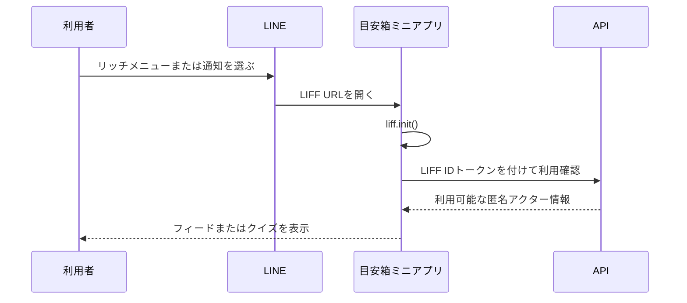

# 起動と利用確認

## 目的

利用者がLINEミニアプリから起動したことを確認し、必要なLIFF初期化が済んだ状態でだけプロダクト画面へ進める。LINE利用者の情報を画面へ出さず、内部の利用識別にだけ使う。

## 起動シーケンス

## 表示状態

| 状態 | 表示 | 遷移・操作 |
| --- | --- | --- |
| 初期化中 | ロゴ、アプリ名、「LINEに接続しています」 | 操作はできない。投稿内容や履歴は表示しない |
| 利用可能 | 初期化表示を閉じる | リッチメニューからはフィード、通知からはクイズへ進む |
| LINE外で起動 | 「このアプリはLINEで開いてください」 | LINEで開くボタン、または案内文を表示する |
| 利用確認失敗 | 「接続できませんでした」 | 再試行する。解決しない場合はLINEを開き直す案内を出す |
| メンテナンス中 | 「ただいま準備中です」 | LINEへ戻る操作を出す |

## 実装上の扱い

- LIFF初期化前、IDトークン検証前、または検証失敗時にフィード・投稿・履歴のAPIを呼ばない。
- 通知から開いた場合は、`/quiz/today` を復元する。その他の起動では `/` を初期画面にする。
- LINE内では「閉じる」操作に `liff.closeWindow()` を使う。ブラウザへの遷移や別タブを主要導線にしない。
