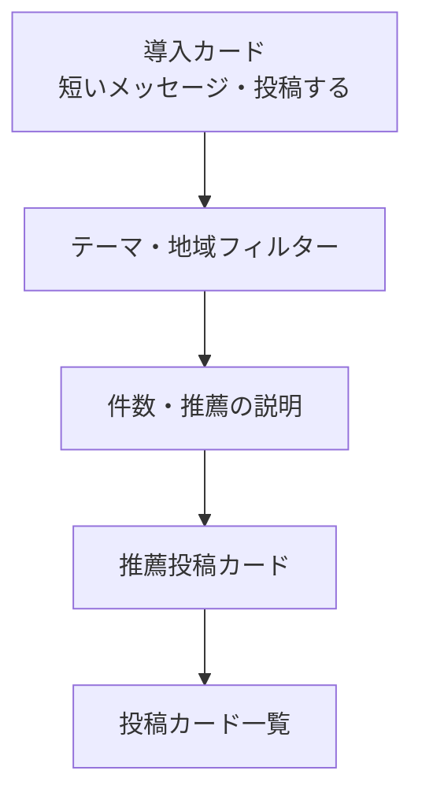

# フィード

## 目的

他人の悩みを一つずつ読み、「自分とは異なる立場の人がいる」ことを知る入口にする。LINEの利用者識別は既読・推薦に使うが、フィード上に利用者情報は表示しない。

## レイアウト

| 領域 | 内容 | 操作 |
| --- | --- | --- |
| 導入カード | 「誰かの見え方を知る」短い説明と投稿導線 | 投稿フォームへ進む |
| フィルター | テーマ、地域。選択中の条件を明示する | フィードを絞り込む。解除は「すべて」で行う |
| フィード情報 | 表示件数、推薦理由またはテーマ | 推薦理由は短く具体的にする |
| 投稿カード | 本文の先頭、テーマ、公開属性、粗い日時、リアクション数 | 本文を選ぶと詳細へ進む。リアクションはカード内で完結する |

投稿本文は一覧で3〜5行を目安に表示し、長文は省略記号と詳細への導線を付ける。年代・地域は投稿者が公開を選んだ場合だけ表示する。性別は一覧の標準表示に含めない。

## 状態と例外

| 状態 | 表示 | 次の行動 |
| --- | --- | --- |
| 読み込み中 | 投稿カードと同じ大きさのスケルトンを3件表示する | 操作不要 |
| 投稿なし | 「まだ声が届いていません」と表示する | 投稿する、またはフィルターを解除する |
| 絞り込み結果なし | 選択中の条件を表示する | 条件を解除する |
| 取得失敗 | 「読み込めませんでした」と理由を短く示す | 再試行する |
| AI処理中 | 投稿本文は表示し、テーマ・翻訳には「準備中」と表示する | そのまま読む |

## アクセシビリティ

- 投稿本文を開く操作とリアクション操作を分離する。
- リアクション後は「考えた。現在18件」のように結果を通知する。
- フィルターは選択中の状態を `aria-pressed` などで伝える。
