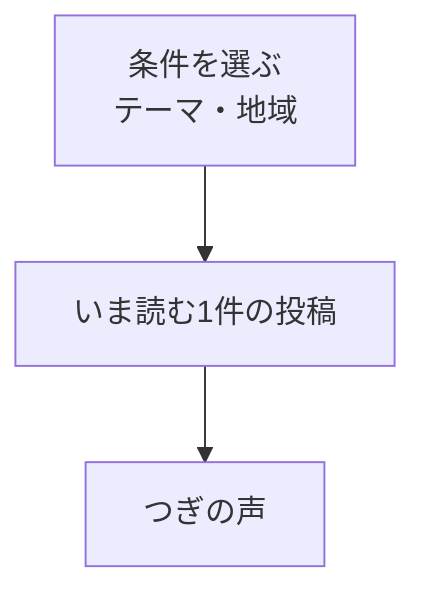

# フィード

## 目的

他人の悩みを一つずつ読み、「自分とは異なる立場の人がいる」ことを知る入口にする。LINEの利用者識別は既読・推薦に使うが、フィード上に利用者情報は表示しない。

## レイアウト

| 領域 | 内容 | 操作 |
| --- | --- | --- |
| 条件を選ぶ | テーマ、地域。選択中の条件を短く示す | 必要な場合だけシートを開いて絞り込む。解除は「すべて」で行う |
| いま読む投稿 | 本文、テーマ、公開属性、粗い日時、推薦理由、リアクション数 | 本文を選ぶと詳細へ進む。「そっと寄りそう」は投稿内で完結する |
| 次の導線 | 「つぎの声」 | 条件に合う次の1件へ切り替える |

フィードでは同時に複数の投稿を並べない。本文が画面内に収まらない場合は詳細へ進み、詳細では全文を読む。年代・地域は投稿者が公開を選んだ場合だけ表示する。性別はフィードの標準表示に含めない。

通常ブラウザとLINEミニアプリの未ログイン利用者もフィードを読める。通常ブラウザでは投稿・リアクションを表示せず、操作を選んだ場合はLINEミニアプリで開く案内を表示する。LINEミニアプリの未ログイン利用者が投稿・リアクションを選んだ場合はLINEログインを案内する。LINEログイン後の投稿も、フィード上では匿名で表示する。

## 状態と例外

| 状態 | 表示 | 次の行動 |
| --- | --- | --- |
| 読み込み中 | 投稿と同じ大きさのスケルトンを1件表示する | 操作不要 |
| 投稿なし | 「まだ声が届いていません」と表示する | 投稿する、またはフィルターを解除する |
| 絞り込み結果なし | 選択中の条件を表示する | 条件を解除する |
| 取得失敗 | 「読み込めませんでした」と理由を短く示す | 再試行する |
| AI処理中 | 投稿本文は表示し、テーマ・翻訳には「準備中」と表示する | そのまま読む |

## アクセシビリティ

- 投稿本文を開く操作とリアクション操作を分離する。
- リアクション後は「そっと寄りそいました。現在18件」のように結果を通知する。
- フィルターは選択中の状態を `aria-pressed` などで伝える。
