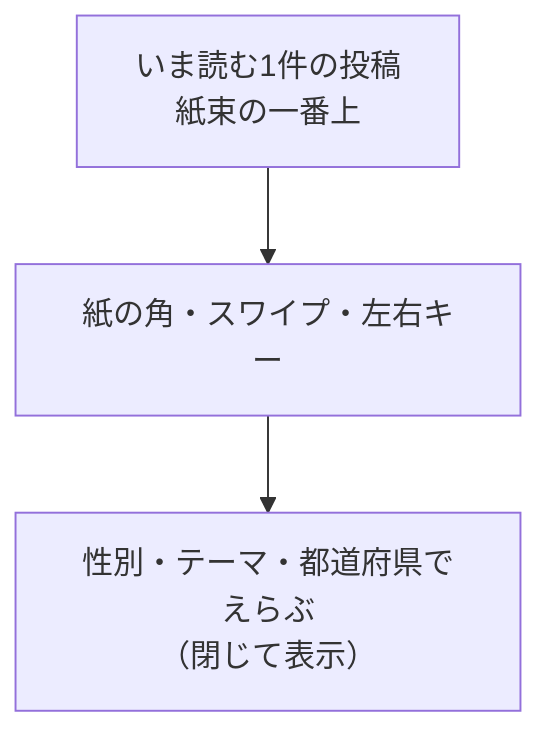

# フィード

## 目的

他人の悩みを一つずつ読み、「自分とは異なる立場の人がいる」ことを知る入口にする。LINEの利用者識別は既読・推薦に使うが、フィード上に利用者情報は表示しない。

## レイアウト

| 領域 | 内容 | 操作 |
| --- | --- | --- |
| いま読む投稿 | 本文、公開された年代・都道府県は上辺のインデックス | 本文を選ぶと詳細へ進む |
| めくる操作 | 紙の右下の角、左スワイプ、右スワイプ、左右キー | 条件に合う次の1件、または直前の1件へ切り替える |
| 条件をえらぶ | 初期状態では閉じた「性別・テーマ・都道府県でえらぶ」。選択中の条件があれば値だけ添える | 必要な場合だけ開いて絞り込む。解除は「すべて」で行う |

この画面は最初に開く画面である。最初の1枚だけはノートの表紙とし、アプリ名と短い一言、めくる操作を置く。表紙は本文ページより少し小さく見せ、「めくってみる」を押すと大きく広がってから表紙をめくり、最初の悩みへつなげる。表紙をめくる動作そのものを読みはじめの合図にし、説明で読む気持ちを作らない。2枚目からは声の紙だけを見せ、見出し・件数・日時・推薦理由は画面に置かない。投稿の下に次の紙が控えていることは、文字ではなく紙束のふちで示す。

表紙に置くのは題字と一言、そしてクレヨンの絵までとする。件数、今日の投稿数、推薦理由など、めくる前に中身を予告するものは置かない。表紙の下に控えた声の紙も、インデックスの付箋を出さない。

表紙の題字は、ほかの画面の見出しと同じ手書き書体・波線・紙の影で書く。表紙の操作は、声の紙にある「そっと寄りそう」と同じハート付きのスタンプ台の形にし、読みはじめから声を受け取る気持ちへつなげる。表紙だけ字づかいやボタンの形が違うと、ここだけ別のアプリの画面に見える。

表紙の絵は、紙の上に太陽と雲、紙の下辺にチューリップを並べ、題字と一言を囲む。絵は装飾として扱い、押せる要素にも、読み上げの対象にもしない。チューリップは同じ形で描き、背の高さ・色・傾きだけを変えて、同じ手が描いた絵にする。この絵は表紙だけに置き、声の紙には持ち込まない。声の紙に絵があると、本文より先に絵を見てしまう。

フィードでは同時に複数の投稿を並べない。本文の長さが変わっても紙の大きさは変えず、めくる体験の手応えを一定に保つ。本文が画面内に収まらない場合は詳細へ進み、詳細では全文を読む。年代・都道府県は投稿者が公開を選んだ場合だけ表示する。性別はフィードの標準表示に含めない。

投稿は一冊のリングノートとして見せる。左辺にとじリングを置き、リングは紙ではなくバインダー側のものとして、めくっても動かさない。紙の側には、リングと同じ間隔でとじ穴を開ける。穴の形を少し不揃いにし、ふちはクレヨンで描いたように揺らす。本文の左には、リングに文字が乗らないだけのとじ代を取る。紙の見え方は絵本の見開きにならい、1枚めくるごとに紙の地色を替えて、同じページを見ている感覚を断つ。色はページの順番に従う。公開されている年代・都道府県の付箋は、紙の上辺をまたいで外へ出し、紙に挟んだインデックスとして横に並べる。3色はそのページの色から近い色どうしで組み、貼った角度はそろえない。紙の右下は角がめくれた形にし、次があることを絵で伝える。紙の中には本文だけを置き、「そっと寄りそう」は本の外で「性別・地域でえらぶ」の上に置く。押したあとは線画のハートに色が入り、ボタンの紙片も変える。押した瞬間だけ、まわりへ短い線が散る。件数やノンブルは置かない。

紙の大きさはどの声でも変えない。フィード画面全体の背景には約5mm間隔の淡い方眼を敷き、カードの紙面はページごとの地色を保つ。めくる手応えを一定に保つため、収まらない本文は行数で切り、続きは詳細で全文を読む。

次の1件へ進むとき、いま読んでいる紙はリング側から手前へ持ち上がり、色のついた文字のない裏面を見せながら360度回って左へ抜ける。その下から次の紙が現れる。表紙から本文へ開く最初のめくりは、表紙を大きく持ち上げて手前へ出してから回し、読みはじめの合図を強くする。リングは動かさず、紙に隠れる線と、とじ穴を通して見える線を紙の回転に合わせて描き分ける。前の1件へ戻るときは、綴じ側から紙が手前へ倒れて元の位置に着く。動きを控える設定では、回転を描かず次の声へ切り替える。

次の1件へは紙の右下のめくれた角を押すか、投稿を左へスワイプする。右へスワイプすると直前の1件へ戻る。キーボードでは左右矢印で同じ操作を行う。進むときは読んでいる紙が左へ伏せ、その下から次の紙が現れる。戻るときは伏せてあった紙を拾い上げ、読んでいる紙の上へ降ろす。どちらも同じ180度のめくりとし、前後で手応えを変えない。縦方向の操作はスクロールとして扱い、めくりには使わない。条件のプルダウンは設定画面と同じ選択部品を使い、画面下端では選択肢を上向きに開く。

通常ブラウザとLINEミニアプリの未ログイン利用者もフィードを読める。通常ブラウザでは投稿・リアクションを表示せず、操作を選んだ場合はLINEミニアプリで開く案内を表示する。LINEミニアプリの未ログイン利用者が投稿・リアクションを選んだ場合はLINEログインを案内する。LINEログイン後の投稿も、フィード上では匿名で表示する。

## 状態と例外

| 状態 | 表示 | 次の行動 |
| --- | --- | --- |
| 読み込み中 | 投稿と同じ大きさのスケルトンを1件表示する | 操作不要 |
| 投稿なし | 「まだ声が届いていません」と表示する | 投稿する、またはフィルターを解除する |
| 絞り込み結果なし | 選択中の条件を表示する | 条件を解除する |
| 取得失敗 | 「読み込めませんでした」と理由を短く示す | 再試行する |
| AI処理中 | 投稿本文は表示し、翻訳には「準備中」と表示する | そのまま読む |

## アクセシビリティ

- 投稿本文を開く操作とリアクション操作を分離する。
- リアクション後は「そっと寄りそいました。現在18件」のように結果を通知する。色の変化だけで結果を伝えない。
- 押した跡の線とハートの弾みは、動きを控える設定では出さず、色と文言の変化だけを残す。
- フィルターは選択中の状態を、閉じた見出しに値を添えて伝える。
- めくれた角、スワイプ、左右キーで同じ移動ができるようにする。めくれた角は補助操作として扱い、読み上げには操作を重ねて出さない。
- しおり・とじリング・紙の地色は装飾として扱い、色だけで意味を伝えない。
- 動きを控える設定では、めくる紙を描かずに次の1件へ切り替える。
