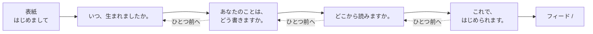

# はじめの1ページ（初期登録）

## 目的

LINEログイン直後に、年代・性別・都道府県のもとになる情報を一度だけ書いてもらう。これらは投稿に添える公開属性であり、読む声の選びかたにも使うため、空のまま投稿・クイズ・履歴へ進めない。

登録の手続きとして4項目を1枚のフォームに並べることはしない。1つの問いを1枚の紙に置き、答えるたびに紙をめくる。書けた項目は紙の上辺にはさまったしおりとして増えていき、最後の1枚でそのしおりが1枚の紙に貼り直される。「アカウントを作る」ではなく「自分の本の1ページ目を書く」時間として扱う。

書く内容は設定画面の「あなたの設定」と同じ4項目である（[共通UI・状態](./shared-ui.md)）。この画面で書いたあとも、設定画面からいつでも書き直せる。

## 入口

| 入口 | 条件 | 動き |
| --- | --- | --- |
| 投稿・クイズ・履歴を選ぶ | LINEログイン済みで、4項目のいずれかが未記入 | はじめの1ページ `/onboarding` へ置き換える |
| `/onboarding` を直接開く | LINEログイン済みで、4項目が記入済み | フィード `/` へ戻す |
| `/onboarding` を直接開く | LINEミニアプリ内で未ログイン | LINEログイン案内を表示する |
| `/onboarding` を直接開く | 通常ブラウザ | 「LINEミニアプリで開く」案内を表示する |

フィードと投稿詳細の閲覧は、この画面を通らなくても今までどおり続けられる。読むだけの利用者を登録で止めない。

## 紙の並び

| 紙 | 内容 | 主要な操作 |
| --- | --- | --- |
| 表紙 | 題字、短い一言、クレヨンの絵 | 「ひらいてみる」 |
| 生まれた年月 | 生まれた年・月の入力欄 | 「つぎへ」 |
| 性別 | 女性・男性・その他・回答しないの4つを2列×2行で表示 | 選ぶことが答えなので、選んだらそのままめくる |
| 地域 | 47都道府県から選ぶ | 「つぎへ」 |
| 仕上げ | 書いた3つのしおりを並べた名札 | 「はじめる」 |

- 1枚に置く主要な操作は1つにする。性別の紙には「つぎへ」を置かない。確定の操作をもう一つ挟んでも、選んだ内容は変わらない。
- 紙は左へめくって進み、「ひとつ前へ」で前の紙が降りてくる。横スワイプと左右キーでも同じ操作ができる。表紙へは戻さない。
- しおりは書けた項目だけを示し、操作には使わない。残り枚数を数字や帯で示さない。
- 紙の中に大きな絵を置くのは表紙だけにする。問いの紙と仕上げの紙は、書くものと書いたものが主役なので、絵は余白のラクガキにとどめる。
- 表紙のあいだは、本のまわりに書く道具（えんぴつ・ふせん・クリップ・定規など）を置く。フィードの表紙もまわりを飾るが、あちらは読む本なのでほし・ハートのシールを外へ散らす。こちらは書く本なので、道具を並べ、開くとノートの中へ入っていく。同じ絵を同じ動きで置くと、2冊が同じ表紙の使い回しに見える。
- 表紙のあいだは本を少し小さく置き、「ひらいてみる」で本が広がりながら道具がしまわれる。書きはじめを、手続きの開始ではなくノートを開く動作として見せる。
- めくった先の紙にも、その問いの場面を紙の余白に小さく描く。生まれた年月はふうせんとケーキ、言葉を選ぶ紙は中の空いた吹き出し、地域の紙はおうちと木、仕上げの紙はクラッカーと紙吹雪。問いと入力欄にかかる場所には描かず、本文より後ろに置く。絵で答えの例や残り枚数を示さない。

## 入力と検証

| 項目 | 入力 | 確かめること |
| --- | --- | --- |
| 生まれた年 | 数字 | 1900年から今年まで |
| 生まれた月 | 数字 | 1月から12月まで。今年を選んだときは、これから来る月を選べない |
| 性別 | 女性・男性・その他・回答しない | いずれか1つ |
| 地域 | 47都道府県 | いずれか1つ |

- 年月の確かめは、送る前にその紙の上で伝える。送ってから差し戻すと、めくった先で戻されることになる。
- 確かめに通っていない年月は、しおりにしない。書き終えたものとして数えたことになる。
- 保存は最後の1回だけにする。「はじめる」を押したときに4項目をまとめて送る。

## 状態と例外

| 状態 | 表示と次の行動 |
| --- | --- |
| 書きかけ | その紙の項目が埋まるまで「つぎへ」を押せない |
| 年月が範囲外 | 直す内容を紙の上に示し、「つぎへ」を押せないままにする |
| 送信中 | 「はじめる」を「書き込んでいます…」にし、二重送信を防ぐ |
| 送信に失敗 | 仕上げの紙に留まり、失敗を短く示す。書いた内容は消さず、同じ紙からもう一度送れる |
| 送信に成功 | セッションを取り直してからフィード `/` へ移る。以後この画面へは戻さない |

## アクセシビリティ

- 紙が替わったことを、見出しの言葉として `aria-live` で伝える。
- 選んである選択肢は、色だけでなく押下状態と文字色を組み合わせて示す。
- めくりを減らす設定のときは、紙を回さずに切り替える。まわりの道具も動かさず、紙の余白のラクガキも揺らさない。
- 文字を大きくしたときは、問いや選択肢を縮めず、紙のほうを伸ばして収める。収まらない分は下部ナビより上の縦スクロールで届くようにする。
- しおりは押せる要素にしない。戻る操作は紙のふもとの「ひとつ前へ」に一本化し、44px以上の操作領域を確保する。
