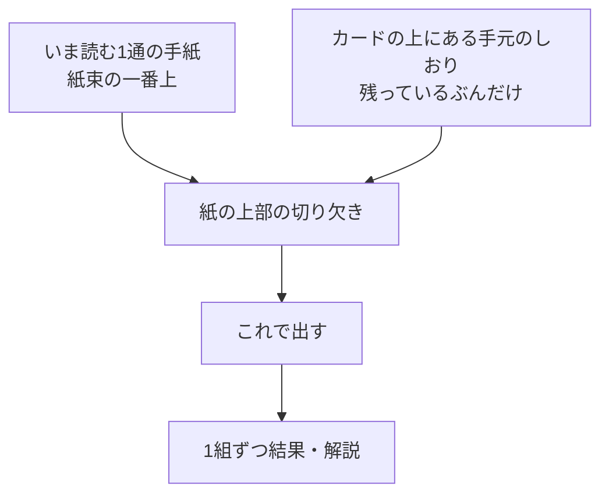

# 今日のクイズ

## 目的

属性だけで人を決めつけず、実際の投稿を丁寧に読む体験を作る。正答を競う画面ではなく、違う立場への想像を促す画面にする。

## LINEからの起動

デイリークイズはLINEミニアプリ内だけで提供する。デイリークイズの通知またはリッチメニューからLIFFを開いた場合、LINEログイン後にこの画面を最初に表示する。通常ブラウザから開いた場合は、クイズ内容を表示せず「LINEミニアプリで開く」案内だけを表示する。通知のURLにはLINE user IDなどの識別子を含めない。

## レイアウトと表示項目

| 領域 | 内容 | 操作 |
| --- | --- | --- |
| いま読む手紙 | 縦にゆとりを持たせた本文と、紙の上部の切り欠き | 切り欠きにしおりを差し込む。差し込んだしおりを押すと手元へ戻る |
| 手元のしおり | しおりの外形は保ち、直下に年代、性別、都道府県を大きく表示する。LINEプロフィール情報や名前は出さない | つまんで切り欠きへ運ぶ。押すだけでも差し込める |
| 送信 | 3通すべて埋まったときだけ現れる「これで出す」 | 回答を送信する |
| 結果 | 書き手の条件が挟まった紙と、短い判定・解説 | めくって1組ずつ読む。最後に履歴への導線を置く |

回答は「しおりを紙に差し込む」ひとつの動作にまとめる。見出し、導入文、注意書き、通し番号、ラジオボタン、送信前の確認一覧は画面に置かない。読む気持ちを作るのは説明文ではなく手紙そのものとし、画面に残すのは手紙の本文と手元のしおりだけにする。

手紙はフィードと同じ一冊のリングノートとして見せる。左辺のとじリングはバインダー側のものとして、めくっても動かさない。紙は縦にゆとりを持たせ、どの手紙でも大きさを揃える。収まらない本文は行数で切る。残りが何通あるかは、数字ではなく下に控えた紙のふちで伝える。手紙をめくるときはフィードと同じ360度の回転を使い、裏面は回答を示さない共通の紙色にする。リングの奥側は次の紙の穴と紙の外にだけ見せる。

しおりと切り欠きは同じ型紙で描き、片方がもう片方に収まることを形で示す。しおりの切り欠きは上辺にくる向きにし、未使用のしおりはカード束の上側に並べる。切り欠きは各手紙の上端に置き、しおりをそれぞれの紙の上に貼るように差し込む。長い条件文はしおりの直下へ置き、しおりの外へ文字が飛び出さないようにする。空の切り欠きには条件を表示せず、「ここへ」だけを置く。結果でも書き手のしおりと条件を同じ位置に残す。しおりは1つの条件につき1枚しかなく、別の手紙に挟んであればそちらから抜けてくる。重複した選択は起こりようがないため、選び直しを促すエラーは表示しない。紙の地色は手紙ごとに変えず、人の区別はしおりに大きく表示する条件で行う。色だけで意味を伝えず、回答前は正解を示す色を使わない。

しおりを差し込むと、その紙はめくれて去り、まだ空いている手紙が現れる。前後の手紙へは、紙の右下のめくれた角、左右のスワイプ、左右の矢印キーで移動でき、差し込んだしおりを押せば手元へ戻せる。送信前にいつでも3通を見返して付け替えられるため、選んだ対応を並べ直す確認画面は置かない。

結果は紙の上で1組ずつ表示する。書き手の条件が挟まった状態の紙に、合っていたかどうかと解説を短く添え、正誤だけで終わらせず「言葉を読んだことで見えたこと」を伝える。回答済みの場合はしおりを動かせない状態で、同じようにめくって読む。

## アクセシビリティ

- しおりはボタンとして扱い、キーボードだけで差し込めるようにする。つまんで運ぶ操作は補助とし、それだけでしか回答できない状態にしない。
- 前後の移動は、めくれた角・スワイプ・左右の矢印キーで同じ結果になるようにする。角とスワイプは読み上げに重ねて出さない。
- 空の切り欠きは装飾として扱い、いま何通目を読んでいるかは読み上げ専用の文で伝える。
- 正誤は色や記号だけでなく、言葉でも伝える。
- 動きを控える設定では、めくる紙を描かずに次の手紙へ切り替える。
