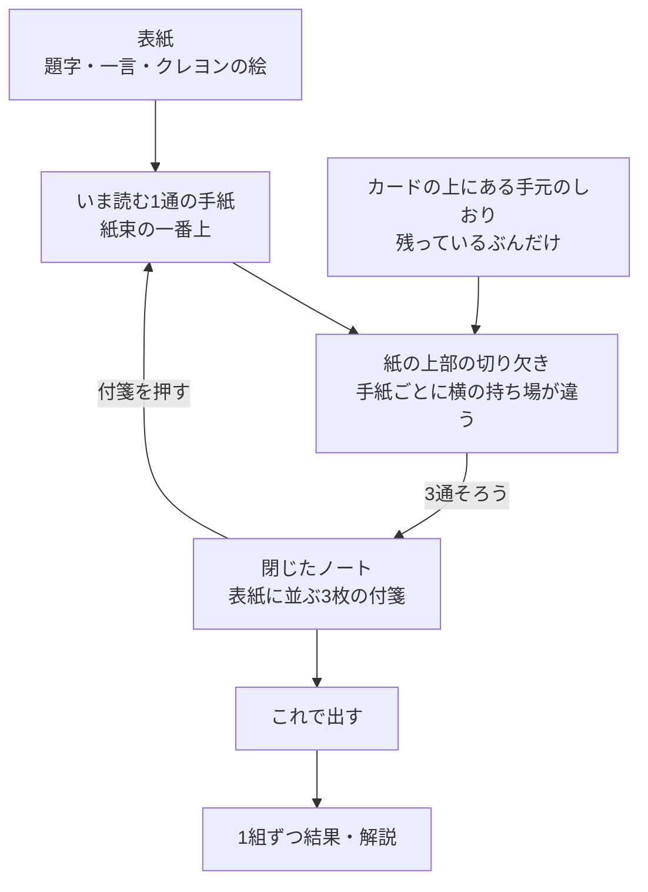

# 今日のクイズ

## 目的

属性だけで人を決めつけず、実際の投稿を丁寧に読む体験を作る。正答を競う画面ではなく、違う立場への想像を促す画面にする。

## LINEからの起動

デイリークイズはLINEミニアプリ内だけで提供する。デイリークイズの通知またはリッチメニューからLIFFを開いた場合、LINEログイン後にこの画面を最初に表示する。通常ブラウザから開いた場合は、クイズ内容を表示せず「LINEミニアプリで開く」案内だけを表示する。通知のURLにはLINE user IDなどの識別子を含めない。

## レイアウトと表示項目

| 領域 | 内容 | 操作 |
| --- | --- | --- |
| 表紙 | 題字と短い一言、クレヨンの絵。最初の1枚 | 「手紙をひらく」で開く。左スワイプ・右矢印でも開く |
| いま読む手紙 | 縦にゆとりを持たせた本文と、紙の上部の切り欠き。切り欠きの横の位置は手紙ごとにずらす | 切り欠きにしおりを差し込む。差し込んだしおりを押すと手元へ戻る |
| 手元のしおり | しおりの外形は保ち、直下に年代、性別、都道府県を大きく表示する。LINEプロフィール情報や名前は出さない | つまんで切り欠きへ運ぶ。押すだけでも差し込める |
| 閉じたノート | 3通すべてに挟み終えると閉じる。表紙の上には、挟んだ付箋だけが手紙ごとの持ち場に並ぶ | 付箋を押すと、その手紙が開いて読み直し・挟み替えができる |
| 送信 | 3通すべて埋まったときだけ現れる「これで出す」 | 回答を送信する |
| 結果 | 書き手の条件が挟まった紙と、短い判定・解説 | めくって1組ずつ読む。最後に履歴への導線を置く |

回答は「しおりを紙に差し込む」ひとつの動作にまとめる。見出し、導入文、注意書き、通し番号、ラジオボタン、送信前の確認一覧は画面に置かない。読む気持ちを作るのは説明文ではなく手紙そのものとし、画面に残すのは手紙の本文と手元のしおりだけにする。

最初の1枚は手紙ではなくノートの表紙とし、読みはじめを「ノートを開く」動作にする。表紙に置くのは題字と短い一言、そしてクレヨンの絵までとし、手紙の本文、書き手の条件、手元のしおり、残りの通数は、めくる前に出さない。表紙のあいだは手元のしおり置き場も出さず、しおりは表紙が開いてから配られる。表紙を開く操作は、この画面で先へ進むときと同じボタンの形にする。表紙だけ操作の形が違うと、ここだけ別の画面に見える。

表紙の絵は、紙の上に飛んできた紙飛行機、紙の下辺に届いた3通の封筒を並べ、題字と一言を囲む。絵は装飾として扱い、押せる要素にも読み上げの対象にもしない。封筒は同じ形で描き、大きさと傾きだけを変える。一通ずつ形を変えると、誰が書いたのかを絵で描き分けたことになり、この画面の問いを先に答えてしまう。この絵は表紙だけに置き、手紙の紙には持ち込まない。

表紙は閉じたノートとしてひと回り小さく置き、開くときに本来の大きさへ広がってから、フィードの表紙と同じ大きな1回転でめくれる。回答済みで開いたときは表紙を挟まず、そのまま結果を読む。表紙はこれから3通を読みはじめる人のための一枚なので、読むものが結果に変わったあとは、同じ紙が「まだ始まっていない」という誤った合図になる。

手紙はフィードと同じ一冊のリングノートとして見せる。左辺のとじリングはバインダー側のものとして、めくっても動かさない。紙は縦にゆとりを持たせ、どの手紙でも大きさを揃える。収まらない本文は行数で切る。残りが何通あるかは、数字ではなく下に控えた紙のふちで伝える。手紙をめくるときはフィードと同じ360度の回転を使い、裏面は回答を示さない共通の紙色にする。リングの奥側は次の紙の穴と紙の外にだけ見せる。

しおりと切り欠きは同じ型紙で描き、片方がもう片方に収まることを形で示す。しおりの切り欠きは上辺にくる向きにし、未使用のしおりはカード束の上側に並べる。切り欠きは各手紙の上端に置き、しおりをそれぞれの紙の上に貼るように差し込む。差し込む場所は紙の幅を通の数で割った持ち場とし、何通目かによって横にずらす。どの紙も同じ位置に挟むと、ノートを閉じたときに3枚が1枚に重なり、どれがどの手紙の付箋か分からなくなる。挟む場所そのものを「何通目か」にしておけば、閉じたあとの並びがそのまま目次になる。長い条件文はしおりの直下へ置き、しおりの外へ文字が飛び出さないようにする。空の切り欠きには条件を表示せず、「ここへ」だけを置く。結果でも書き手のしおりと条件を同じ位置に残す。しおりは1つの条件につき1枚しかなく、別の手紙に挟んであればそちらから抜けてくる。重複した選択は起こりようがないため、選び直しを促すエラーは表示しない。紙の地色は手紙ごとに変えず、人の区別はしおりに大きく表示する条件で行う。色だけで意味を伝えず、回答前は正解を示す色を使わない。

しおりを差し込むと、挟まったしおりを一拍見せてから、その紙はめくれて去り、まだ空いている手紙が現れる。すぐにめくると、自分が何を選んだのかを見ないまま紙が去ってしまうため、間を置く。この間にしおりを押せば、めくりは止まり、その紙に留まったまま選び直せる。挟まっているあいだは、切り欠きに添える問いかけを「押せば外せる」ことを伝える文言に差し替え、やり直し方を同じ位置で示す。

3通すべてに挟み終えると、一拍おいてノートが閉じる。閉じた表紙の上には、挟んだ付箋だけが手紙ごとの持ち場に、紙に挟んだときと同じ高さで出ている。場所を動かさないのは、表紙の上の1枚が、さっき自分がその手紙に挟んだ1枚だと分かるようにするため。付箋を押すとその手紙が開き、読み直しも挟み替えもそこから続けられる。閉じたノートは縮めない。読みはじめる前の表紙だけを小さく置く。付箋の並ぶノートを縮めると、条件の字が読めなくなる。読み終えて閉じた表紙からは、届いたことを告げる紙飛行機を降ろし、一言を読み終えたあとのものに差し替える。まだ次が届くという誤った合図にしないためで、空いた上辺はそのまま付箋の場所になる。

前後の手紙へは、左右のスワイプと左右の矢印キーで移動でき、差し込んだしおりを押せば手元へ戻せる。紙の角にめくれを描いて操作を示すことはしない。紙の上に小さな紙片が貼られたように見え、手紙そのものより先に目を引くため。送信前にいつでも3通を見返して付け替えられるため、選んだ対応を並べ直す確認画面は置かない。

手元のしおり置き場は、3通すべてに挟み終えても畳まない。置き場ごと消すと版面が跳ね上がり、いま差したばかりの手紙から目が外れる。空になった置き場は、手元にもう残っていないことをそのまま表す。

結果は紙の上で1組ずつ表示する。書き手の条件が挟まった状態の紙に、合っていたかどうかと解説を短く添え、正誤だけで終わらせず「言葉を読んだことで見えたこと」を伝える。回答済みの場合はしおりを動かせない状態で、同じようにめくって読む。

## アクセシビリティ

- しおりはボタンとして扱い、キーボードだけで差し込めるようにする。つまんで運ぶ操作は補助とし、それだけでしか回答できない状態にしない。
- 閉じた表紙の付箋もボタンとして扱い、何通目の手紙のものかと、挟んである条件を読み上げに含める。
- ノートが閉じたことは、読み上げ専用の文でも伝える。挟み終えた時点で手元のしおりは1枚もなくなり、押したボタンが消えるため。
- 前後の移動は、スワイプと左右の矢印キーで同じ結果になるようにする。スワイプは読み上げに重ねて出さない。
- 空の切り欠きは装飾として扱い、いま何通目を読んでいるかは読み上げ専用の文で伝える。
- 正誤は色や記号だけでなく、言葉でも伝える。
- 表紙の絵は装飾として扱い、色や絵だけで手紙の内容を予告しない。
- 動きを控える設定では、めくる紙を描かずに次の手紙へ切り替える。表紙も同じく、めくる紙を描かずに1通目へ切り替える。
