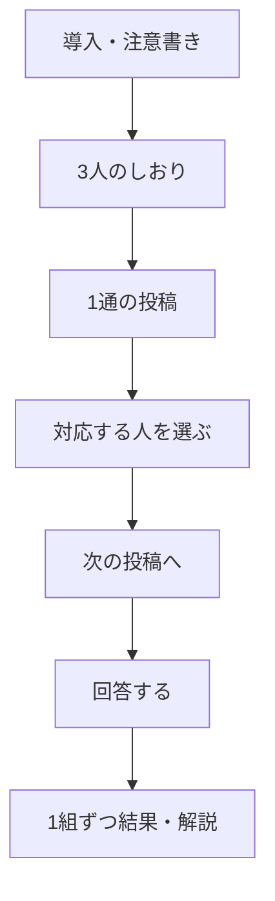

# 今日のクイズ

## 目的

属性だけで人を決めつけず、実際の投稿を丁寧に読む体験を作る。正答を競う画面ではなく、違う立場への想像を促す画面にする。

## LINEからの起動

デイリークイズはLINEミニアプリ内だけで提供する。デイリークイズの通知またはリッチメニューからLIFFを開いた場合、LINEログイン後にこの画面を最初に表示する。通常ブラウザから開いた場合は、クイズ内容を表示せず「LINEミニアプリで開く」案内だけを表示する。通知のURLにはLINE user IDなどの識別子を含めない。

## レイアウトと表示項目

| 領域 | 詳細 |
| --- | --- |
| 導入 | 「属性だけでは決めつけられない」ことを一文で伝える |
| 参加者 | A〜Cの匿名ラベル、年代、性別、地域をしおりとして表示する。LINEプロフィール情報は出さない |
| 投稿 | 3件の実投稿をランダム順に、1通ずつ表示する。原文・ひらがな・英語、読み上げはヘッダーの設定シートで切り替える |
| 回答 | 表示中の投稿に対応する参加者を選び、選択を保持して次の投稿へ進む。重複選択はその場で分かるようにする |
| 確認・送信 | 3通の選択後に、選んだ対応を短く確認してから送信する |
| 結果 | 正解の対応と解説を1組ずつ表示し、次の解説と履歴への導線を置く |

回答前は正解を示す色を使わない。回答後は、正誤だけで終わらせず「言葉を読んだことで見えたこと」を説明する。回答済みの場合は選択肢を変更できない状態で、結果を1組ずつ表示する。
