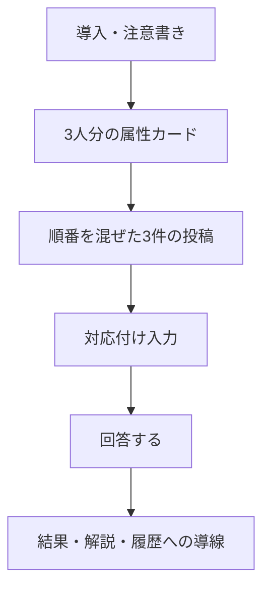

# 今日のクイズ

## 目的

属性だけで人を決めつけず、実際の投稿を丁寧に読む体験を作る。正答を競う画面ではなく、違う立場への想像を促す画面にする。

## LINEからの起動

デイリークイズの通知またはリッチメニューからLIFFを開いた場合、利用確認後にこの画面を最初に表示する。通知のURLにはLINE user IDなどの識別子を含めない。

## レイアウトと表示項目

| 領域 | 詳細 |
| --- | --- |
| 導入 | 「属性だけでは決めつけられない」ことを一文で伝える |
| 参加者 | A〜Cの匿名ラベル、年代、性別、地域を表示する。LINEプロフィール情報は出さない |
| 投稿 | 3件の実投稿をランダム順で表示する。原文・ひらがな・英語の切替を提供する |
| 回答 | 各参加者に対応する投稿を選ぶ。重複選択した場合は送信前に分かるようにする |
| 結果 | 正解の対応、解説、回答済み状態を同一画面で表示する |

回答前は正解を示す色を使わない。回答後は、正誤だけで終わらせず「言葉を読んだことで見えたこと」を説明する。回答済みの場合は選択肢を変更できない状態で結果を表示する。
