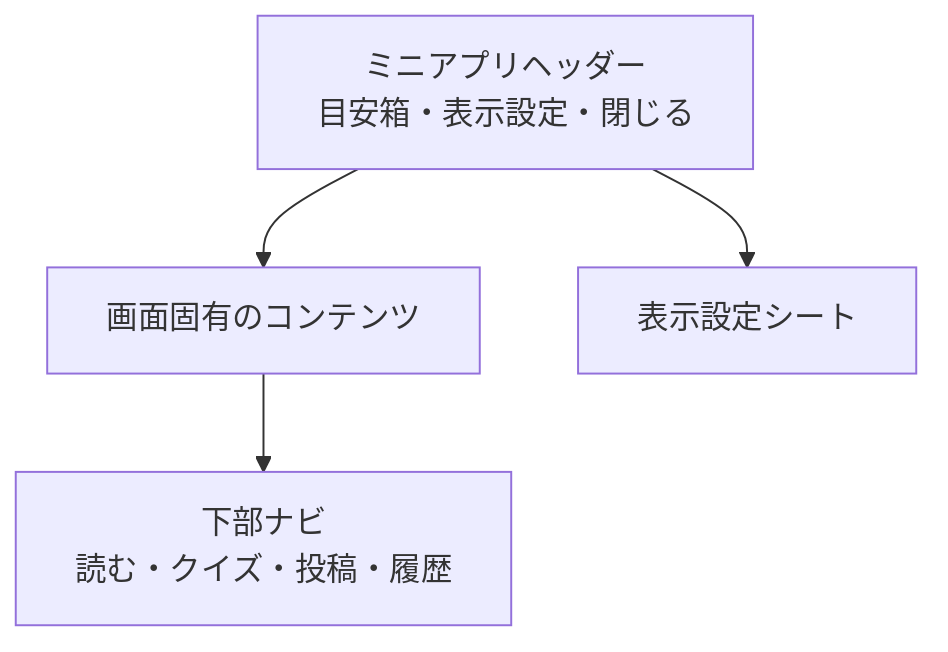

# 共通UI・状態

## アプリケーションシェル

| 要素 | 詳細 |
| --- | --- |
| ヘッダー | アプリ名、表示設定、LINEへ戻る閉じる操作を表示する。LINE表示名やアイコンは表示しない |
| 下部ナビ | 「読む」「クイズ」「投稿」「履歴」の4項目。投稿を中央の強調操作にする |
| コンテンツ幅 | 360px以上の1カラムを基準に、左右16〜20pxの余白を取る |
| 現在地 | 下部ナビで、色とラベル・選択状態を組み合わせて示す |

## 表示設定シート

表示設定は独立ページではなく、ヘッダーから開くボトムシートとする。

| 設定 | 選択肢 | 挙動 |
| --- | --- | --- |
| 文字サイズ | 標準・大きく表示 | 本文、ボタン、フォームを同時に拡大し、横スクロールを発生させない |
| 表示言語 | 原文・ひらがな・英語 | フィード、投稿詳細、クイズの投稿本文へ反映する |
| 読み上げ | 開始・停止 | 現在開いている投稿本文だけを読み上げる |

ボトムシートを開いている間はキーボードフォーカスを設定内に閉じ、閉じた後は開いたボタンへ戻す。

## 共通の状態・通知

- 読み込み中は、内容領域と同じ大きさのスケルトンを表示する。
- 通信失敗時は、何が起きたかと再試行できることを短い日本語で示す。入力内容やクイズの選択内容を失わない。
- 投稿、リアクション、クイズ回答の送信中はボタンを無効化し、進行中であることをボタン文言でも示す。
- 成功・失敗・リアクション数の更新は、視覚表示に加えて `aria-live` で通知する。
- すべての操作はキーボードだけでも実行でき、タップ対象は十分な大きさを確保する。
