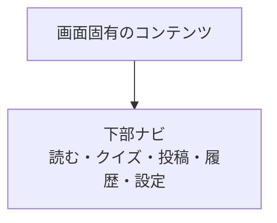

# 共通UI・状態

## アプリケーションシェル

このシェルはLINEミニアプリ用である。アプリ独自のヘッダーは持たず、画面の上端から本文を始める。アプリ名とアプリを閉じる操作はLINEミニアプリ側の表示に委ね、画面内に重ねて置かない。通常ブラウザでは公開フィード・投稿詳細だけを表示し、投稿、リアクション、クイズ、履歴へ進む下部ナビゲーションは表示しない。通常ブラウザからLINEミニアプリへ移る導線を置く場合も、操作ボタンではなく「LINEミニアプリで開く」と明示する。

| 要素 | 詳細 |
| --- | --- |
| ヘッダー | 置かない。アプリ名、LINE表示名やアイコン、アプリを閉じる操作を画面内に表示しない |
| 下部ナビ | 「読む」「クイズ」「投稿」「履歴」「設定」の5項目。投稿を中央に置き、他の項目と高さを揃えて淡い紫の背景で示す |
| 設定 | 下部ナビの右端に置き、`/settings` へ移動する |
| コンテンツ幅 | 360px以上の1カラムを基準に、左右16〜20pxの余白を取る |
| 現在地 | 下部ナビで、色とラベル・選択状態を組み合わせて示す |

下部ナビは画面の下端に常時表示し、本文との境界を細い直線で区切る。本文の上端は端末の安全領域から測る。内容が画面高を超える場合は下部ナビより上の本文領域を縦スクロールできるようにし、文字サイズの拡大やソフトウェアキーボード表示でも操作を隠さない。

## 設定画面

表示設定とログイン済みユーザーの個人設定を、下部ナビの「設定」から開く専用画面にまとめる。画面間の移動にはルーターを使い、設定を開くモーダルやボトムシートは表示しない。下部ナビは表示したままにする。

初期状態は文字サイズを「標準」、表示することばを「原文」とする。

| 設定 | 選択肢 | 挙動 |
| --- | --- | --- |
| 文字サイズ | 標準・大きく表示 | 本文、ボタン、フォームを同時に拡大し、横スクロールを発生させない |
| 表示言語 | 原文・ひらがな・英語 | フィード、投稿詳細、クイズの投稿本文へ反映する |
| 読み上げ | 投稿を開いたら読み上げる（ON・OFF） | 投稿詳細で本文を読み上げ、読み上げ中は本文近くの停止操作で止める |
| 個人設定 | 生まれた年・月、性別、地域 | LINEログイン済みの場合に設定・保存でき、投稿や推薦に利用する。正確な住所は保存しない |

LINEミニアプリ内ではログイン前でも設定画面を開ける。個人設定の保存だけLINEログインを必要とする。通常ブラウザから開いた場合はLINEミニアプリで開く案内を表示する。

### 設定画面のレイアウト規則

- 設定タイトルの直後と各設定項目の終了位置に、既存のクレヨン表現と同じ細い区切り線を置く。最後の項目の後には置かない。
- 各設定グループは、区切り線の前に28px、次のグループまでに24pxを目安とする余白を取り、見出し・説明・操作を密着させない。
- 「あなたの設定」は、文字サイズや表示することばと同じ階層の見出しとして扱う。見出しだけを過度に大きくしない。
- 年・月・性別・地域は、標準文字サイズでは2列、大きく表示では1列にする。項目同士の間隔は20pxを目安とし、ラベルと入力欄の間にも8px以上の余白を取る。
- フォームのラベルは補助情報として一段小さくしてよいが、選択値・入力値・選択肢は「設定を保存する」と同じ操作階層の文字サイズに揃える。
- 性別・地域のプルダウンは、選択肢を選ぶ、別のプルダウンを開く、または外側をタップしたときに閉じる。
- 保存成功・失敗のメッセージは必要なときだけ表示する。結果がない状態で空の表示領域を確保して、保存ボタンの下に不要な余白を作らない。

## 共通の状態・通知

- 読み込み中は、内容領域と同じ大きさのスケルトンを表示する。
- 通信失敗時は、何が起きたかと再試行できることを短い日本語で示す。入力内容やクイズの選択内容を失わない。
- 投稿、リアクション、クイズ回答の送信中はボタンを無効化し、進行中であることをボタン文言でも示す。
- 成功・失敗・リアクション数の更新は、視覚表示に加えて `aria-live` で通知する。
- すべての操作はキーボードだけでも実行でき、タップ対象は十分な大きさを確保する。
