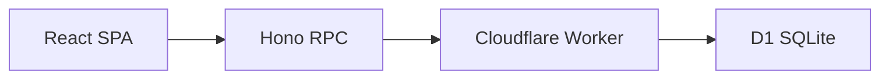
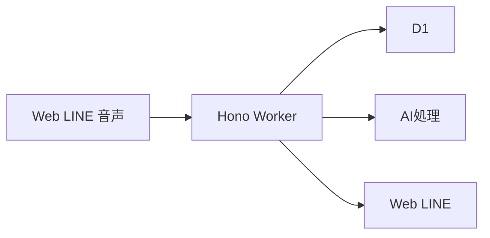

# 目安箱 システムアーキテクチャ

システム構成、責務分担、非機能要件、設計上の前提を定義する。

## システム構成

### 現在の構成

### デモ必須の構成

### バックエンドの責務

既存のレイヤー分割を維持し、機能追加時も依存方向を崩さない。

- `presentation`: HTTPリクエスト、レスポンス、入力検証
- `application`: 投稿、閲覧、推薦、クラスタリング、クイズ、LINE配信、学習履歴などのユースケース
- `application/entity`: アプリケーションで扱うモデル
- `application/repository`: 永続化処理のPort
- `application/port`: 外部サービスのPort
- `application/usecase`: Application層のユースケースと、その実装に依存する抽象契約
- `infrastructure`: D1、Drizzle、音声認識、翻訳、AI、LINEのAdapter
- `bootstrap/container.ts`: 依存関係の組み立て
- `app`: Honoアプリ、共通middleware、エラーハンドラー

リクエストごとにRepositoryやUseCaseを生成せず、現在のComposition Rootの方針を踏襲する。

### 非同期処理

投稿の保存は、AI処理や外部通知の成否に依存させない。少なくとも次の順序を守る。

1. 入力を検証する
2. 投稿をD1へ保存する
3. 投稿者へ保存成功を返す
4. 文字起こし、翻訳、クラスタリング、推薦用データ更新、LINE通知を非同期で処理する
5. 完了または失敗した状態を保存する

ハッカソンでは小規模な非同期処理で実装してよいが、AIサービスの待ち時間で投稿APIがタイムアウトしないことを受け入れ条件とする。

### デプロイ

- バックエンドはCloudflare Workersへデプロイする
- データベースはCloudflare D1を利用する
- フロントエンドはCloudflare Pagesを第一候補とする
- D1のマイグレーションを適用してからWorkerをデプロイする
- 本番用D1の識別子やAPIトークンをリポジトリへ保存しない
- バックエンドとフロントエンドのCI/CDを整備し、E2Eテストを含む完成確認後にデモ環境へデプロイする

## 非機能要件

### 性能

- フィード取得は、AI処理を待たずに通常時2秒以内で画面へ返す
- 投稿受付は、AI処理を待たずに通常時2秒以内で保存結果を返す
- クラスタリングや要約は結果が遅れても投稿閲覧を妨げない
- ハッカソンデモでは、同時100ユーザー程度を想定する

### 可用性と障害時の挙動

- D1やWorkerが一時的に失敗した場合は、再試行可能なエラーを表示する
- AI、翻訳、音声認識のサービス停止時は、原文で投稿と閲覧を継続する
- LINEが停止しても、通常ブラウザとLINEミニアプリの公開投稿閲覧は継続する。投稿、リアクション、クイズ、履歴などLINEログインが必要な操作は利用できない状態を明示する
- 外部サービスの障害を理由に、投稿本文を再送し続けない

### セキュリティ

- 本文、属性、クイズ回答をサーバー側でも検証する
- 本番CORSは許可するフロントエンドのoriginに限定する
- APIキー、LINE秘密情報、Cloudflareトークンをフロントエンドへ含めない
- 投稿、リアクション、クイズ回答には過剰利用を抑止する仕組みを設ける
- ログへ投稿本文、IPアドレス、アクセストークンを出力しない
- LINE webhookは署名検証し、配信APIは内部認証で保護する

### アクセシビリティ

- キーボード操作だけで主要フローを完了できる
- スクリーンリーダーが入力欄、ボタン、エラーを認識できる
- 文字サイズ変更時に本文と操作部品が重ならない
- 色、音、アニメーションのいずれか一つに依存せず状態を伝える
- 原文、翻訳文、ひらがな文、匿名属性、集計値を短く分かりやすく表示する

## 重要な設計判断

現時点では、次の方針を実装上の前提とする。

1. 入口は通常ブラウザでの公開投稿閲覧と、LINEミニアプリでの閲覧・操作とする。音声入力はLINEミニアプリ内で提供する
2. 通常ブラウザと未ログインのLINEミニアプリでは公開投稿を閲覧できる。投稿、リアクション、既読、クイズ、履歴はLINEログイン済みのLINEミニアプリに限定する
3. 投稿保存と外部処理を分離し、AI、翻訳、音声認識の障害で投稿を失わないようにする
4. 正確な位置情報と生IPを保存しない
5. クラスタリングや推薦は、失敗時に新着順へ戻れるようにする
6. クイズは3ユーザーの実投稿を対応付ける形式とし、架空の選択肢は使わない
7. D1のテーブル、Drizzle schema、migrationを同じ変更単位で管理する
8. 現在のHono、Workers、D1、Hono RPCの構成を維持し、外部機能はPortとAdapterに分離する
