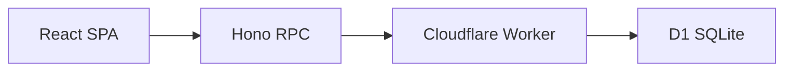
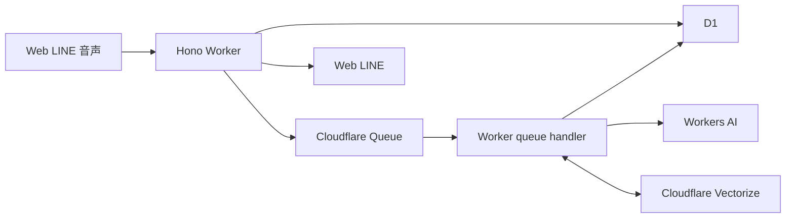

# 目安箱 システムアーキテクチャ

システム構成、責務分担、非機能要件、設計上の前提を定義する。

## システム構成

### 現在の構成

### デモ必須の構成

### バックエンドの責務

既存のレイヤー分割を維持し、機能追加時も依存方向を崩さない。

- `presentation`: HTTPリクエスト、レスポンス、入力検証
- `application`: 投稿、閲覧、推薦、クラスタリング、クイズ、LINE配信、学習履歴などのユースケース
- `application/entity`: アプリケーションで扱うモデル
- `application/repository`: 永続化処理のPort
- `application/port`: 外部サービスのPort
- `application/usecase`: Application層のユースケースと、その実装に依存する抽象契約
- `infrastructure`: D1、Drizzle、音声認識、翻訳、AI、LINEのAdapter
- `bootstrap/container.ts`: 依存関係の組み立て
- `app`: Honoアプリ、共通middleware、エラーハンドラー

リクエストごとにRepositoryやUseCaseを生成せず、現在のComposition Rootの方針を踏襲する。

### Workers AI

- `backend/wrangler.jsonc` の AI binding `AI` を Worker の `env.AI` として利用する。API キーは設定しない。
- Application 層は `TextTranslator`、`TextEmbeddingGenerator`、`SpeechRecognizer` Portに依存し、Infrastructure層のWorkers AI Adapterが `env.AI.run(model, input)`を呼び出す。
- 原文（日本語）→英語、原文（日本語）→ひらがなは `@cf/meta/llama-3.1-8b-instruct-fp8` 1つに統一し、タスクごとの短い指示だけを変える。音声認識は多言語の `@cf/openai/whisper` を使う。
- Embeddingは `@cf/qwen/qwen3-embedding-0.6b` を使い、複数テキストを入力順にベクトル化する。当初候補の `@cf/pfnet/plamo-embedding-1b` は2048次元で、Vectorizeの最大1536次元を超えるため採用しない。Qwen3の1024次元出力に合わせてVectorize indexを作成する（[PLaMo model card](https://huggingface.co/pfnet/plamo-embedding-1b/blob/main/README_ja.md)、[Vectorize limits](https://developers.cloudflare.com/vectorize/platform/limits/)、[Qwen3 model card](https://huggingface.co/Qwen/Qwen3-Embedding-0.6B)）。Qwen3 Embeddingは100以上の言語に対応する。
- 投稿保存後は `concern.process` メッセージをQueueへ送り、Queue consumerから `ConcernProcessingUseCase` を起動する。ひらがな・英語表現とクラスタ割当はD1に保存し、EmbeddingはVectorizeに保存する。D1の `concerns.cluster_id` を正とし、Queue再試行でも既存の割当を使う。
- Vectorizeは投稿処理内部の近傍照合にだけ使う。公開の任意文検索APIやRAGはこの段階では提供しない。Vectorize metadataにはcluster IDだけを保存し、本文や属性は保存しない。Embeddingの次元とindex設定はモデルに合わせ、モデルを変更する場合はindexを再構築する。
- 近傍照合はcosine metricで上位10件を取得し、scoreが既定値0.8以上の候補のうち最も高いものへ割り当てる。閾値は本番ではGitHub Actions Variable `CONCERN_CLUSTER_SIMILARITY_THRESHOLD`、ローカル開発では`wrangler.dev.jsonc`で設定する。新しいベクトルが検索可能になるまで遅延するため、短時間に連続投稿された悩みが初回処理時に同じクラスタへまとまらない場合がある（[Vectorize changelog](https://developers.cloudflare.com/changelog/product/vectorize/)）。
- D1には投稿ごとにモデル名とindex versionを組み合わせたEmbedding versionを記録する。Queue再処理時に現在のversionと一致しない投稿は既存のひらがな・英語表現を再利用して再Embeddingし、対象Vectorize indexへ再upsertする。indexを再作成したときは環境固有の`CONCERN_VECTOR_INDEX_VERSION`を更新する。
- 新規のpending clusterは最大10件の公開済み悩みを使ってlabelとsummaryを生成し、D1へ保存する。Workers AIへ送る本文は1件あたり最大2000文字に切り詰め、生成前はlabelとsummaryをnullにする。
- D1の条件付き更新でclusterをpendingからgeneratingへ原子的にclaimする。同じclusterを別workerが生成中ならQueueを再試行する。claimは5分で失効し、生成失敗時はpendingへ戻してQueueを再試行する。
- 生成結果はJSON形式でlabelとsummaryだけを含み、両方が空でないことを検証する。出力文の長さ・個人情報・禁止語のパターン検査は行わず、プロンプトでそれらを出力しないよう指示する。
- 生成に失敗したclusterの割当はフィードに出さず、投稿は原文で閲覧できる。生成済みclusterへ悩みが追加された後のlabel・summary再生成は後続処理で扱い、既存表示を上書きしない。
- `wrangler dev` はローカルD1・Queueと開発用remote Vectorize indexを使う。Vectorizeにはローカルシミュレーターがないため、開発・本番のindexを別々に作成する。
- `wrangler dev` 中でも実際の推論はCloudflareアカウントへ接続し、Workers AIの利用枠を消費する。テストでは実AIを呼ばずFakeを使う。
- 投稿本文を入力に使う場合、本文がCloudflareへ送信されることを前提に利用目的を明示し、呼び出し回数を制限する。投稿内容のモデレーションは行わない。

## 非同期処理

投稿の保存は、AI処理や外部通知の成否に依存させない。少なくとも次の順序を守る。

1. 入力を検証する
2. 投稿をD1へ保存する
3. `concern.process` メッセージをQueueへ送信する
4. 投稿者へ保存成功を返す
5. Queue consumerから文字起こし、翻訳、Embedding、Vectorize近傍照合、クラスタ割当、推薦用データ更新、LINE通知を非同期で処理する
6. 完了または失敗した状態を保存する

ハッカソンでは小規模な非同期処理で実装してよいが、AIサービスの待ち時間で投稿APIがタイムアウトしないことを受け入れ条件とする。

### デプロイ

- バックエンドはCloudflare Workersへデプロイする
- データベースはCloudflare D1を利用する
- フロントエンドはCloudflare Pagesを第一候補とする
- D1のマイグレーションを適用してからWorkerをデプロイする
- 本番用D1の識別子やAPIトークンをリポジトリへ保存しない
- バックエンドとフロントエンドのCI/CDを整備し、E2Eテストを含む完成確認後にデモ環境へデプロイする

## 非機能要件

### 性能

- フィード取得は、AI処理を待たずに通常時2秒以内で画面へ返す
- 投稿受付は、AI処理を待たずに通常時2秒以内で保存結果を返す
- クラスタリングや要約は結果が遅れても投稿閲覧を妨げない
- ハッカソンデモでは、同時100ユーザー程度を想定する

### 可用性と障害時の挙動

- D1やWorkerが一時的に失敗した場合は、再試行可能なエラーを表示する
- AI、翻訳、音声認識のサービス停止時は、原文で投稿と閲覧を継続する
- LINEが停止しても、通常ブラウザとLINEミニアプリの公開投稿閲覧は継続する。投稿、リアクション、クイズ、履歴などLINEログインが必要な操作は利用できない状態を明示する
- 外部サービスの障害を理由に、投稿本文を再送し続けない

### セキュリティ

- 本文、属性、クイズ回答をサーバー側でも検証する
- 本番CORSは許可するフロントエンドのoriginに限定する
- APIキー、LINE秘密情報、Cloudflareトークンをフロントエンドへ含めない
- 投稿、リアクション、クイズ回答には過剰利用を抑止する仕組みを設ける
- ログへ投稿本文、IPアドレス、アクセストークンを出力しない
- LINE webhookは署名検証し、配信APIは内部認証で保護する

### アクセシビリティ

- キーボード操作だけで主要フローを完了できる
- スクリーンリーダーが入力欄、ボタン、エラーを認識できる
- 文字サイズ変更時に本文と操作部品が重ならない
- 色、音、アニメーションのいずれか一つに依存せず状態を伝える
- 原文、翻訳文、ひらがな文、匿名属性、集計値を短く分かりやすく表示する

## 重要な設計判断

現時点では、次の方針を実装上の前提とする。

1. 入口は通常ブラウザでの公開投稿閲覧と、LINEミニアプリでの閲覧・操作とする。音声入力はLINEミニアプリ内で提供する
2. 通常ブラウザと未ログインのLINEミニアプリでは公開投稿を閲覧できる。投稿、リアクション、既読、クイズ、履歴はLINEログイン済みのLINEミニアプリに限定する
3. 投稿保存と外部処理を分離し、AI、翻訳、音声認識の障害で投稿を失わないようにする
4. 正確な位置情報と生IPを保存しない
5. クラスタリングや推薦は、失敗時に新着順へ戻れるようにする
6. クイズは3ユーザーの実投稿を対応付ける形式とし、架空の選択肢は使わない
7. D1のテーブル、Drizzle schema、migrationを同じ変更単位で管理する
8. 現在のHono、Workers、D1、Hono RPCの構成を維持し、外部機能はPortとAdapterに分離する
