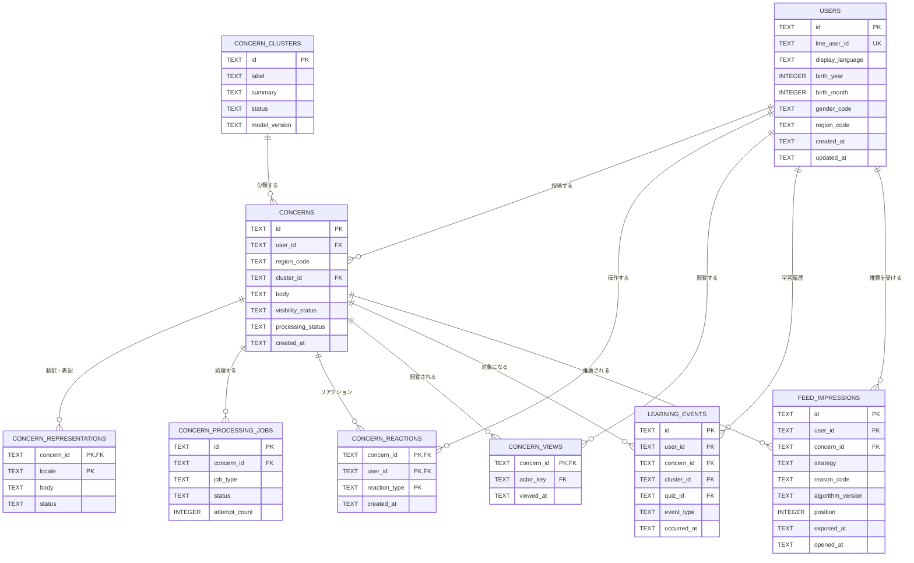
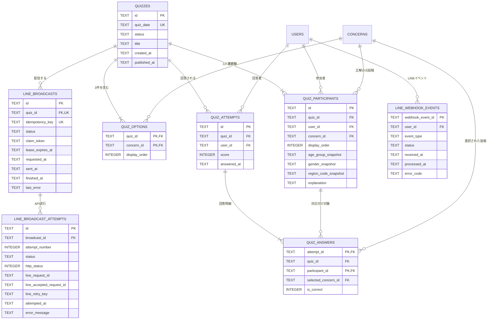
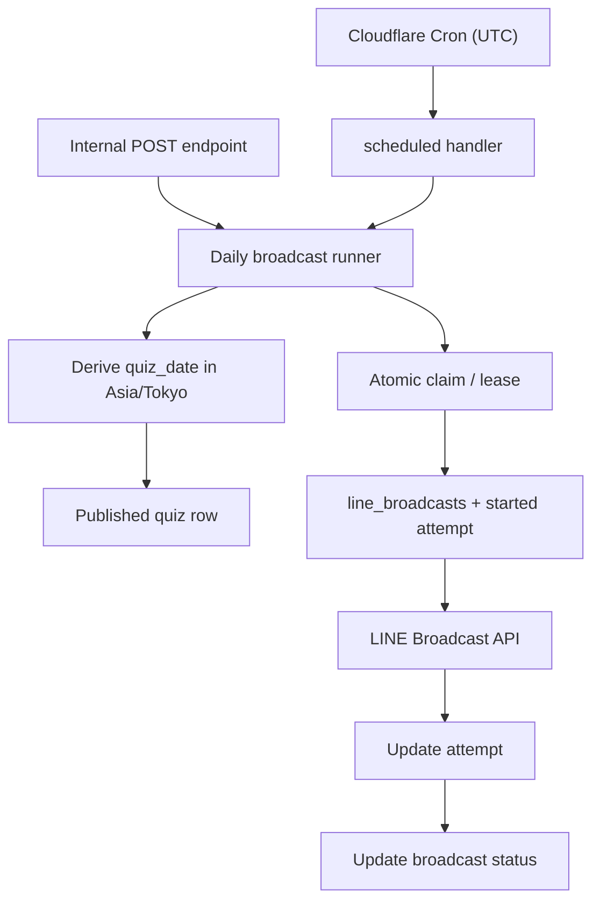

# SQLite データベース設計

Issue #29「データベース設計」の設計書。  
対象アプリは、LINEミニアプリ（LIFF）を入口として悩みを受け付け、投稿の公開、意味クラスタリング、推薦、クイズ、学習履歴、LINE 配信までを行う。

## 1. 設計の前提

- データベースは Cloudflare D1（SQLite）を使用する。
- 現在の `_health` テーブルは、D1 の疎通確認用として残す。
- ID は API に返しても個人を推測できない、アプリ生成の文字列 ID（ULID など）を使用する。
- 日時は UTC の ISO 8601 文字列を TEXT として保存する。
- 真偽値と件数は SQLite の INTEGER（0 または 1）で保存する。
- SQLite の ENUM は使用せず、TEXT と CHECK 制約で状態値を表現する。
- 正確な年齢、住所、緯度経度、IP アドレス、生音声、LINE のアクセストークンは保存しない。
- 投稿の公開状態と、翻訳・クラスタリングなどの処理状態は別々に管理する。
- 外部 AI や LINE の失敗で、保存済みの原文投稿が失われないことを優先する。

## 2. 全体方針

### 2.1 ユーザー識別を users に統一する

公開投稿の閲覧は認証なしで行い、投稿、既読、リアクション、クイズ回答、推薦履歴などの操作は LINE ログイン済みユーザーに限定する。操作主体は users.id に統一し、通常ブラウザや未ログインの LIFF の閲覧用に users 行を作らない。

- LINE/LIFF では、フロントエンドが取得した ID token を認証 API へ送る。バックエンドは LINE Login v2.1 の Verify ID token API で検証し、検証済みの LINE user ID から内部 users.id を解決する。
- バックエンドはログイン成功後に HttpOnly Cookie のセッションを発行する。以降の操作 API はこのセッションから users.id を解決する。
- ID token とアクセストークンは保存しない。LINE user ID は `users.line_user_id` に認証用識別子として保存し、APIレスポンスや通常ログへ出力しない。
- LINE Broadcast API の配信対象は公式アカウントが管理する友だち全体であり、D1 でユーザーごとの配信明細は持たない。
- リクエスト本文から送られた user_id は信頼せず、Cookie セッションの主体から解決した user_id を利用する。

公開閲覧ではユーザー履歴を記録せず、操作 API だけが Cookie セッションで識別された users.id を利用する。

### 2.2 非同期処理はジョブ単位で管理する

翻訳、ひらがな変換、クラスタリング、モデレーションを一つの状態値だけで管理すると、処理が並列に走ったときに状態を正しく表現できない。そのため、concerns.processing_status は API 向けの概要値とし、実際の処理状況は concern_processing_jobs で管理する。

原文は先に保存し、各処理が失敗しても原文の投稿は閲覧可能にする。

### 2.3 クイズは元投稿を参照し、属性はスナップショットする

クイズ参加者には、クイズ生成時点の年代・性別・都道府県コードをコピーして保存する。投稿本文は concern_id で元投稿を参照する。

投稿が削除または非公開になったときは、元投稿をクイズ画面に表示できないため、そのクイズを hidden にする。本文のスナップショットを持たせないことで、削除済み投稿がクイズ経由で再表示されることを防ぐ。


### 2.4 LINEミニアプリとAPIの認証

公開閲覧 API は認証情報を要求しない。投稿、リアクション、既読、クイズ、履歴などの操作 API は LINE ログイン後に発行された HttpOnly Cookie セッションを使い、内部 user_id をサーバー側で決定する。クライアントから送られた user_id は無視する。

- LIFF は liff.init() と liff.login() でログイン状態を確立する。認証 API は ID token と channel ID を LINE Login v2.1 の Verify ID token API（POST https://api.line.me/oauth2/v2.1/verify）へ渡し、検証済みの subject（LINE user ID）から users を upsert して Cookie セッションを発行する。
- 操作 API は Cookie セッションを検証し、セッションに紐づく users.id を利用する。ID token を各操作 API に送り直さない。
- 成功した認証結果からのみ内部 user_id を決定する。ID token、アクセストークン、LINE user ID の生値はレスポンスや通常ログへ出力しない。
- LINE webhook は LIFF 認証とは別に X-Line-Signature を channel secret で検証し、署名検証後の event.source.userId を内部処理にだけ利用する。ログや画面には出力しない。
- 日次配信の内部 endpoint はエンドユーザーの LIFF token を受け付けず、Worker 間の内部認証を使う。

参照: [LIFFアプリの開発](https://developers.line.biz/en/docs/liff/developing-liff-apps/)、[LINE Loginでユーザーを管理する](https://developers.line.biz/en/docs/line-login/managing-users/)、[LINE Messaging API リファレンス](https://developers.line.biz/en/reference/messaging-api/nojs/)。
## 3. リレーション図

### 3.1 投稿・閲覧・AI処理



### 3.2 クイズ・学習・LINE 配信



ER 図における「3人」「3件」は、SQLite のリレーションだけでは件数まで表現できないため、クイズ生成ユースケースのトランザクション内で検証する。

## 4. テーブル定義

### 4.1 主体・都道府県コード

| テーブル | 主なカラム | 制約・用途 |
| --- | --- | --- |
| users | id, line_user_id, display_language, birth_year, birth_month, gender_code, region_code, friend_status, joined_at, unfollowed_at, last_seen_at, created_at, updated_at, deleted_at | LINE/LIFF ログイン済みユーザー。LINE user ID は認証用に内部保存し、APIや画面には返さない。display_language は original, jaHira, en のいずれかで、初期値は original。プロフィールは生年月（年・月）、性別、都道府県を保持し、未入力のユーザーは NULL とする。friend_status は follow/unfollow の状態を保持する。deleted_at はアカウントの削除状態を示す |

### 4.2 投稿・AI処理

| テーブル | 主なカラム | 制約・用途 |
| --- | --- | --- |
| concerns | id, user_id, body, age_group, gender_code, region_code, visibility_status, processing_status, cluster_id, embedding_version, moderation_reason_code, created_at, updated_at, published_at, deleted_at | 悩み本体とVectorize登録version。region_code は任意の都道府県コード。visibility_status は pending, published, hidden, deleted |
| concern_clusters | id, legacy_label, legacy_summary, label, summary, status, model_version, created_at, updated_at | AI が作った分類。`legacy_*` は既存外部キーを保ったまま移行するための互換用必須列。statusはpending/generating/ready。生成中はupdated_atをclaim lease時刻として使い、アプリケーションが使うlabel/summaryは生成前にNULL |
| concern_representations | concern_id, locale, body, status, error_code, updated_at | locale は ja-Hira または en。原文は concerns.body に保持 |
| concern_processing_jobs | id, concern_id, job_type, status, attempt_count, available_at, last_error, started_at, completed_at | job_type は moderation, ja_hira, en_translation, clustering。concern_id と job_type の組を UNIQUE |
| concern_reactions | concern_id, user_id, reaction_type, created_at | MVP は reaction_type を empathy に固定し、concern_id、user_id、reaction_type の組を主キーにする |
| concern_views | concern_id, actor_key, viewed_at | 既読記録。concern_id と actor_key の組で一意 |
| learning_events | id, user_id, event_type, concern_id, cluster_id, quiz_id, occurred_at | view, reaction, quiz_answer などの学習イベントを保存 |
| feed_impressions | id, user_id, concern_id, strategy, reason_code, algorithm_version, position, exposed_at, opened_at | 推薦品質の確認用。fallback で新着順にした場合も strategy に記録 |

concerns の processing_status は次の概要値とする。

- pending: 未処理
- processing: いずれかのジョブを処理中
- ready: 必要な派生データの生成が完了
- failed: 一部処理に失敗。ただし原文は利用可能

投稿EmbeddingはD1へ複製せず、Cloudflare Vectorizeの `58-hackathon-concern-vectors` indexへ保存する。`@cf/qwen/qwen3-embedding-0.6b` の1024次元出力に合わせ、metricはcosineとする。Vector IDはconcern ID、metadataはcluster IDだけとし、投稿本文・ユーザー属性はVectorize metadataに含めない。D1の `concerns.embedding_version` にはモデル名と環境別index versionを記録し、Queue再処理時に現在のversionと異なる投稿を再登録する。Embeddingの次元・metricはindex作成時に固定し、同じindexに異なるモデルのベクトルを混在させない。cluster割当の正はD1の `concerns.cluster_id` であり、Vectorizeの近傍結果は候補として扱う。処理完了前または失敗時はフィード上でclusterを返さず、原文を閲覧できる。

`concern_clusters` は既存の `concerns.cluster_id` 外部キーを保つため、既存の必須カラムをテーブル再作成で変更しない。既存カラムを `legacy_label` / `legacy_summary` として残し、アプリケーションが使う nullable な `label` / `summary` を追加する。新規クラスタでは互換用カラムへ `__pending__` を入れ、要約生成時にpendingからgeneratingへ原子的にclaimする。`updated_at`をlease時刻として扱い、5分経過後はQueue再試行がclaimを取り直せる。表示用label・summaryを検証して保存するとreadyになる。`model_version` は従来どおりEmbedding model versionを保持する。

モデレーションの判定不能は、processing の失敗とは別に visibility_status を pending のまま保持する。これにより、AI 処理の失敗で原文を失わず、不適切な投稿だけは公開保留にできる。

### 4.3 クイズ

| テーブル | 主なカラム | 制約・用途 |
| --- | --- | --- |
| quizzes | id, quiz_date, status, title, created_at, published_at, hidden_at | quiz_date は UNIQUE。status は draft, published, closed, hidden |
| quiz_participants | id, quiz_id, user_id, concern_id, display_order, age_group_snapshot, gender_snapshot, region_code_snapshot, explanation | クイズに登場する3人。region_code_snapshot は都道府県コードのスナップショット。quiz_id と user_id、quiz_id と concern_id をそれぞれ UNIQUE にし、id と quiz_id の複合 UNIQUE を quiz_answers の外部キー先として持つ |
| quiz_options | quiz_id, concern_id, display_order | 3件の投稿を混ぜて表示する。quiz_id と display_order を UNIQUE にし、quiz_id と concern_id を複合主キーにする |
| quiz_attempts | id, quiz_id, user_id, score, answered_at | quiz_id と user_id を UNIQUE にして二重回答を防ぎ、id と quiz_id の複合 UNIQUE を quiz_answers の外部キー先として持つ |
| quiz_answers | quiz_id, attempt_id, participant_id, selected_concern_id, is_correct | PRIMARY KEY は attempt_id と participant_id。attempt_id と quiz_id、participant_id と quiz_id、quiz_id と selected_concern_id を複合外部キーにして、回答対象を同じクイズに限定する |

quiz_options の (quiz_id, concern_id) は quiz_participants の同じ組を参照する複合外部キーにする。quiz_answers には quiz_id を必ず持たせ、次の複合外部キーを設定する。

- (attempt_id, quiz_id) REFERENCES quiz_attempts(id, quiz_id)
- (participant_id, quiz_id) REFERENCES quiz_participants(id, quiz_id)
- (quiz_id, selected_concern_id) REFERENCES quiz_options(quiz_id, concern_id)

quiz_attempts と quiz_participants には、それぞれ (id, quiz_id) の複合 UNIQUE 制約を付ける。SQLite/D1 で外部キー制約を有効にし、いずれかの複合外部キーに違反した回答はトランザクション全体をロールバックする。これにより、別クイズの attempt_id、participant_id、selected_concern_id を混在させた行を保存できない。

クイズ回答は次の処理を一つのトランザクションで行う。

1. 公開中のクイズであることを確認する。
2. 元投稿3件がすべて公開中であることを確認する。
3. quiz_attempts を挿入する。既存なら 409 を返す。
4. 同じ quiz_id を付与した3件の quiz_answers を挿入する。複合外部キーの検証に失敗した場合はトランザクション全体をロールバックする。
5. 正答数を計算し、score を更新する。
6. learning_events に回答イベントを追加する。

元投稿が hidden または deleted になった場合は、クイズを hidden に更新し、クイズ画面から投稿本文を表示しない。

### 4.4 LINE

| テーブル | 主なカラム | 制約・用途 |
| --- | --- | --- |
| line_webhook_events | webhook_event_id, user_id, event_type, status, received_at, processed_at, error_code | LINE の再送に対する冪等性を確保。webhook_event_id は LINE の webhookEventId に対応し、user_id は user source の場合だけ入り得る nullable の外部キー。生の webhook payload は保存しない |
| line_broadcasts | id, quiz_id, idempotency_key, status, claim_token, lease_expires_at, requested_at, sent_at, finished_at, last_error | デイリークイズを全友だちへ送る一回の論理実行単位。quiz_id と idempotency_key をそれぞれ UNIQUE にし、claim_token と lease_expires_at で実行単位を原子的に占有する |
| line_broadcast_attempts | id, broadcast_id, attempt_number, status, http_status, line_request_id, line_accepted_request_id, line_retry_key, attempted_at, error_message | LINE Broadcast API の HTTP 呼び出し一回につき一行。配信先ユーザーごとの明細ではない。外部 API 呼び出し前に status=started と line_retry_key を保存し、結果不明の再試行では同じキーを使う |

`users.friend_status` は `active` または `unfollowed` を保存する。follow 時は `joined_at`（初回のみ）と `last_seen_at` を更新し、unfollow 時は `unfollowed_at` を更新する。友だち状態は運用・分析用であり、配信先一覧の生成には使わない。Broadcast API の配信対象は LINE Platform に任せる。

POST https://api.line.me/v2/bot/message/broadcast（LINE Broadcast API）は同じメッセージを公式アカウントの全友だちへ送るため、送信先を一人ずつ D1 に展開しない。line_broadcasts はクイズごとの論理配信、line_broadcast_attempts はその論理配信に対する HTTP 試行履歴として分離する。アプリ側の idempotency_key と LINE の X-Line-Retry-Key を分けて保持し、日次実行の二重起動と同一 API リクエストの重複をそれぞれ抑止する。line_broadcasts の claim_token と lease_expires_at を使い、Cron と内部 endpoint の呼び出しが同じ論理配信を同時に外部 API へ送らないようにする。

LINE API を呼ぶ前に、claim を取得したトランザクション内で line_broadcast_attempts に status=started、attempt_number、attempted_at、line_retry_key を保存する。Worker が API 応答を受け取る前に終了した場合、lease の期限切れ後に同じ attempt の line_retry_key を再利用する。LINE が 409 と X-Line-Accepted-Request-Id を返した場合は、先行リクエストが受理済みとして論理的な成功に扱う。line_broadcasts.status=succeeded は LINE が一回の Broadcast API リクエストを受理した状態であり、友だち一人ひとりの配信完了を D1 で追跡するものではない。LINE の user ID やアクセストークンはログとレスポンスに出力しない。

#### API項目と物理カラムの対応

API の camelCase と D1/SQLite の snake_case は次のように対応する。受信者ごとの配信行は作成せず、論理配信と HTTP 試行だけを保存する。

| API / LINE項目 | D1/SQLite カラム | 用途 |
| --- | --- | --- |
| webhookEventId | line_webhook_events.webhook_event_id | Webhook の重複処理を防ぐ外部イベント ID |
| quizId | line_broadcasts.quiz_id | 配信対象クイズ。1クイズにつき1論理配信 |
| idempotencyKey | line_broadcasts.idempotency_key | アプリ側の日次実行キー |
| broadcastId | line_broadcasts.id | アプリ側の論理配信 ID |
| X-Line-Retry-Key | line_broadcast_attempts.line_retry_key | LINE API の再試行キー |
| X-Line-Request-Id | line_broadcast_attempts.line_request_id | LINE が返す試行単位のリクエスト ID |
| X-Line-Accepted-Request-Id | line_broadcast_attempts.line_accepted_request_id | 409 時に受理済みの先行リクエストを識別する ID |

## 5. SQLite で必ず設定する制約

### 一意性

- users.line_user_id
- quizzes.quiz_date
- concern_reactions の concern_id、user_id、reaction_type の組
- concern_views の concern_id と actor_key の組
- quiz_participants の quiz_id と user_id
- quiz_participants の id と quiz_id（quiz_answers の複合外部キー先）
- quiz_attempts の quiz_id と user_id
- quiz_attempts の id と quiz_id（quiz_answers の複合外部キー先）
- quiz_options の quiz_id と concern_id
- line_broadcasts.quiz_id
- line_broadcasts.idempotency_key
- line_broadcast_attempts の broadcast_id と attempt_number

### CHECK 制約

- concern_reactions.reaction_type: empathy
- concerns.visibility_status: pending, published, hidden, deleted
- concern_processing_jobs.status: pending, running, succeeded, failed
- concern_representations.locale: ja-Hira, en
- quizzes.status: draft, published, closed, hidden
- line_webhook_events.status: received, processed, ignored, failed
- line_broadcasts.status: pending, running, succeeded, failed
- line_broadcasts.status=running の行は claim_token と lease_expires_at を持ち、succeeded/failed に遷移したら claim を解放する
- line_broadcast_attempts.status: started, succeeded, failed（LINE の 409 + X-Line-Accepted-Request-Id は succeeded として記録）
- 数値の display_order, score, attempt_count, attempt_number は 0 以上

属性値の表示名はデータベースに日本語の自由入力で保存せず、API のコード値を利用する。例えば年代は 10s, 20s, 30s, 40s, 50s, 60s, 70s, 80s, 90s_plus, no_answer、性別は male, female, non_binary, other, no_answer とする。

### 推奨インデックス

```sql
CREATE INDEX concerns_feed_idx
  ON concerns (visibility_status, created_at DESC, id DESC);

CREATE INDEX concerns_cluster_feed_idx
  ON concerns (cluster_id, visibility_status, created_at DESC, id DESC);

CREATE INDEX concerns_region_feed_idx
  ON concerns (region_code, visibility_status, created_at DESC, id DESC);

CREATE INDEX concerns_user_idx
  ON concerns (user_id, created_at DESC);

CREATE INDEX processing_jobs_pickup_idx
  ON concern_processing_jobs (status, available_at);

CREATE UNIQUE INDEX concern_views_concern_actor_idx
  ON concern_views (concern_id, actor_key);

CREATE INDEX concern_views_actor_viewed_at_idx
  ON concern_views (actor_key, viewed_at);

CREATE INDEX reactions_user_idx
  ON concern_reactions (user_id, created_at DESC);

CREATE INDEX learning_events_user_idx
  ON learning_events (user_id, occurred_at DESC);

CREATE INDEX feed_impressions_user_idx
  ON feed_impressions (user_id, exposed_at DESC);

CREATE INDEX line_broadcast_lease_idx
  ON line_broadcasts (status, lease_expires_at);
```

フィードは created_at だけで並べず、同時刻の投稿を安定してページングするため id をタイブレーカーにする。

```sql
WHERE visibility_status = 'published'
  AND (created_at, id) < (?, ?)
ORDER BY created_at DESC, id DESC
LIMIT ?
```

## 6. 主要処理とデータ更新

### 投稿

1. LINE ログイン済み Cookie セッションを検証し、サーバー側で users.id を解決する。
2. 本文・属性をサーバー側で検証する。
3. concerns を保存する。
4. concern_processing_jobs に必要なジョブを登録する。
5. API は AI 処理を待たずに投稿 ID と保存状態を返す。
6. 原文は visibility_status に応じて表示し、翻訳・クラスタリングは完了後に追加表示する。
### 既読とリアクション

- 既読は認証済みセッションの users.id を actor_key として concern_views に記録する。同じ投稿の再閲覧では viewed_at を維持する。
- リアクションは INSERT ... ON CONFLICT DO NOTHING を使う。
- 集計数は concern_reactions の concern_id 件数から求める。必要になった場合だけ concerns に集計キャッシュを追加する。

### 推薦

1. concern_views から未読投稿を除外する。
2. 直近の cluster_id と都道府県の偏りを確認する。
3. 新着・クラスタ分散・都道府県分散で候補を並べる。
4. 各候補を feed_impressions に保存し、strategy と reason_code を返す。
5. AI や推薦処理が使えない場合は strategy=fallback で新着順を返す。

### LINE 日次一斉配信

日次配信は、Cloudflare Cron の scheduled() または内部認証付き POST /api/v1/line/broadcasts/daily-quiz から、同じ配信ランナーを起動する。スケジュール自体は D1 に保存せず、Worker の wrangler.jsonc に固定の Cron Trigger として定義する。endpoint は手動実行と失敗時の再試行の入口として扱う。



1. Cron の実行時刻は UTC として受け取り、Asia/Tokyo に変換した業務日を quizzes.quiz_date として求める。保存する日時は UTC のままにする。
2. 対象日の published な quizzes を一件取得する。
3. D1 の一つのトランザクションで、idempotency_key=daily-quiz:YYYY-MM-DD の行を `INSERT ... ON CONFLICT DO NOTHING` で確保する。その後、`status=pending` または `status=failed`、もしくは `status=running AND lease_expires_at <= now` の行だけを `status=running` に更新し、呼び出しごとに生成したランダムな claim_token と lease_expires_at を保存する。更新件数が0なら、別の実行が有効な lease を保持しているか、既に succeeded なので LINE API を呼ばずに終了する。この compare-and-set を同一トランザクションで行うことで、Cron と内部 endpoint の重複実行を一つに絞る。
4. claim を取得したトランザクション内で、既存の status=started の attempt があればその line_retry_key を再利用し、なければ次の attempt_number と新しい line_retry_key を生成して `status=started` の line_broadcast_attempts を保存する。外部 API を呼ぶ前にこのトランザクションを commit する。
5. commit 後、クイズ URL を含むメッセージを POST https://api.line.me/v2/bot/message/broadcast に一回送信する。配信先は LINE 公式アカウントの全友だちであり、ユーザーごとの Push API 呼び出しは行わない。
6. API 応答後に、HTTP ステータス、LINE の X-Line-Request-Id、X-Line-Accepted-Request-Id、Retry Key、エラーを attempt に記録する。更新は claim_token が一致する running 行に限定し、lease を奪われた古い Worker が新しい実行結果を上書きしないようにする。
7. 成功時は line_broadcasts.sent_at / finished_at と status=succeeded を更新する。明確に送信されなかった失敗だけは attempt/status=failed として再試行し、タイムアウトなど結果不明の場合は attempt/status=started と同じ line_retry_key を残したまま lease の期限切れを待つ。次の実行はその key を再利用する。LINE の 409 + X-Line-Accepted-Request-Id は受理済みの成功として扱う。

line_broadcasts.status=succeeded は LINE Broadcast API が論理リクエストを受理した状態であり、全友だちへの個別配信結果を意味しない。したがって、line_broadcast_deliveries のような受信者単位のテーブルは作成しない。

Cron と scheduled handler の仕様は [Cloudflare Cron Triggers](https://developers.cloudflare.com/workers/configuration/cron-triggers/) と [Scheduled Handler](https://developers.cloudflare.com/workers/runtime-apis/handlers/scheduled/) を参照する。
## 7. マイグレーションと実装順

既存の _health は維持し、次の順で migration を追加する。

1. users
2. concern_clusters、concerns
3. concern_representations、concern_processing_jobs
4. concern_views、concern_reactions、learning_events、feed_impressions
5. quizzes、quiz_participants、quiz_options、quiz_attempts、quiz_answers
6. line_webhook_events、line_broadcasts、line_broadcast_attempts
7. 各検索インデックス

実装時は次の3点を同じ PR に含める。

- backend/src/infrastructure/database/schema.ts の Drizzle schema
- backend/migrations/ の生成 SQL
- Repository と UseCase のテスト

アプリケーション層では、D1 固有の型を直接扱わず、既存の方針どおり Repository Port と D1/Drizzle Adapter を分離する。

## 8. 保存・削除方針

- concerns は物理削除よりも deleted への状態変更を優先する。
- deleted の投稿は一般フィード、クイズ、推薦から除外する。
- users.deleted_at が設定されたユーザーは、公開投稿を残す場合でも本人の学習履歴を API から参照できないようにする。
- 投稿削除要求では、対象 concern と派生表現・クラスタ表示・クイズ表示を同時に非公開化する。
- 生音声、IP、LINE アクセストークンは保存しない。
- デモ終了時には、投稿、表現、学習履歴、LINE 連携情報をまとめて削除できる手順を用意する。
