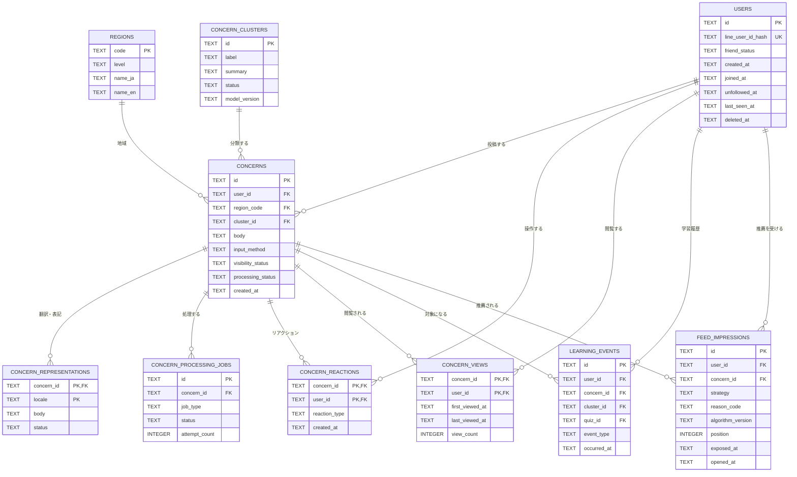
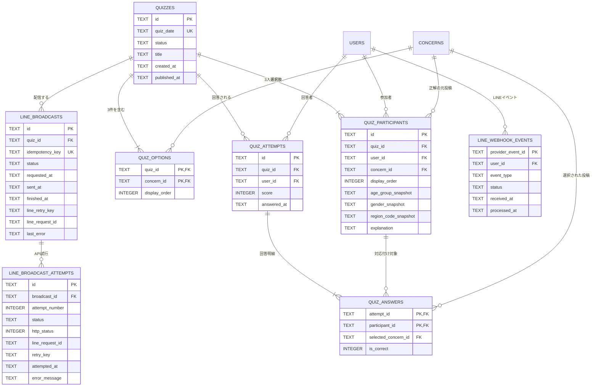
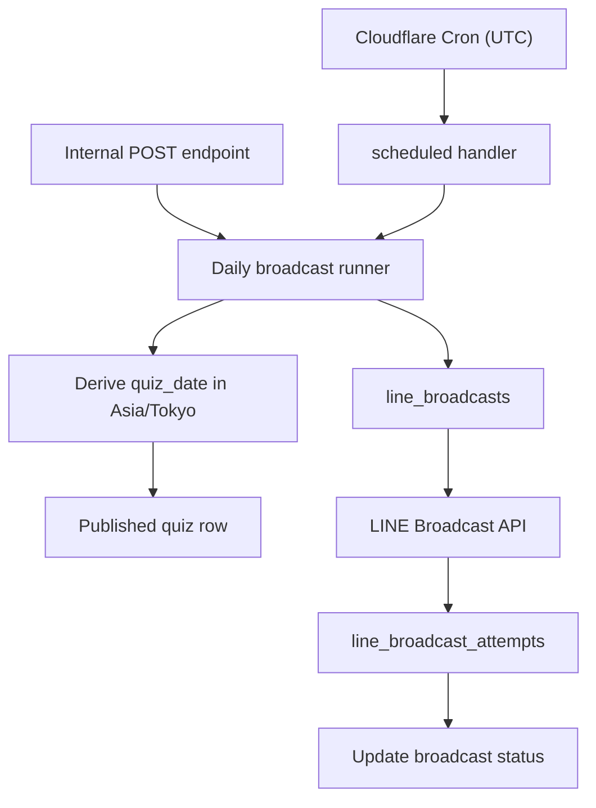

# SQLite データベース設計

Issue #29「データベース設計」の設計書。  
対象アプリは、LINEミニアプリ（LIFF）を入口として悩みを受け付け、投稿の公開、意味クラスタリング、推薦、クイズ、学習履歴、LINE 配信までを行う。

## 1. 設計の前提

- データベースは Cloudflare D1（SQLite）を使用する。
- 現在の `_health` テーブルは、D1 の疎通確認用として残す。
- ID は API に返しても個人を推測できない、アプリ生成の文字列 ID（ULID など）を使用する。
- 日時は UTC の ISO 8601 文字列を TEXT として保存する。
- 真偽値と件数は SQLite の INTEGER（0 または 1）で保存する。
- SQLite の ENUM は使用せず、TEXT と CHECK 制約で状態値を表現する。
- 正確な年齢、住所、緯度経度、IP アドレス、生音声、LINE のアクセストークンは保存しない。
- 投稿の公開状態と、翻訳・クラスタリングなどの処理状態は別々に管理する。
- 外部 AI や LINE の失敗で、保存済みの原文投稿が失われないことを優先する。

## 2. 全体方針

### 2.1 ユーザーを LINE 認証で統一する

本アプリは LINE ミニアプリ（LIFF）を入口とし、全ユーザーを LINE Login/LIFF で認証する。匿名セッション用の別テーブルは持たず、投稿、既読、リアクション、クイズ回答、推薦履歴はすべて users.id を参照する。

- フロントエンドは LIFF でログインし、取得した ID token を Authorization: Bearer <ID_TOKEN> として API に送る。
- バックエンドは LINE Login v2.1 の Verify ID token API で ID token を検証し、検証済みの LINE user ID から内部 users.id を解決する。
- LINE user ID はサーバー側の秘密鍵で HMAC 化した値だけを users.line_user_id_hash に保存し、生の ID や ID token・アクセストークンは保存しない。
- リクエスト本文から送られた user_id は信頼せず、必ず検証済みトークンの主体から解決した user_id を利用する。
- LINE の友だち状態は users.friend_status で管理する。配信対象は LINE Broadcast API が管理する友だち全体であり、D1 でユーザーごとの配信明細は持たない。

この構成により、すべてのドメインテーブルが users.id を参照し、匿名利用者用と LINE 利用者用の多態的な外部キーを持たずに済む。

### 2.2 非同期処理はジョブ単位で管理する

翻訳、ひらがな変換、クラスタリング、モデレーションを一つの状態値だけで管理すると、処理が並列に走ったときに状態を正しく表現できない。そのため、concerns.processing_status は API 向けの概要値とし、実際の処理状況は concern_processing_jobs で管理する。

原文は先に保存し、各処理が失敗しても原文の投稿は閲覧可能にする。

### 2.3 クイズは元投稿を参照し、属性はスナップショットする

クイズ参加者には、クイズ生成時点の年代・性別・地域をコピーして保存する。投稿本文は concern_id で元投稿を参照する。

投稿が削除または非公開になったときは、元投稿をクイズ画面に表示できないため、そのクイズを hidden にする。本文のスナップショットを持たせないことで、削除済み投稿がクイズ経由で再表示されることを防ぐ。


### 2.4 LINEミニアプリとAPIの認証

通常の API は LIFF 認証を必須とする。フロントエンドは liff.init() と liff.login() でログイン状態を確立し、ID token を Bearer トークンとして送信する。バックエンドは LINE Login v2.1 の Verify ID token API（POST https://api.line.me/oauth2/v2.1/verify）へ ID token と LIFF の channel ID を渡して検証し、検証済みの subject（LINE user ID）から users を upsert する。

- 成功した検証結果からのみ内部 user_id を決定する。クライアントが body や query に指定した user_id は無視する。
- ID token、アクセストークン、LINE user ID の生値は保存・ログ出力しない。識別が必要な場合は HMAC-SHA-256 のハッシュを用いる。
- LINE webhook は LIFF 認証とは別に X-Line-Signature を channel secret で検証し、イベントの user ID を同じ users に紐付ける。
- 日次配信の内部 endpoint はエンドユーザーの LIFF token を受け付けず、Worker 間の内部認証を使う。

参照: [LIFFアプリの開発](https://developers.line.biz/en/docs/liff/developing-liff-apps/)、[LINE Loginでユーザーを管理する](https://developers.line.biz/en/docs/line-login/managing-users/)、[LINE Messaging API リファレンス](https://developers.line.biz/en/reference/messaging-api/nojs/)。
## 3. リレーション図

### 3.1 投稿・閲覧・AI処理



### 3.2 クイズ・学習・LINE 配信



ER 図における「3人」「3件」は、SQLite のリレーションだけでは件数まで表現できないため、クイズ生成ユースケースのトランザクション内で検証する。

## 4. テーブル定義

### 4.1 主体・地域

| テーブル | 主なカラム | 制約・用途 |
| --- | --- | --- |
| users | id, line_user_id_hash, friend_status, created_at, joined_at, unfollowed_at, last_seen_at, deleted_at | LINE/LIFF 認証済みユーザー。line_user_id_hash は HMAC 値を UNIQUE にする |
| regions | code, level, name_ja, name_en | 都道府県と広域区分のマスタ。投稿には自由入力文字列を保存しない |

### 4.2 投稿・AI処理

| テーブル | 主なカラム | 制約・用途 |
| --- | --- | --- |
| concerns | id, user_id, body, input_method, age_group, gender_code, region_code, visibility_status, processing_status, cluster_id, moderation_reason_code, created_at, updated_at, published_at, deleted_at | 悩み本体。input_method は web, line, voice。visibility_status は pending, published, hidden, deleted |
| concern_clusters | id, label, summary, status, model_version, created_at, updated_at | AI が作った分類。画面表示前に長さ・禁止語・個人情報を検査 |
| concern_representations | concern_id, locale, body, status, error_code, updated_at | locale は ja-Hira または en。原文は concerns.body に保持 |
| concern_processing_jobs | id, concern_id, job_type, status, attempt_count, available_at, last_error, started_at, completed_at | job_type は moderation, ja_hira, en_translation, clustering。concern_id と job_type の組を UNIQUE |
| concern_reactions | concern_id, user_id, reaction_type, created_at | MVP は reaction_type を一種類に固定し、concern_id と user_id の組を UNIQUE |
| concern_views | concern_id, user_id, first_viewed_at, last_viewed_at, view_count | 既読判定と推薦用の集約行。concern_id と user_id の組を主キー |
| learning_events | id, user_id, event_type, concern_id, cluster_id, quiz_id, occurred_at | view, reaction, quiz_answer などの学習イベントを保存 |
| feed_impressions | id, user_id, concern_id, strategy, reason_code, algorithm_version, position, exposed_at, opened_at | 推薦品質の確認用。fallback で新着順にした場合も strategy に記録 |

concerns の processing_status は次の概要値とする。

- pending: 未処理
- processing: いずれかのジョブを処理中
- ready: 必要な派生データの生成が完了
- failed: 一部処理に失敗。ただし原文は利用可能

モデレーションの判定不能は、processing の失敗とは別に visibility_status を pending のまま保持する。これにより、AI 処理の失敗で原文を失わず、不適切な投稿だけは公開保留にできる。

### 4.3 クイズ

| テーブル | 主なカラム | 制約・用途 |
| --- | --- | --- |
| quizzes | id, quiz_date, status, title, created_at, published_at, hidden_at | quiz_date は UNIQUE。status は draft, published, closed, hidden |
| quiz_participants | id, quiz_id, user_id, concern_id, display_order, age_group_snapshot, gender_snapshot, region_code_snapshot, explanation | クイズに登場する3人。quiz_id と user_id、quiz_id と concern_id をそれぞれ UNIQUE |
| quiz_options | quiz_id, concern_id, display_order | 3件の投稿を混ぜて表示する。quiz_id と display_order を UNIQUE |
| quiz_attempts | id, quiz_id, user_id, score, answered_at | quiz_id と user_id を UNIQUE にして二重回答を防ぐ |
| quiz_answers | attempt_id, participant_id, selected_concern_id, is_correct | attempt_id と participant_id、attempt_id と selected_concern_id を UNIQUE |

quiz_options の (quiz_id, concern_id) は quiz_participants の同じ組を参照する複合外部キーにする。quiz_answers.selected_concern_id も、同じ quiz_id の quiz_options に存在することを複合外部キーまたはユースケースで検証する。

クイズ回答は次の処理を一つのトランザクションで行う。

1. 公開中のクイズであることを確認する。
2. 元投稿3件がすべて公開中であることを確認する。
3. quiz_attempts を挿入する。既存なら 409 を返す。
4. 3件の quiz_answers を挿入する。
5. 正答数を計算し、score を更新する。
6. learning_events に回答イベントを追加する。

元投稿が hidden または deleted になった場合は、クイズを hidden に更新し、クイズ画面から投稿本文を表示しない。

### 4.4 LINE

| テーブル | 主なカラム | 制約・用途 |
| --- | --- | --- |
| line_webhook_events | provider_event_id, user_id, event_type, status, received_at, processed_at, error_code | LINE の再送に対する冪等性を確保。生の webhook payload は保存しない。user_id は検証済みイベントから解決する |
| line_broadcasts | id, quiz_id, idempotency_key, status, requested_at, sent_at, finished_at, line_retry_key, line_request_id, last_error | デイリークイズを全友だちへ送る一回の実行単位。idempotency_key は daily-quiz:YYYY-MM-DD |
| line_broadcast_attempts | id, broadcast_id, attempt_number, status, http_status, line_request_id, retry_key, attempted_at, error_message | LINE Broadcast API の呼び出し一回につき一行。配信先ユーザーごとの明細ではない |

POST https://api.line.me/v2/bot/message/broadcast（LINE Broadcast API）は同じメッセージを公式アカウントの全友だちへ送るため、送信先を一人ずつ D1 に展開しない。API 呼び出しが失敗した場合だけ、line_broadcast_attempts に試行結果を追加し、line_broadcasts を再試行可能な状態にする。アプリ側の idempotency_key と LINE の X-Line-Retry-Key を分けて保持し、日次実行の二重起動と同一 API リクエストの重複をそれぞれ抑止する。LINE の user ID やアクセストークンはログとレスポンスに出力しない。
## 5. SQLite で必ず設定する制約

### 一意性

- users.line_user_id_hash
- quizzes.quiz_date
- concerns の同一 user によるリアクション
- concerns の同一 user による既読集約
- quiz_participants の quiz_id と user_id
- quiz_attempts の quiz_id と user_id
- line_broadcasts.idempotency_key
- line_broadcast_attempts の broadcast_id と attempt_number

### CHECK 制約

- users.friend_status: active, unfollowed, blocked
- concerns.input_method: web, line, voice
- concerns.visibility_status: pending, published, hidden, deleted
- concern_processing_jobs.status: pending, running, succeeded, failed
- concern_representations.locale: ja-Hira, en
- quizzes.status: draft, published, closed, hidden
- line_broadcasts.status: pending, running, succeeded, failed
- line_broadcast_attempts.status: started, succeeded, failed
- 数値の display_order, score, view_count, attempt_count, attempt_number は 0 以上

属性値の表示名はデータベースに日本語の自由入力で保存せず、API のコード値を利用する。例えば年代は 10s, 20s, 30s, 40s, 50s_plus, no_answer、性別は male, female, non_binary, other, no_answer とする。

### 推奨インデックス

```sql
CREATE INDEX concerns_feed_idx
  ON concerns (visibility_status, created_at DESC, id DESC);

CREATE INDEX concerns_cluster_feed_idx
  ON concerns (cluster_id, visibility_status, created_at DESC, id DESC);

CREATE INDEX concerns_region_feed_idx
  ON concerns (region_code, visibility_status, created_at DESC, id DESC);

CREATE INDEX concerns_user_idx
  ON concerns (user_id, created_at DESC);

CREATE INDEX processing_jobs_pickup_idx
  ON concern_processing_jobs (status, available_at);

CREATE INDEX views_user_idx
  ON concern_views (user_id, last_viewed_at DESC);

CREATE INDEX reactions_user_idx
  ON concern_reactions (user_id, created_at DESC);

CREATE INDEX learning_events_user_idx
  ON learning_events (user_id, occurred_at DESC);

CREATE INDEX feed_impressions_user_idx
  ON feed_impressions (user_id, exposed_at DESC);
```

フィードは created_at だけで並べず、同時刻の投稿を安定してページングするため id をタイブレーカーにする。

```sql
WHERE visibility_status = 'published'
  AND (created_at, id) < (?, ?)
ORDER BY created_at DESC, id DESC
LIMIT ?
```

## 6. 主要処理とデータ更新

### 投稿

1. Authorization Bearer の ID token を検証し、LINE user ID から内部 user_id を解決する。
2. 本文・属性・input_method をサーバー側で検証する。
3. concerns を保存する。
4. concern_processing_jobs に必要なジョブを登録する。
5. API は AI 処理を待たずに投稿 ID と保存状態を返す。
6. 原文は visibility_status に応じて表示し、翻訳・クラスタリングは完了後に追加表示する。
### 既読とリアクション

- 既読は concern_views を INSERT または UPSERT し、learning_events に view を追加する。
- リアクションは INSERT ... ON CONFLICT DO NOTHING を使う。
- 集計数は concern_reactions の concern_id 件数から求める。必要になった場合だけ concerns に集計キャッシュを追加する。

### 推薦

1. concern_views から未読投稿を除外する。
2. 直近の cluster_id と地域の偏りを確認する。
3. 新着・クラスタ分散・地域分散で候補を並べる。
4. 各候補を feed_impressions に保存し、strategy と reason_code を返す。
5. AI や推薦処理が使えない場合は strategy=fallback で新着順を返す。

### LINE 日次一斉配信

日次配信は、Cloudflare Cron の scheduled() または内部認証付き POST /api/v1/line/broadcasts/daily-quiz から、同じ配信ランナーを起動する。スケジュール自体は D1 に保存せず、Worker の wrangler.jsonc に固定の Cron Trigger として定義する。endpoint は手動実行と失敗時の再試行の入口として扱う。



1. Cron の実行時刻は UTC として受け取り、Asia/Tokyo に変換した業務日を quizzes.quiz_date として求める。保存する日時は UTC のままにする。
2. 対象日の published な quizzes を一件取得する。
3. idempotency_key=daily-quiz:YYYY-MM-DD で line_broadcasts を作成する。既に succeeded なら何もしない。failed または未完了なら再実行する。
4. クイズ URL を含むメッセージを POST https://api.line.me/v2/bot/message/broadcast に一回送信する。配信先は LINE 公式アカウントの全友だちであり、ユーザーごとの Push API 呼び出しは行わない。
5. API 呼び出しごとに line_broadcast_attempts を追加し、HTTP ステータス、LINE の request ID、Retry Key、エラーを記録する。
6. 成功時は line_broadcasts.sent_at / finished_at と status=succeeded を更新し、失敗時は last_error と status=failed を保存して再試行できるようにする。

Cron と scheduled handler の仕様は [Cloudflare Cron Triggers](https://developers.cloudflare.com/workers/configuration/cron-triggers/) と [Scheduled Handler](https://developers.cloudflare.com/workers/runtime-apis/handlers/scheduled/) を参照する。
## 7. マイグレーションと実装順

既存の _health は維持し、次の順で migration を追加する。

1. users、regions
2. concern_clusters、concerns
3. concern_representations、concern_processing_jobs
4. concern_views、concern_reactions、learning_events、feed_impressions
5. quizzes、quiz_participants、quiz_options、quiz_attempts、quiz_answers
6. line_webhook_events、line_broadcasts、line_broadcast_attempts
7. 各検索インデックス

実装時は次の3点を同じ PR に含める。

- backend/src/infrastructure/database/schema.ts の Drizzle schema
- backend/migrations/ の生成 SQL
- Repository と UseCase のテスト

アプリケーション層では、D1 固有の型を直接扱わず、既存の方針どおり Repository Port と D1/Drizzle Adapter を分離する。

## 8. 保存・削除方針

- concerns は物理削除よりも deleted への状態変更を優先する。
- deleted の投稿は一般フィード、クイズ、推薦から除外する。
- users.deleted_at が設定されたユーザーは、公開投稿を残す場合でも本人の学習履歴を API から参照できないようにする。
- 投稿削除要求では、対象 concern と派生表現・クラスタ表示・クイズ表示を同時に非公開化する。
- 生音声、IP、LINE アクセストークンは保存しない。
- デモ終了時には、投稿、表現、学習履歴、LINE 連携情報をまとめて削除できる手順を用意する。
