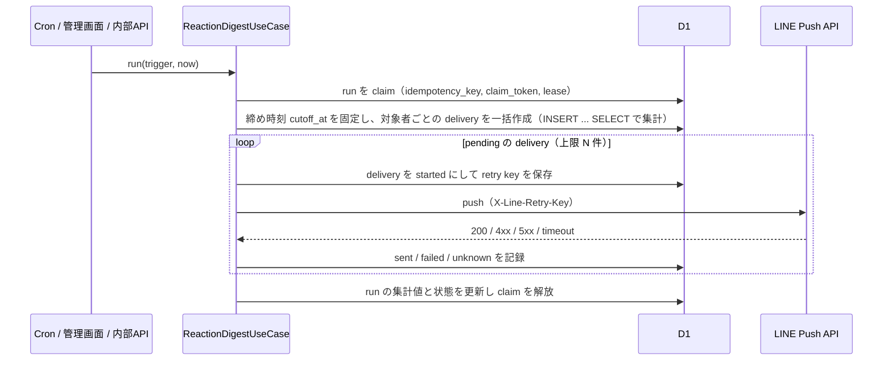

# LINE 寄りそい通知（リアクションダイジェスト）設計

投稿者へ「前回のお知らせ以降に届いた『そっと寄りそう』の数」を LINE で知らせる機能の設計書。
実装済み。API の契約は [API仕様 9.5](./api.md#95-line-寄りそい通知)、テーブルは [SQLiteデータベース設計](./database.md) と [データモデル](./data.md) を正とし、この文書は背景と設計判断を残す。

## 1. 目的とコンセプト

### 1.1 解決したい課題

現状、投稿者は自分の悩みに寄りそいが届いても知る手段がない。プロダクト要件の中心価値である「投稿者が『自分の悩みを知ってもらえた』と感じる」体験が、投稿直後以降に成立していない。

### 1.2 コンセプト: 地域としての一体感

単に件数を伝えるのではなく、「同じ地域の誰かが気にかけてくれた」「全国のいろいろな地域から届いた」ことを伝え、地域の中でつながっている感覚を作る。

- 寄りそった人のうち、投稿者と同じ都道府県の人数を伝える
- 寄りそいが届いた都道府県の数を伝える
- 寄りそった人を特定できる情報（個人の属性の組み合わせ、時刻、投稿ごとの内訳）は伝えない

### 1.3 メッセージ例

投稿者のプロフィールに都道府県があり、同じ都道府県からの寄りそいがある場合:

```
あなたの悩みに、5人がそっと寄りそいました。
そのうち2人は、あなたと同じ北海道の人です。
全国3つの都道府県から届いています。

▼ みんなの悩みを見てみる
https://liff.line.me/{LIFF_ID}/
```

同じ都道府県からの寄りそいがない、または投稿者が都道府県を未設定の場合は、2 行目を省略する。
寄りそいの届いた都道府県が 1 つ以下の場合は 3 行目を省略する（寄りそった人が 1 人だけの場合に地域が特定されやすくなるのを避ける）。

`users.display_language` に応じて、原文（漢字かな交じり）・ひらがな・英語のテンプレートを使い分ける。都道府県名は既存の `backend/src/util/attribute-name.ts` の表示名を使う。

## 2. 要件

| 項目 | 内容 |
| --- | --- |
| 定期送信 | Cloudflare Cron で 1 日 1 回送信する。時刻は 20:00 JST（`0 11 * * *`）を想定する |
| 任意送信 | 管理画面 `/admin/line-broadcast` のボタン、および内部 API から任意のタイミングで送信できる |
| 集計対象 | 前回の通知が成功した時点（なければ最初）から、今回の締め時刻までに、その人の公開中の投稿へ新しく付いた寄りそい |
| 送信対象 | LINE 公式アカウントの友だち（`users.friend_status = 'active'`）かつ未削除で、集計対象の寄りそいが 1 件以上ある人 |
| 送信しない | 新しい寄りそいが 0 件の人、ブロック中の人、自分の投稿への自分の寄りそい |
| 冪等性 | 同じ実行を再試行しても同じ人へ二重送信しない。Cron の二重起動でも同じ日に 2 回送らない |
| 障害時 | 一部の人への送信に失敗しても他の人への送信を続ける。失敗した人は次回の実行で前回成功時点から改めて集計される |

## 3. クイズ配信との違い

設計は既存のデイリークイズ配信（`line_broadcasts` / `line_broadcast_attempts`、[API仕様 9章](./api.md#9-line-デイリークイズ一斉配信)）を踏襲するが、次の点が異なる。

| 観点 | デイリークイズ配信 | 寄りそい通知 |
| --- | --- | --- |
| LINE API | Broadcast API（全友だちへ同一メッセージ） | Push API（`POST /v2/bot/message/push`）で 1 人ずつ |
| 内容 | 全員同じ | 人ごとに件数・地域が異なる |
| 実行単位 | クイズ 1 件につき 1 論理配信 | 実行（run）1 回の中に、受信者ごとの配信（delivery）が複数 |
| 受信者ごとの記録 | 持たない | 持つ。「前回送信から」の起点を決めるために必須 |
| 1 日の実行回数 | 1 回（quizDate で一意） | Cron は 1 日 1 回。手動実行は何度でも可 |

クイズ配信のドキュメントにある「users を全件走査して Push API を呼び出してはならない」は Broadcast で済むクイズ配信の制約であり、本機能は内容が人ごとに異なるため Push API を使う。この違いを API 仕様にも明記する。

## 4. 全体の流れ



1. 起動元（Cron、管理画面、内部 API）から同じ UseCase を呼ぶ
2. 実行単位 `reaction_digest_runs` を作成・claim する。Cron は `reaction-digest:cron:YYYY-MM-DD`、手動は `reaction-digest:manual:{runId}` を idempotency key にする
3. claim した時点の時刻を `cutoff_at` として run に固定する。再試行しても集計範囲は変わらない
4. 受信者ごとの `reaction_digest_deliveries` を 1 回の `INSERT ... SELECT` で作成する。集計値（件数、同じ都道府県の人数、都道府県数）はこの時点でスナップショットする
5. `pending` の delivery を上限件数まで順に Push API で送る
6. すべての delivery が確定したら run を `succeeded`（一部失敗なら `partially_failed`）にする。上限件数を超えた残りがある場合は run を `pending` に戻し、次の手動実行または再試行で続きから送る

## 5. 「前回送信から」の起点

ユーザーごとの起点（`window_start`）は、そのユーザーの **最後に送信成功した delivery の `window_end`** とする。

- 初回（成功 delivery がない人）は起点を持たず、今回の締め時刻までの全寄りそいを対象にする
- 送信に失敗した delivery は起点にならない。次回の実行では前回成功時点から集計し直すため、取りこぼしが起きない
- 未確定（`pending` / `started`）の delivery がある人は、その delivery が確定するまで新しい run の対象から外す。結果不明の `started` は同じ Retry Key で再送して確定させる
- `users` に「最終通知時刻」列を追加する方式も考えられるが、送信結果と起点がずれる恐れがあるため、delivery の履歴を正とする

集計条件:

```sql
concern_reactions.created_at >  window_start   -- 起点がある場合のみ
concern_reactions.created_at <= run.cutoff_at
concerns.user_id = 受信者
concerns.visibility_status = 'published'
concern_reactions.user_id <> 受信者          -- 自分への寄りそいは除く
```

「人数」は実人数（`count(distinct reactor)`）とする。同じ人が複数の投稿へ寄りそった場合も 1 人と数える。

## 6. データ設計

### 6.1 reaction_digest_runs

| カラム | 型 | 説明 |
| --- | --- | --- |
| id | TEXT PK | run ID |
| trigger | TEXT | `cron` / `manual` |
| idempotency_key | TEXT UNIQUE | Cron: `reaction-digest:cron:YYYY-MM-DD`、手動: `reaction-digest:manual:{id}` |
| status | TEXT | `pending` / `running` / `succeeded` / `partially_failed` / `failed` |
| cutoff_at | TEXT | 集計の締め時刻。最初の claim 時に固定 |
| claim_token | TEXT NULL | 実行中の runner を識別 |
| lease_expires_at | TEXT NULL | runner が落ちた場合に再 claim できる期限 |
| deliveries_prepared_at | TEXT NULL | delivery を作成した時刻。二度作らないための印 |
| requested_at | TEXT | 作成時刻 |
| finished_at | TEXT NULL | 完了時刻 |

CHECK: `running` のときだけ `claim_token` と `lease_expires_at` を持つ（`line_broadcasts` と同じ制約）。

件数（対象・送信・失敗・対象外・残り）は run に持たず、delivery から毎回集計する。状態を二重に持つとずれるため。

### 6.2 reaction_digest_deliveries

| カラム | 型 | 説明 |
| --- | --- | --- |
| id | TEXT PK | delivery ID |
| run_id | TEXT FK | reaction_digest_runs.id |
| user_id | TEXT FK | 受信者の users.id（LINE user ID は保存しない。送信時に users から引く） |
| window_start | TEXT NULL | 集計の起点（排他的）。初回は NULL |
| window_end | TEXT | 集計の終点（= run.cutoff_at） |
| reactor_count | INTEGER | 新しく寄りそった人の実人数 |
| same_region_count | INTEGER | うち受信者と同じ都道府県の人からの数 |
| region_count | INTEGER | 寄りそいが届いた都道府県の数（未設定は数えない） |
| region_code_snapshot | TEXT NULL | 集計時の受信者の都道府県コード |
| status | TEXT | `pending` / `started` / `sent` / `failed` / `skipped` |
| line_retry_key | TEXT NULL UNIQUE | Push API の X-Line-Retry-Key。送信前に保存 |
| http_status | INTEGER NULL | LINE API の HTTP status |
| line_request_id | TEXT NULL | X-Line-Request-Id |
| created_at | TEXT | 作成時刻 |
| attempted_at | TEXT NULL | 最後に送信を試みた時刻 |
| sent_at | TEXT NULL | 送信成功時刻 |
| error_code | TEXT NULL | `upstream_rejected` / `user_blocked` など |

- UNIQUE(run_id, user_id): 同じ run で同じ人へ 2 通送らない
- INDEX(user_id, status, window_end): 起点の検索用
- INDEX(run_id, status): pending の取り出し用
- `skipped`: 送信直前に友だち解除・削除済みになっていた場合

メッセージ本文は保存しない。集計値から毎回同じ本文を組み立てられるため、再送時も同一内容になる。

### 6.3 保存・削除方針

- 寄りそった人の ID や個別の都道府県は delivery に保存しない。集計値だけを持つ
- LINE user ID、channel access token はログ・レスポンス・DB の delivery に出さない
- デモ終了時の削除対象に `reaction_digest_runs` / `reaction_digest_deliveries` を加える

## 7. API 設計

既存のクイズ配信と同じく、内部 API（INTERNAL_API_TOKEN）と管理画面 API（Cloudflare Access + Origin 検証）の 2 系統を用意する。

### 7.1 POST /api/v1/line/notifications/reaction-digest（内部）

- 認証: `Authorization: Bearer {INTERNAL_API_TOKEN}`
- Request body なし。管理画面の POST と同じく、未完了の run があれば続きを送り、なければ新しい手動 run を作る
- 画面向け `AppType` には含めない

### 7.2 GET /api/v1/admin/line/notifications/reaction-digest（管理画面）

直近の run（最大 10 件）の状態を返す。受信者一覧や個人の集計値は返さない。

```json
{
  "deliveryMode": "line_api",
  "runs": [
    {
      "runId": "01J...",
      "trigger": "manual",
      "status": "succeeded",
      "requestedAt": "2026-09-26T05:12:00.000Z",
      "finishedAt": "2026-09-26T05:12:03.000Z",
      "targetCount": 12,
      "sentCount": 12,
      "failedCount": 0,
      "skippedCount": 0,
      "remainingCount": 0
    }
  ]
}
```

### 7.3 POST /api/v1/admin/line/notifications/reaction-digest（管理画面）

- Request body なし
- 未完了（`pending`）の run があれば、新しい run を作らずその続きを送る。なければ新しい手動 run を作成して実行する
- 別の runner が `running` で lease 期限内の場合は 409 `REACTION_DIGEST_IN_PROGRESS`（同時実行で同じ人に 2 通送るのを防ぐ）
- 上限件数を超えて残りがある場合は 202 と run の状態を返し、管理画面から「続きを送る」を押せるようにする

### 7.4 Cron

- `wrangler.jsonc` の `triggers.crons` に `0 11 * * *` を追加する
- `scheduled` handler は `controller.cron` で分岐し、`0 0 * * *` はクイズ配信、`0 11 * * *` は寄りそい通知を呼ぶ
- Cron の run は Asia/Tokyo の日付で idempotency key を作るため、同じ日に 2 回起動しても 1 回しか作られない

### 7.5 エラー

| status | code | 条件 |
| --- | --- | --- |
| 401 | AUTHENTICATION_REQUIRED | 内部トークン不正 |
| 403 | — | 管理 POST の Origin 不一致（既存と同じ） |
| 409 | REACTION_DIGEST_IN_PROGRESS | 別の run が実行中 |
| 503 | LINE_INTEGRATION_NOT_CONFIGURED | access token / LIFF ID 未設定 |

## 8. バックエンド構成

AGENTS.md のレイヤー規約に従い、次を追加する。

| レイヤー | 追加するもの |
| --- | --- |
| Entity | `application/entity/reaction-digest.entity.ts`: run / delivery の状態、メッセージに使う集計値（`ReactionDigestSummary`） |
| Port | `application/port/line-push-sender.ts`: `sendPush(lineUserId, messages, retryKey)`。結果型はクイズの `LineBroadcastResult` と同じ形 |
| Repository | `application/repository/reaction-digest.repository.ts`: claim、delivery の一括作成、pending の取得、結果記録、状態取得 |
| UseCase | `application/usecase/reaction-digest.usecase.ts`: `ReactionDigestUseCase`（`runScheduled` / `runManual` / `getRecentRuns`） |
| 共有 | メッセージ文面の組み立て（表示言語別テンプレート） |
| Adapter | `infrastructure/line/line-push.sender.ts`（Push API）、`infrastructure/line/local-line-push.sender.ts`（ローカル模擬）、`infrastructure/database/d1-reaction-digest.repository.ts` |
| Handler | `presentation/reaction-digest.handler.ts` |
| Composition Root | `bootstrap/container.ts` に依存を追加し、`scheduled` を cron 式で振り分ける |

ローカル開発では、クイズ配信と同じ `DEV_LINE_BROADCAST_SIMULATION=true` のとき LINE へ送らず、`deliveryMode: "simulation"` で送信成功として記録する。

### 8.1 送信の上限と冪等性

- Workers の 1 回の実行で呼べる外部 API 数には上限があるため、1 run の 1 回の実行で送る件数を `REACTION_DIGEST_MAX_PER_RUN`（既定 40）に制限する。残りは run を `pending` に戻して次の実行で続きを送る
- 各 delivery は送信前に `status=started` と `line_retry_key` を保存する。タイムアウトなどで結果不明なら `started` のまま残し、次の実行で同じ Retry Key を使って再送する（LINE 側で重複排除される）
- LINE が 409 と `X-Line-Accepted-Request-Id` を返したら送信成功として扱う
- 400/403（友だちでない、ブロック）などは `failed` とし、`error_code` に記録する。再送はしない
- 5xx は `failed` とし、次回の run で改めて集計される（起点が更新されないため取りこぼさない）

利用者が増えた場合は、delivery ごとに Cloudflare Queue のメッセージを発行する方式へ置き換えられるよう、「delivery を 1 件送る」処理を UseCase 内で独立させておく。

## 9. 決定事項

| 項目 | 決定 |
| --- | --- |
| 送信時刻 | 20:00 JST（`0 11 * * *`） |
| 件数の数え方 | 実人数（「◯人がそっと寄りそいました」） |
| 地域表現 | 都道府県単位のみ。地方単位の表現は入れない |
| 通知の停止 | 設定画面は作らず、LINE のブロックで止める |
| リンク先 | 自分の投稿への反応を見る画面ができるまで、フィードのトップ |

## 10. 前提と注意事項

- **LINE user ID の一致**: Push API の宛先は Messaging API チャネル上の user ID。LINE ログインのチャネルと Messaging API のチャネルが同じプロバイダー配下にあれば同じ user ID になる。本番設定でこの前提を確認する
- **友だち状態**: `users.friend_status` は webhook の follow / unfollow で更新される。LIFF ログインだけの人（友だち未登録）は送信対象にならない
- **通数課金**: Push API は受信者 1 人につき 1 通としてカウントされる。LINE 公式アカウントの無料プランは月 200 通まで。Cron 1 日 1 回 × 対象人数が上限を超えないかをデモ規模で確認する
- **プライバシー**: 寄りそった人の地域は都道府県単位の集計値だけを伝える。寄りそいが 1 人だけの場合に地域がわかる程度の情報は、既存のフィードの属性表示と同程度として許容する

## 11. テスト観点

- 前回成功時点より後の寄りそいだけが数えられる。失敗した delivery は起点にならない
- 自分の寄りそい、非公開投稿への寄りそい、締め時刻より後の寄りそいは数えない
- 同じ日の Cron 二重起動で run が 1 つしか作られない
- 手動実行中に別の手動実行を行うと 409 になる
- 結果不明の delivery は同じ Retry Key で再送される
- LINE の 409 + X-Line-Accepted-Request-Id を成功として扱う
- 上限件数を超えた場合に run が pending に戻り、続きを送れる
- 友だち解除・削除済みの人は送らない
- レスポンスとログに LINE user ID、アクセストークン、投稿本文を含めない
